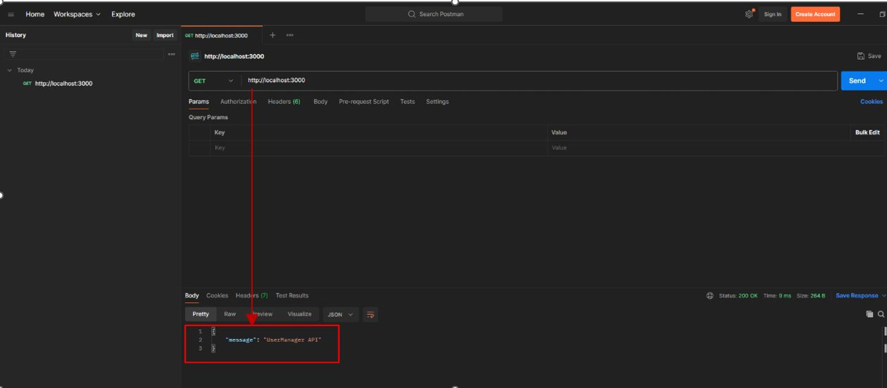
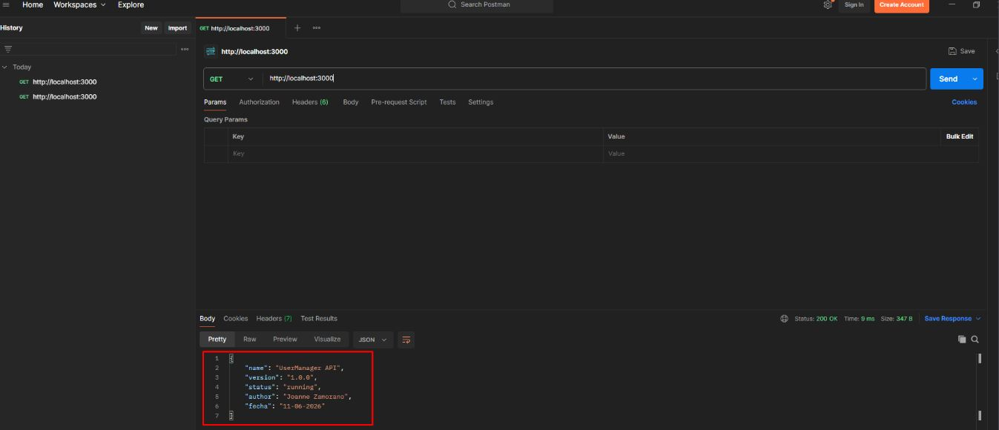
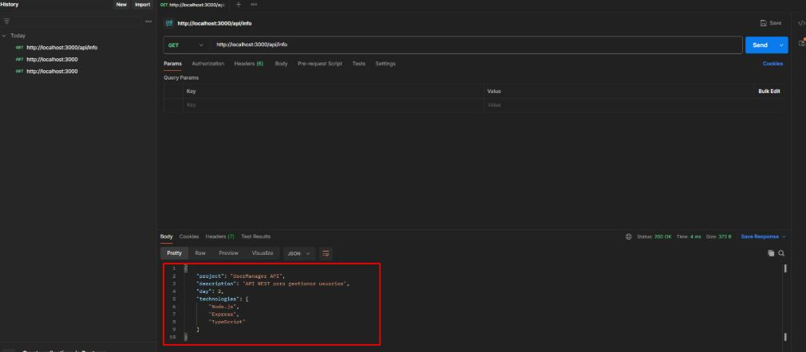
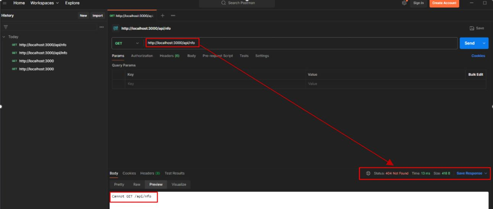

# Día 2: Preparación del proyecto

## Qué he hecho

- He inicializado el proyecto Node.js.
- He instalado Express.
- He configurado TypeScript.
- He creado la carpeta src.
- He creado el archivo src/server.ts.
- He arrancado el servidor en local.
- He probado la respuesta desde navegador o Thunder Client.
## URL de prueba

```text
http://localhost:3000
```

## Respuesta obtenida

```json
{
  "message": "UserManager API"
}
```


## Parte libre
### Tarea libre 1: Personalizar el mensaje inicial
Modifica la respuesta de la ruta / para que devuelva algo más completo.


### Tarea libre 2: Añadir una segunda ruta temporal
Crea una ruta nueva:  GET /api/info
Esta ruta debe devolver información básica del proyecto.


## Tarea libre 3: Breve explicacion

### ¿Qué hace el archivo src/server.ts?
Es el cerebro y el centro de mandos de nuestra aplicación. Aquí se junta todo: importamos Express, definimos el puerto de trabajo, configuramos las reglas del juego y escribimos las rutas a las que la gente puede llamar. Sin este archivo encendido, nuestra API no existe.

### ¿Qué hace app.get?
Sirve para crear una "ventanilla de atención" en una dirección específica (ruta) que solo reacciona cuando alguien entra a pedir o consultar información. Por ejemplo, al poner `app.get("/")` le decimos al servidor qué contenido debe mostrar o devolver en la página principal.

### ¿Qué hace app.listen?
Es el interruptor que enciende el servidor de verdad y lo deja funcionando. Le dice a nuestro ordenador: *"Quédate despierto, abre bien los oídos en el puerto 3000 y avísame en cuanto escuches que alguien te llama desde Postman o el navegador"*. Sin esto, el programa se abriría y se cerraría en un milisegundo.

### ¿Por qué usamos express.json()?
Es nuestro traductor automático. Cuando el frontend o Postman nos envían datos (como formularios con emails o contraseñas), esa información viaja por internet como un bloque de texto gigante y pegado. Esta línea traduce ese texto bruto y lo convierte en un objeto JSON limpio que nuestro código sí puede entender y manejar fácilmente.

## Tarea libre 4: Investigar un error
Provoca intencionadamente un pequeño error, por ejemplo:
 - Escribir mal una ruta.

* **Qué error apareció:** En Postman apareció un error con código de estado **`404 Not Found`** y el mensaje en pantalla **`Cannot GET /api/info`**. 
* **Qué crees que significaba:** El servidor está funcionando perfectamente, pero cuando el cliente (Postman) llamó a la dirección `/api/nfo`, Express miró en su lista de rutas registradas y no encontró ninguna que coincidiera exactamente con esa URL y ese método GET.
* **Cómo lo solucionaste:** Escribí correctamente la ruta.


