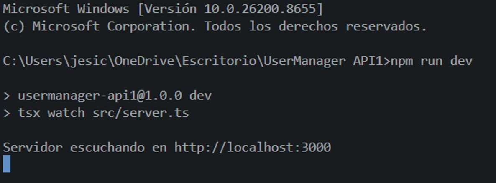
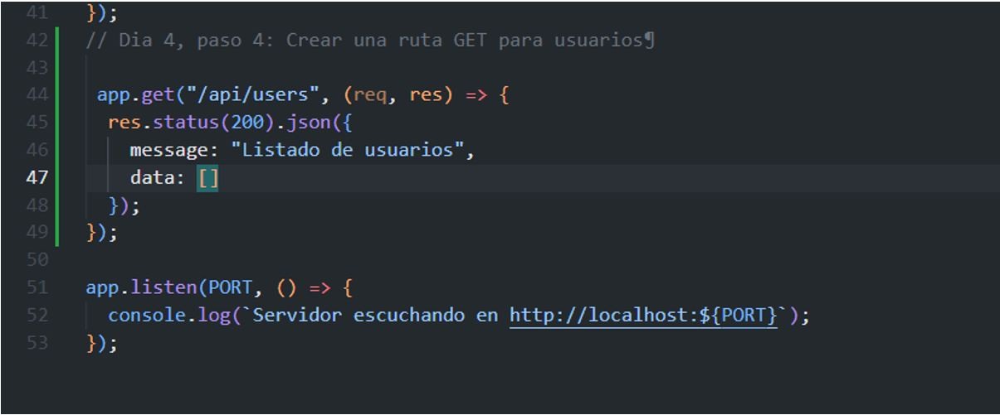
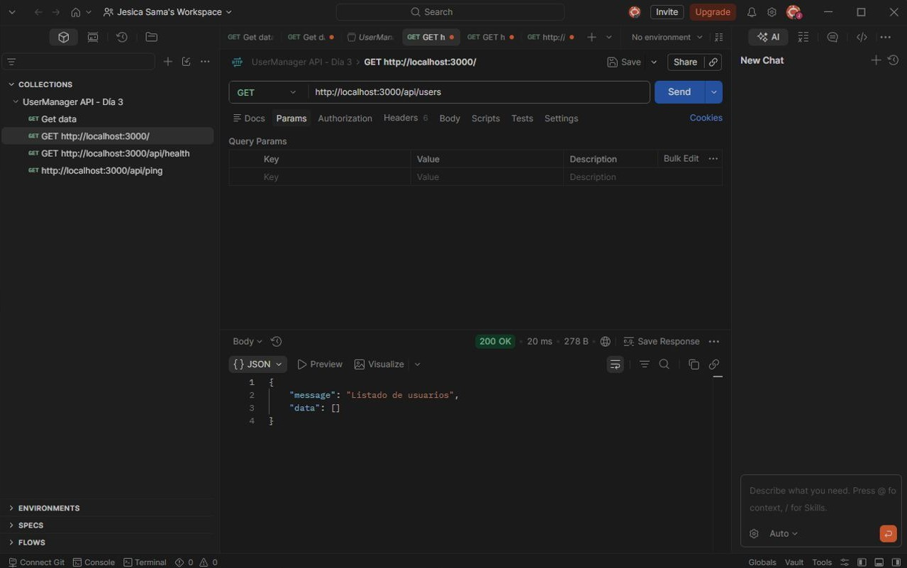
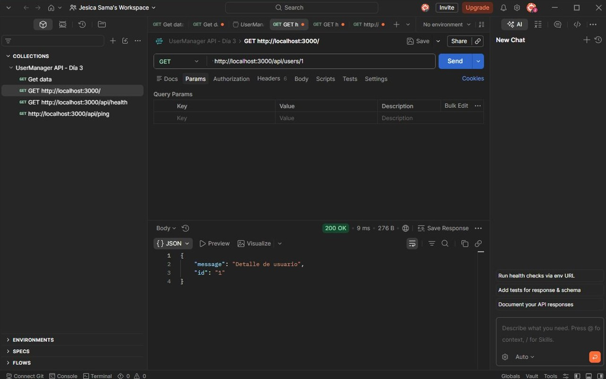
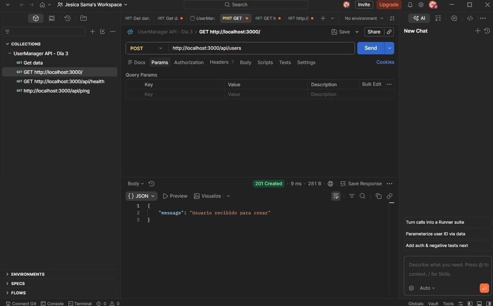
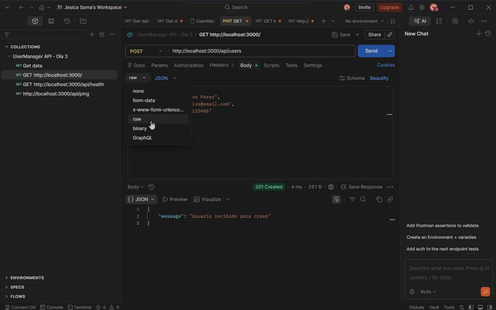
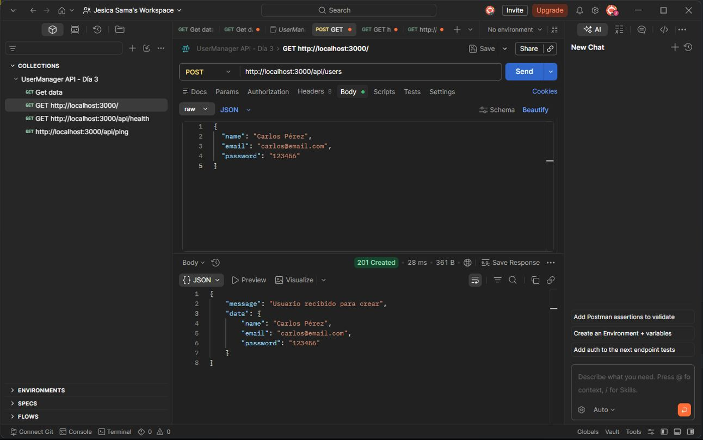

# Día 4: Métodos HTTP

## Qué he hecho

- He repasado los métodos HTTP GET, POST, PATCH y DELETE.
- He relacionado esos métodos con operaciones CRUD.
- He creado endpoints temporales para usuarios.
- He usado req.body para leer datos enviados en el body.
- He usado req.params para leer parámetros de ruta.
- He devuelto respuestas JSON simuladas.
- He usado códigos de estado como 200 OK y 201 Created.
- He preparado ejemplos para probar las rutas con Thunder Client o Postman.
- He documentado el avance del día 4.

## Conceptos trabajados

| Concepto | Qué significa |
| --- | --- |
| Método HTTP | Acción que se quiere realizar sobre un recurso |
| GET | Consultar información |
| POST | Crear información |
| PATCH | Modificar parcialmente un recurso |
| DELETE | Eliminar o desactivar un recurso |
| CRUD | Crear, leer, actualizar y eliminar datos |
| Body | Datos enviados por el cliente en una petición |
| Parámetro de ruta | Parte variable de una URL, como ``:id`` |
| Status code | Código que comunica el resultado de una petición |
## Relacion entre GRUD y métpodos HTTP
CRUD significa:

| Operación | Significado | Método HTTP habitual | Ejemplo |
| --- | --- | --- | --- |
| Create | Crear | POST | POST /api/users |
| Read | Leer | GET | GET /api/users |
| Read | Leer detalle | GET | GET /api/users/:id |
| Update | Actualizar | PATCH | PATCH /api/users/:id |
| Delete | Eliminar | DELETE | DELETE /api/users/:id |

La combinación entre método y ruta es lo que da significado al endpoint. Por ejemplo, GET /api/users y POST /api/users comparten una ruta parecida, pero representan acciones diferentes.

## Endpoints creados

### Listar usuarios

```http
GET /api/users
```

Uso:

```http
Obtener el listado de usuarios.
```

Obtener:

```json
{
  "message": "Listado de usuarios",
  "data": []
}
```

Por ahora data devuelve un array vacío porque todavía no hay base de datos.

### Ver detalle usuario

```http
GET /api/users/:id
```

Ejemplo:

```http
GET /api/users/1
```

Respuesta sumulada:

```json
{
  "message": "Detalle de usuario",
  "id": "1"
}
```

En esta ruta se usa un parámetro dinámico. La parte :id indica que ese valor puede cambiar en cada petición.

### Crear usuario

```http
POST /api/users
```

Body de ejemplo:

```json
{
  "name": "Laura Martínez",
  "email": "laura@email.com",
  "password": "123456"
}
```

Respuesta simulada:

```json
{
  "message": "Usuario recibido para crear",
  "data": {
    "name": "Laura Martínez",
    "email": "laura@email.com",
    "password": "123456"
  }
}
```

Cuando una creación se realiza correctamente, el código de estado habitual es:

```http
201 Created
```

En este proyecto, de momento, el servidor no guarda el usuario. Solo devuelve los datos recibidos para confirmar que el body se está leyendo correctamente.

### Actualizar usuario

```http
PATCH /api/users/:id
```

Ejemplo:

```http
PATCH /api/users/1
```

```json
{
  "name": "Laura García"
}
```

```json
{
  "message": "Usuario recibido para actualizar",
  "id": "1",
  "changes": {
    "name": "Laura García"
  }
}
```

PATCH permite enviar solo los campos que se quieren modificar. No obliga a mandar el usuario completo.

### Eliminar o desactivar usuario

```http
DELETE /api/users/:id
```

Ejemplo:

```http
DELETE /api/users/1
```

Respuesta simulada:

```json
{
  "message": "Usuario recibido para eliminar o desactivar",
  "id": "1"
}
```

En proyectos reales, muchas veces no se borra físicamente un usuario. Es común hacer un borrado lógico, por ejemplo cambiando un campo como:

```http
isActive = false
```

Esto permite conservar historial y evitar pérdidas de información.

### Código añadido

En src/server.ts se han añadido estas rutas:

```json
app.get("/api/users", (req, res) => {
  res.status(200).json({
    message: "Listado de usuarios",
    data: []
  });
});

app.get("/api/users/:id", (req, res) => {
  const { id } = req.params;

  res.status(200).json({
    message: "Detalle de usuario",
    id: id
  });
});

app.post("/api/users", (req, res) => {
  const userData = req.body;

  res.status(201).json({
    message: "Usuario recibido para crear",
    data: userData
  });
});

app.patch("/api/users/:id", (req, res) => {
  const { id } = req.params;
  const changes = req.body;

  res.status(200).json({
    message: "Usuario recibido para actualizar",
    id: id,
    changes: changes
  });
});

app.delete("/api/users/:id", (req, res) => {
  const { id } = req.params;

  res.status(200).json({
    message: "Usuario recibido para eliminar o desactivar",
    id: id
  });
});
```

### Body de una petición

El body es el cuerpo de la petición. Sirve para enviar datos al servidor, especialmente en métodos como POST y PATCH.

Este proyecto puede leer JSON gracias a esta línea:

```json
app.use(express.json());
```

Sin ese middleware, Express no interpretaría correctamente los datos enviados en formato JSON.

Ejemplo de lectura del body:

```json
app.post("/api/users", (req, res) => {
  const userData = req.body;

  res.status(201).json({
    message: "Usuario recibido para crear",
    data: userData
  });
});
```

### Parámetros de ruta

Un parámetro de ruta permite trabajar con partes variables de la URL.

Estas URLs representan distintos usuarios:

```http
GET /api/users/1
GET /api/users/2
GET /api/users/25
```

En Express se define una sola ruta dinámica:

```json
app.get("/api/users/:id", (req, res) => {
  const { id } = req.params;

  res.json({
    message: "Detalle de usuario",
    id: id
  });
});
```

La parte :id se puede leer desde:`

```http
req.params
```

### Pruebas realizadas

Para probar las rutas, primero se arranca el servidor:

```http
npm run dev
```

Después se pueden enviar peticiones desde Thunder Client, Postman o una herramienta similar.

| Petición            | Body | Código esperado | Resultado esperado              |
|---------------------|------|-----------------|---------------------------------|
| GET /api/users      | No   | 200             | Devuelve el listado simulado    |
| GET /api/users/1    | No   | 200             | Devuelve el id recibido         |
| POST /api/users     | Sí   | 201             | Devuelve los datos enviados     |
| PATCH /api/users/1  | Sí   | 200             | Devuelve el id y los cambios    |
| DELETE /api/users/1 | No   | 200             | Devuelve el id recibido|

## Explicación personal

GET sirve para obtener información.
POST sirve para crear información.
PATCH sirve para modificar parte de un recurso.
DELETE sirve para eliminar o desactivar un recurso.

# Parte guiada

## Paso 1: Abrir el proyecto

Abre el repositorio del reto:

Entra en la carpeta del proyecto:

```bash
cd usermanager-api
```

Comprueba que tienes la estructura del día anterior:

```bash
usermanager-api/
  README.md
  package.json
  package-lock.json
  tsconfig.json
  src/
    server.ts
  docs/
    dia-01-diseno-inicial.md
    dia-02-preparacion-proyecto.md
    dia-03-primer-endpoint.md
```

## Paso 2: Arrancar el servidor

Ejecuta:

```bash
npm run dev
```


Comprueba que el servidor funciona visitando:

```bash
http://localhost:3000/api/health
```

Se recibe la respuesta correcta, continuamos.

## Paso 3: Abrir: src/server.ts

Abre:

```bash
src/server.ts
```

Al abrir nos saldra algo parecido a esto:

```bash
import express from "express";

const app = express();
const PORT = 3000;

app.use(express.json());

app.get("/", (req, res) => {
  res.json({
    message: "UserManager API"
  });
});

app.get("/api/health", (req, res) => {
  res.status(200).json({
    status: "ok",
    message: "UserManager API funcionando",
    timestamp: new Date().toISOString()
  });
});

app.listen(PORT, () => {
  console.log(`Servidor escuchando en http://localhost:${PORT}`);
});
```

## Paso 4: Crear una ruta GET para usuarios

Añadimos la siguiente ruta debajo de /api/healt:

```bash
app.get("/api/users", (req, res) => {
  res.status(200).json({
    message: "Listado de usuarios",
    data: []
  });
});
```



Esta ruta todavia no devuelve usuarios reales. Devuelve un array vacio para simular que todavia no tenemos datos.

```bash
GET http://localhost:3000/api/users
```

Prueba:



La respuesta es la esperada, tiene que salir:

```bash
{
  "message": "Listado de usuarios",
  "data": []
}
```

## Paso 5: Crear una ruta GET por ID

Añadimos la siguiente ruta:

```bash
app.get("/api/users/:id", (req, res) => {
  const { id } = req.params;

  res.status(200).json({
    message: "Detalle de usuario",
    id: id
  });
});
```

Prueba:


La respuesta es la esperada, tiene que salir:

```bash
{
  "message": "Detalle de usuario",
  "id": "1"
}
```

En el resultado no sale el valor "1" como texto. Esto ocurre porque los parámetros de ruta llegan como string.

## Paso 6:Crear una ruta POST para usuarios

Añadimos esta ruta:

```bash
app.post("/api/users", (req, res) => {
  const userData = req.body;

  res.status(201).json({
    message: "Usuario recibido para crear",
    data: userData
  });
});
```

Prueba:

```bash
POST http://localhost:3000/api/users
```



En el body envía JSON:

```ts
{
  "name": "Carlos Pérez",
  "email": "carlos@email.com",
  "password": "123456"
}
```


La respuesta esperada:

```ts
{
  "message": "Usuario recibido para crear",
  "data": {
    "name": "Carlos Pérez",
    "email": "carlos@email.com",
    "password": "123456"
  }
}
```


De momento estamos devolviendo tambien la contraseña porque estamos simulando. Mas adelante no se devolvera ninguna contraseña.


