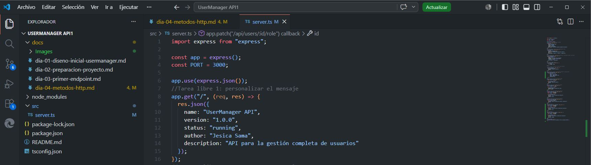

## Objetivo del día

El objetivo del día 5 ha sido entender dónde viajan los datos dentro de una petición HTTP y cómo leerlos desde Express.

En una API REST no solo importa la ruta. También importa dónde se envía cada dato:

- En el body.
- En los route params.
- En los query params.
- En los headers.

Durante el reto estos elementos se usarán constantemente para crear usuarios, consultar recursos concretos, filtrar listados y enviar tokens de autenticación.

## Qué he hecho

- He repasado qué es JSON.
- He comprobado que Express lee JSON con `app.use(express.json())`.
- He probado cómo leer datos enviados en el body con `req.body`.
- He probado cómo leer route params con `req.params`.
- He probado cómo leer query params con `req.query`.
- He probado cómo leer headers con `req.headers`.
- He creado rutas temporales de debug.
- He preparado pruebas HTTP para el día 5.

## Conceptos trabajados

| Concepto        | Qué significa                                                   |
|-----------------|-----------------------------------------------------------------|
| JSON            | Formato de texto usado para intercambiar datos                  |
| Body            | Cuerpo de la petición; contiene los datos principales           |
| Route params    | Valores variables dentro de la ruta, como `:id`                 |
| Query params    | Parámetros enviados al final de la URL después de `?`           |
| Headers         | Metadatos de la petición                                        |
| Content-Type    | Indica el formato de los datos enviados                         |
| Authorization   | Envía credenciales o tokens                                     |
| req.body        | Lugar desde el que Express lee el body                          |
| req.params      | Lugar desde el que Express lee los parámetros de ruta           |
| req.query       | Lugar desde el que Express lee los query params                 |
| req.headers     | Lugar desde el que Express lee los headers                      |

## Qué es JSON

JSON significa *JavaScript Object Notation*. Es un formato de intercambio de datos muy utilizado por APIs REST.

Ejemplo:

```json
{
  "name": "Laura Martinez",
  "email": "laura@email.com",
  "role": "USER",
  "isActive": true
}
```

## Body

El body es el cuerpo de una petición HTTP. Sirve para enviar los datos principales al servidor, especialmente con métodos como `POST`, `PATCH` o `PUT`.

Ejemplo:

POST /api/debug/body
Content-Type: application/json

```http
POST /api/debug/body
Content-Type: application/json
```

```json
{
  "name": "Ana Garcia",
  "email": "ana@email.com"
}
```

En Express se lee con:

```ts
req.body
```

Para que Express pueda interpretar JSON, el servidor debe tener este middleware antes de las rutas:

```ts
app.use(express.json());
```



## Route params

Los route params son valores que forman parte de la ruta. Sirven para identificar un recurso concreto.

Ejemplo:

```http
GET /api/debug/params/25
```

La ruta se define con una parte dinámica:

```ts
app.get("/api/debug/params/:id", (req, res) => {
  res.json({
    params: req.params
  });
});
```

En Express se leen con:

```ts
req.params
```

Importante: los params llegan como texto.
Aunque 25 parezca un número, Express lo recibe como "25".


## Query params

Los query params se envían al final de la URL después del signo `?`.  
Sirven para enviar filtros, opciones o criterios de búsqueda.

Ejemplo:

```http
GET /api/debug/query?role=ADMIN&isActive=true
```

En Express se leen con:

```ts
req.query
```

Los query params también llegan como texto.
Por ejemplo, isActive=true se recibe como "true".

## Headers

Los headers son metadatos de la petición.  
No suelen contener los datos principales, sino información adicional sobre la petición.

Ejemplos habituales:

| Header         | Uso                                      |
|----------------|-------------------------------------------|
| Content-Type   | Indica el formato de los datos enviados   |
| Authorization  | Envía credenciales o tokens               |
| Accept         | Indica qué tipo de respuesta espera       |
| User-Agent     | Identifica el cliente que hace la petición |

En Express se leen con:

```ts
req.headers
```

Más adelante, el header Authorization será importante para enviar tokens JWT:

```htpp
Authorization: Bearer token-de-prueba
```

## Rutas trabajadas

Estas rutas son temporales y sirven para practicar cómo llegan los datos a una API.

```http
POST /api/debug/body
GET /api/debug/params/:id
GET /api/debug/query
GET /api/debug/headers
PATCH /api/debug/users/:id
```

## Ruta combinada

La ruta combinada permite probar params, query params, headers y body en una misma petición.

```http
PATCH /api/debug/users/7?notify=true
Authorization: Bearer token-de-prueba
Content-Type: application/json
```

```json
{
  "name": "Nombre actualizado"
}
```

En esta petición los datos viajan así:

| Dato                     | Dónde viaja     | Dónde se lee                   |
|--------------------------|-----------------|--------------------------------|
| `7`                      | Route params    | `req.params.id`                |
| `true`                   | Query params    | `req.query.notify`             |
| `Bearer token-de-prueba` | Headers         | `req.headers.authorization`    |
| `name`                   | Body            | `req.body.name`                |

## Pruebas realizadas

| Petición                                      | Dato probado   | Código esperado | Resultado esperado                                  |
|-----------------------------------------------|----------------|-----------------|------------------------------------------------------|
| `POST /api/debug/body`                        | Body           | 200             | Devuelve el body recibido                            |
| `GET /api/debug/params/25`                    | Params         | 200             | Devuelve `{ "id": "25" }` dentro de `params`         |
| `GET /api/debug/query?role=ADMIN&isActive=true` | Query params | 200             | Devuelve los filtros recibidos                       |
| `GET /api/debug/headers`                      | Headers        | 200             | Devuelve los headers de la petición                  |
| `PATCH /api/debug/users/7?notify=true`        | Combinado      | 200             | Devuelve params, query, header y body                |

## Dónde viaja cada dato

| Dato             | Dónde viajaría     | Ejemplo                           |
|------------------|---------------------|------------------------------------|
| ID de usuario    | Route params        | `GET /api/users/1`                 |
| Email de registro| Body                | `{ "email": "ana@email.com" }`     |
| Filtro por rol   | Query params        | `GET /api/users?role=ADMIN`        |
| Token JWT        | Headers             | `Authorization: Bearer token`      |
| Nueva contraseña | Body                | `{ "newPassword": "abcdef" }`      |

## Errores frecuentes

- Olvidar `app.use(express.json())`.
- Enviar el body como texto en lugar de JSON.
- No configurar `Content-Type: application/json`.
- Buscar en `req.params` un dato que viene en `req.body`.
- Buscar en `req.body` un dato que viene en `req.query`.
- Usar un método HTTP incorrecto.
- Probar una ruta distinta a la definida en Express.

## Resumen

En el día 5 se ha trabajado una idea clave para cualquier API: los datos de una petición HTTP pueden viajar en lugares distintos.

- El **body** sirve para enviar datos principales.
- Los **route params** sirven para identificar recursos concretos.
- Los **query params** sirven para filtros u opciones.
- Los **headers** sirven para información adicional, como tokens o formato de datos.

Comprender dónde viaja cada dato es esencial para construir y depurar una API REST.
