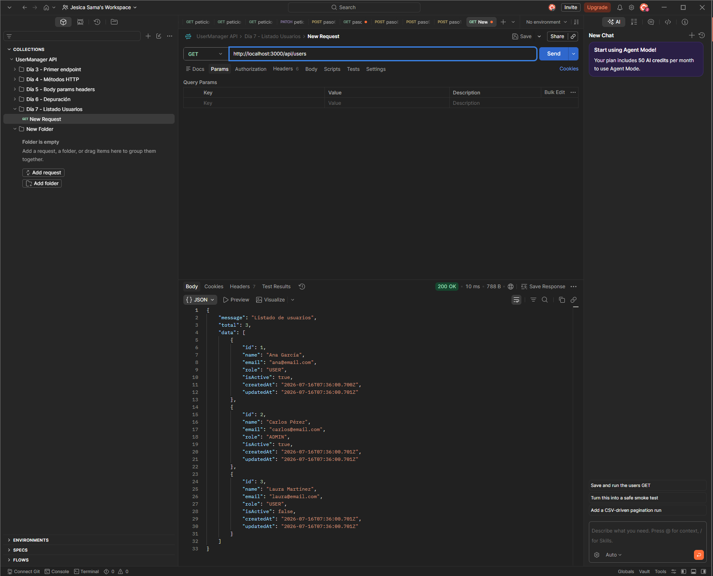

# Día 7: Listado de usuarios en memoria

## Objetivo del día

El objetivo del día 7 ha sido empezar el CRUD de usuarios trabajando con datos en memoria.

Hasta ahora las rutas de usuarios devolvían respuestas simuladas. En este día se ha creado un array de usuarios dentro del servidor y se ha actualizado el endpoint `GET /api/users` para devolver ese listado en formato JSON.

## Qué he hecho

- He creado un tipo `User` en TypeScript.
- He creado un array de usuarios en memoria.
- He actualizado el endpoint `GET /api/users`.
- He devuelto un listado de usuarios en formato JSON.
- He añadido el total de usuarios en la respuesta.
- He comprobado que no se devuelven contraseñas.
- He documentado la diferencia entre memoria y base de datos.

## Endpoint trabajado

```http
GET /api/users
```

Este endpoint devuelve los usuarios cargados temporalmente en memoria.

## Tipo User

El tipo `User` define la forma que debe tener cada usuario:

```ts
type User = {
  id: number;
  name: string;
  email: string;
  role: "USER" | "ADMIN";
  isActive: boolean;
  createdAt: string;
  updatedAt: string;
};
```

Gracias a este tipo, TypeScript puede avisar si falta un campo obligatorio o si un campo tiene un tipo incorrecto.

## Usuarios en memoria

Los usuarios se guardan en un array dentro de `src/server.ts`.

```ts
const users: User[] = [
  {
    id: 1,
    name: "Ana García",
    email: "ana@email.com",
    role: "USER",
    isActive: true,
    createdAt: new Date().toISOString(),
    updatedAt: new Date().toISOString()
  }
];
```

En este momento el array tiene tres usuarios de prueba:

| ID | Nombre | Email | Rol | Activo |
| ---: | --- | --- | --- | --- |
| 1 | Ana García | ana@email.com | USER | Sí |
| 2 | Carlos Pérez | carlos@email.com | ADMIN | Sí |
| 3 | Laura Martínez | laura@email.com | USER | No |

## Respuesta obtenida

Ejemplo de respuesta:

```json
{
  "message": "Listado de usuarios",
  "total": 3,
  "data": [
    {
      "id": 1,
      "name": "Ana García",
      "email": "ana@email.com",
      "role": "USER",
      "isActive": true,
      "createdAt": "2026-01-01T10:00:00.000Z",
      "updatedAt": "2026-01-01T10:00:00.000Z"
    },
    {
      "id": 2,
      "name": "Carlos Pérez",
      "email": "carlos@email.com",
      "role": "ADMIN",
      "isActive": true,
      "createdAt": "2026-01-01T10:00:00.000Z",
      "updatedAt": "2026-01-01T10:00:00.000Z"
    },
    {
      "id": 3,
      "name": "Laura Martínez",
      "email": "laura@email.com",
      "role": "USER",
      "isActive": false,
      "createdAt": "2026-01-01T10:00:00.000Z",
      "updatedAt": "2026-01-01T10:00:00.000Z"
    }
  ]
}
```

Las fechas reales pueden cambiar porque se generan con `new Date().toISOString()` al arrancar el servidor.

## Tabla de comprobación

| Comprobación | Resultado |
| --- | --- |
| La ruta `GET /api/users` responde | Correcto |
| El status code es 200 | Correcto |
| La respuesta contiene `message` | Correcto |
| La respuesta contiene `total` | Correcto |
| La respuesta contiene `data` | Correcto |
| `data` es un array | Correcto |
| Los usuarios no incluyen contraseña | Correcto |



## Datos sensibles

El listado de usuarios no devuelve campos como:

- `password`
- `passwordHash`
- `token`

Aunque todavía se trabaje con datos de prueba, es importante empezar con esta regla: la API solo debe devolver los datos que el cliente necesita.

## Memoria vs base de datos

Guardar datos en memoria significa que los datos viven dentro del proceso del servidor mientras está encendido.

Esto permite practicar la lógica de una API sin añadir todavía una base de datos, pero tiene una limitación importante: si se reinicia el servidor, los datos vuelven al estado inicial definido en el código.

Más adelante será necesario usar una base de datos para que los usuarios se guarden de forma persistente, incluso aunque el servidor se apague o se vuelva a desplegar.

| En memoria | Base de datos |
| --- | --- |
| Los datos son temporales | Los datos son persistentes |
| Se guardan en un array dentro del código | Se guardan en un sistema externo |
| Se pierden al reiniciar el servidor | Se conservan al reiniciar |
| Sirve para aprender la lógica inicial | Sirve para una API real |

## Explicación personal

Trabajar en memoria significa que los datos están guardados temporalmente mientras el servidor está encendido. Es útil para aprender cómo una ruta lee y devuelve información, pero no sustituye a una base de datos.

El endpoint `GET /api/users` ya no devuelve un array vacío. Ahora devuelve un listado inicial de usuarios, el total de elementos y una respuesta JSON más parecida a la que podría tener una API real.

## Resumen

En el día 7 se ha empezado a transformar la API de rutas simuladas en una API que trabaja con datos.

El proyecto ya tiene un listado inicial de usuarios en memoria y el endpoint `GET /api/users` devuelve una respuesta estructurada con `message`, `total` y `data`.
