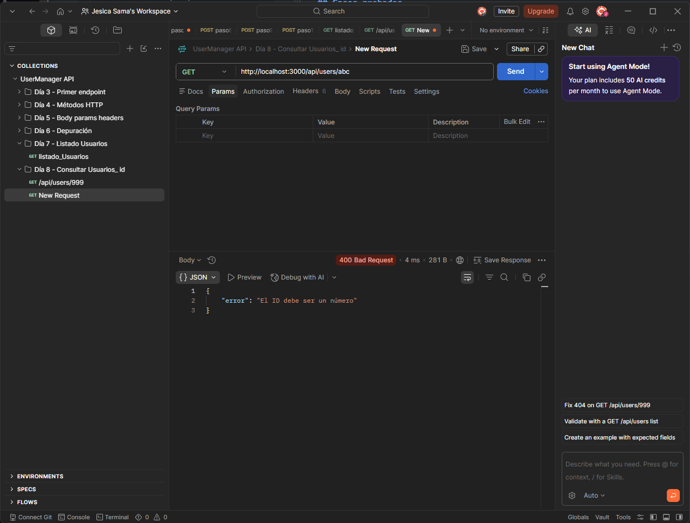

# Día 8: Consultar usuario por ID

## Objetivo del día

El objetivo del día 8 ha sido completar una parte fundamental del CRUD:
consultar un usuario concreto a partir de su ID.

El endpoint `GET /api/users/:id` ahora lee el parámetro de ruta, lo convierte a
número, busca el usuario dentro del array `users` y responde con el código HTTP
adecuado según el caso.

## Qué he hecho

- He actualizado el endpoint `GET /api/users/:id`.
- He leído el ID desde `req.params`.
- He convertido el ID de `string` a `number`.
- He validado si el ID es numérico.
- He buscado usuarios con `find`.
- He devuelto `200` cuando el usuario existe.
- He devuelto `404` cuando el usuario no existe.
- He devuelto `400` cuando el ID no es válido.
- He añadido la ruta `GET /api/users/active`.
- He preparado pruebas HTTP para los casos principales.

## Endpoint trabajado

```http
GET /api/users/:id
```

Ejemplo:

```http
GET /api/users/1
```

## Funcionamiento

La ruta sigue estos pasos:

1. Lee el valor recibido en `req.params.id`.
2. Convierte ese valor a número con `Number`.
3. Comprueba si el resultado es `NaN`.
4. Busca el usuario con `users.find`.
5. Devuelve el usuario si existe.
6. Devuelve un error si no existe o si el ID no es válido.

## Código trabajado

```ts
app.get("/api/users/:id", (req, res) => {
  const idParam = req.params.id;
  const id = Number(idParam);

  if (Number.isNaN(id)) {
    return res.status(400).json({
      error: "El ID debe ser un número",
      received: idParam
    });
  }

  const user = users.find((user) => user.id === id);

  if (!user) {
    return res.status(404).json({
      error: "Usuario no encontrado",
      id
    });
  }

  return res.status(200).json({
    message: "Usuario encontrado",
    data: user
  });
});
```

## Casos probados

| Petición | Código esperado | Resultado |
| --- | ---: | --- |
| GET /api/users/1 | 200 |  |
| GET /api/users/2 | 200 |  |
| GET /api/users/999 | 404 |  |
| GET /api/users/abc | 400 |  |


## Respuesta correcta

```json
{
  "message": "Usuario encontrado",
  "data": {
    "id": 1,
    "name": "Ana García",
    "email": "ana@email.com",
    "role": "USER",
    "isActive": true,
    "createdAt": "2026-01-01T10:00:00.000Z",
    "updatedAt": "2026-01-01T10:00:00.000Z"
  }
}
```

Las fechas reales pueden cambiar porque se generan al arrancar el servidor.

## Error 404

Si el ID es numérico pero no existe ningún usuario con ese identificador, la API
devuelve `404 Not Found`.

```json
{
  "error": "Usuario no encontrado",
  "id": 999
}
```

Este código significa que el recurso solicitado no existe.

## Error 400

Si el ID no se puede convertir a número, la API devuelve `400 Bad Request`.

```json
{
  "error": "El ID debe ser un número",
  "received": "abc"
}
```

Este código indica que la petición enviada por el cliente no tiene el formato
correcto.

## Explicación personal

El parámetro `:id` se recibe desde `req.params`. Aunque en la URL parezca un
número, Express lo recibe como `string`.

Por eso hay que convertirlo antes de compararlo con los IDs del array `users`,
porque en el tipo `User` el campo `id` es un `number`.

```ts
const idParam = req.params.id;
const id = Number(idParam);
```

Después se puede buscar el usuario con `find`:

```ts
const user = users.find((user) => user.id === id);
```

Si `find` no encuentra nada, devuelve `undefined`, y ese caso debe convertirse
en una respuesta `404`.

## Usuarios activos

También se ha creado una ruta para consultar solo usuarios activos:

```http
GET /api/users/active
```

La ruta usa `filter` para devolver solo los usuarios con `isActive: true`.

```ts
const activeUsers = users.filter((user) => user.isActive);
```

## Orden de rutas en Express

En Express el orden de las rutas importa.

Las rutas fijas como estas:

```http
GET /api/users/count
GET /api/users/active
```

deben colocarse antes de la ruta dinámica:

```http
GET /api/users/:id
```

Si `GET /api/users/active` estuviera después de `GET /api/users/:id`, Express
podría interpretar `active` como si fuera el parámetro `id`. En ese caso la API
intentaría convertir `"active"` a número y devolvería un error `400`, aunque la
ruta real sí existe.

## Resumen

En el día 8 se ha añadido la consulta de un usuario concreto por ID. El endpoint
ya controla los tres casos principales:

- Usuario encontrado: `200 OK`.
- Usuario inexistente: `404 Not Found`.
- ID no válido: `400 Bad Request`.

También se ha practicado el orden de rutas en Express con la ruta
`GET /api/users/active`.