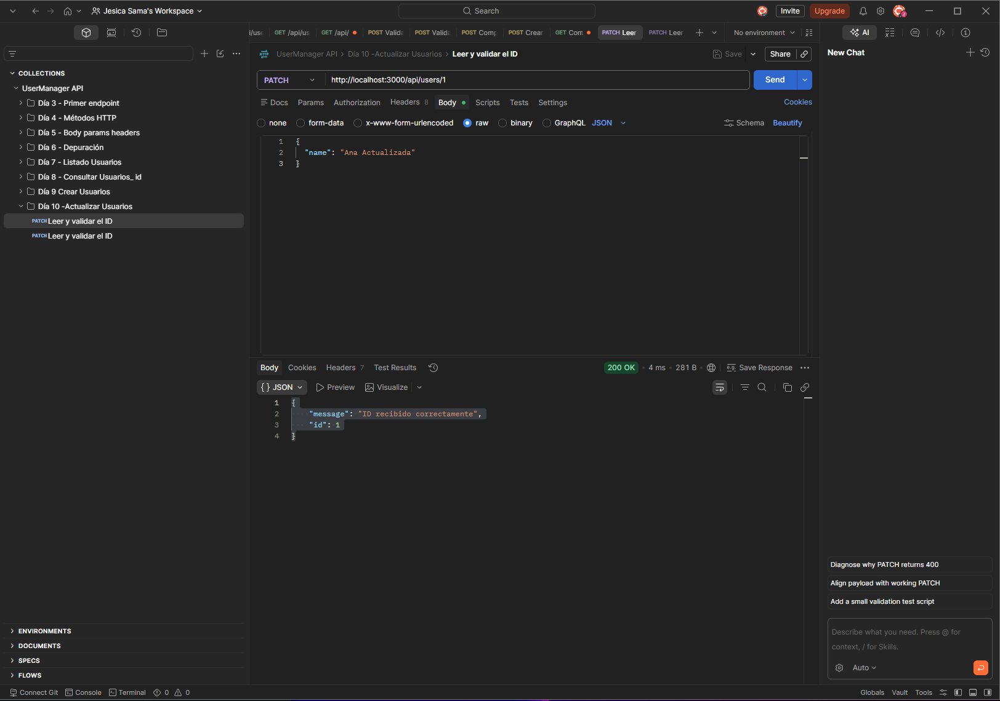
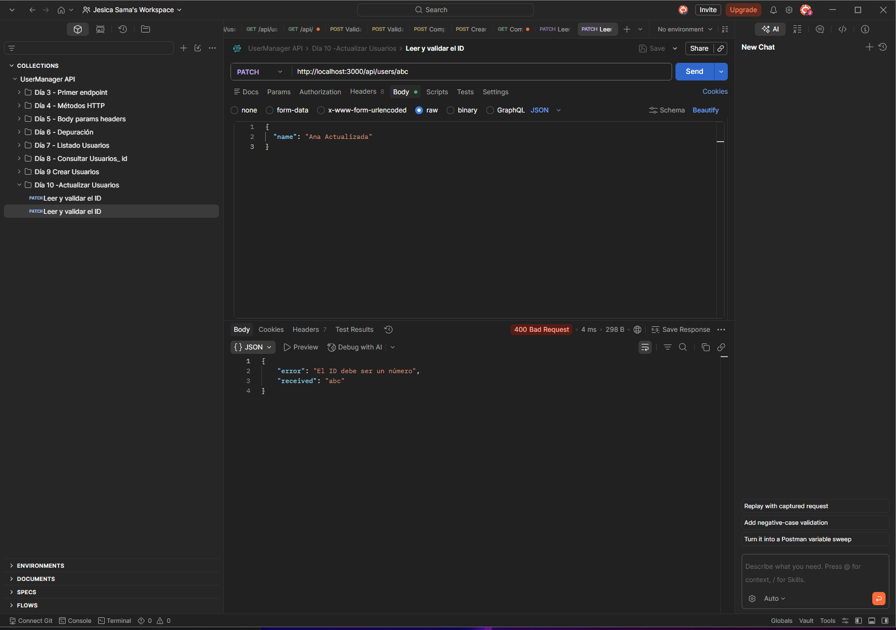
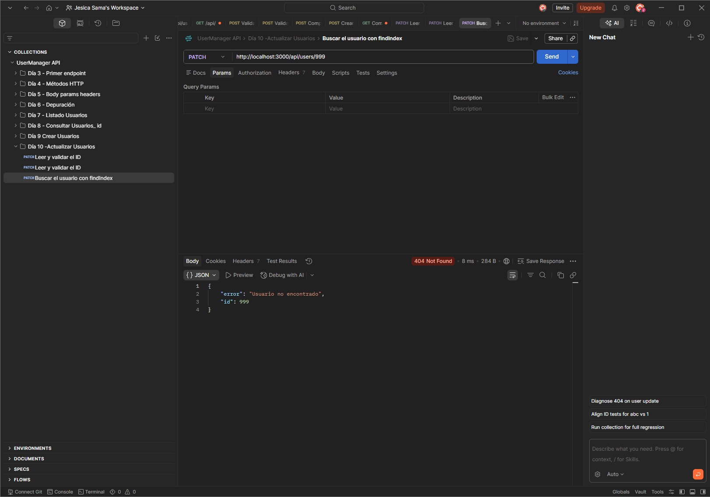
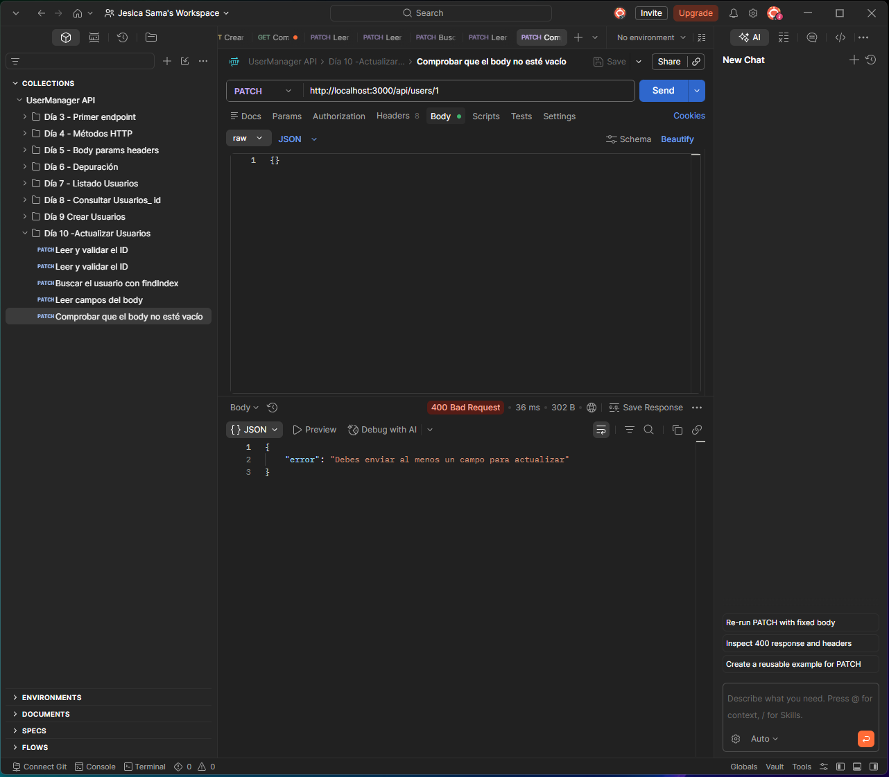
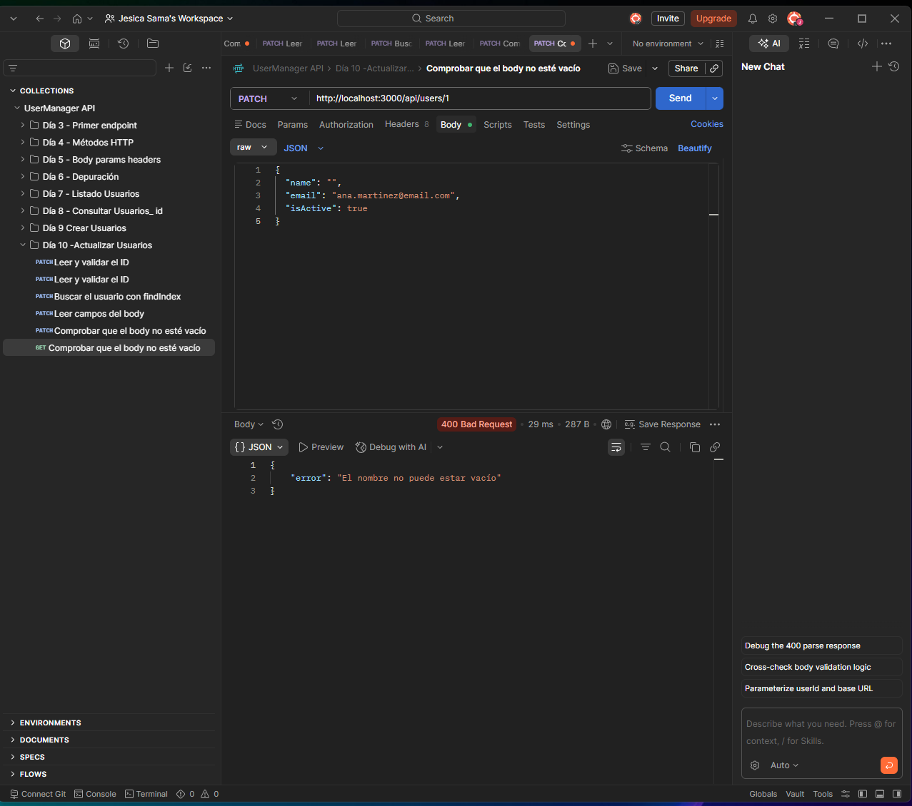
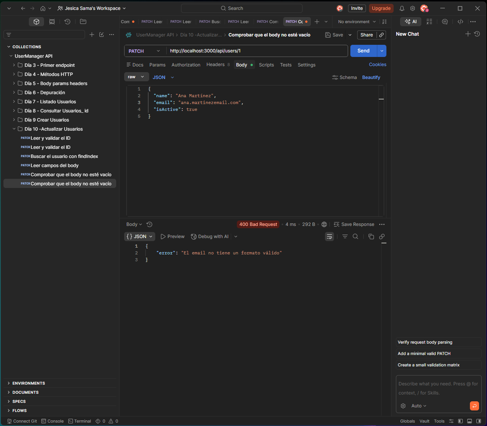
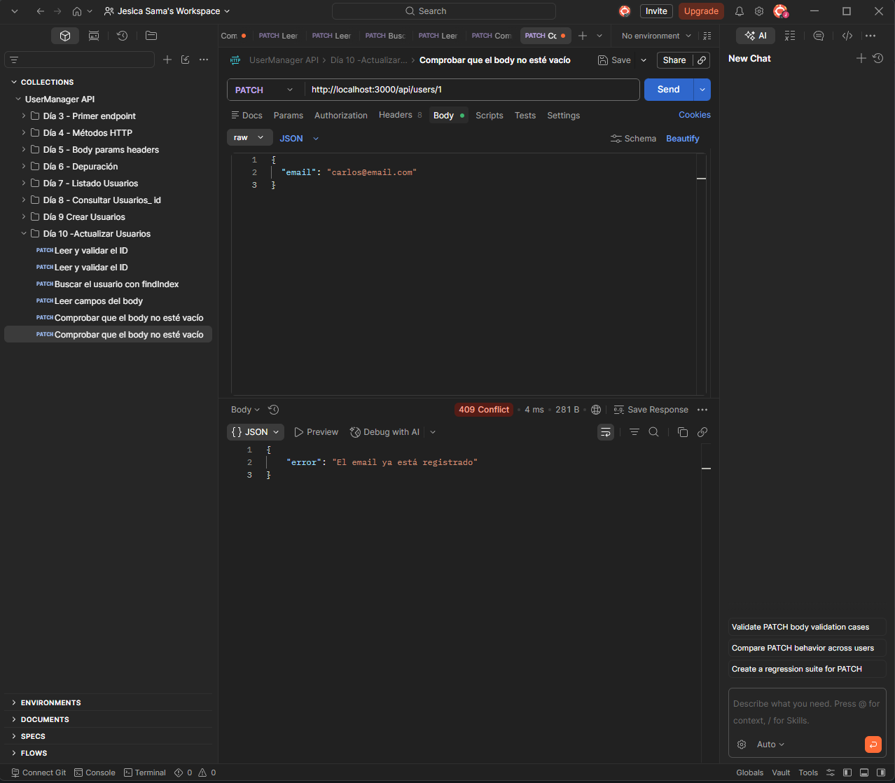
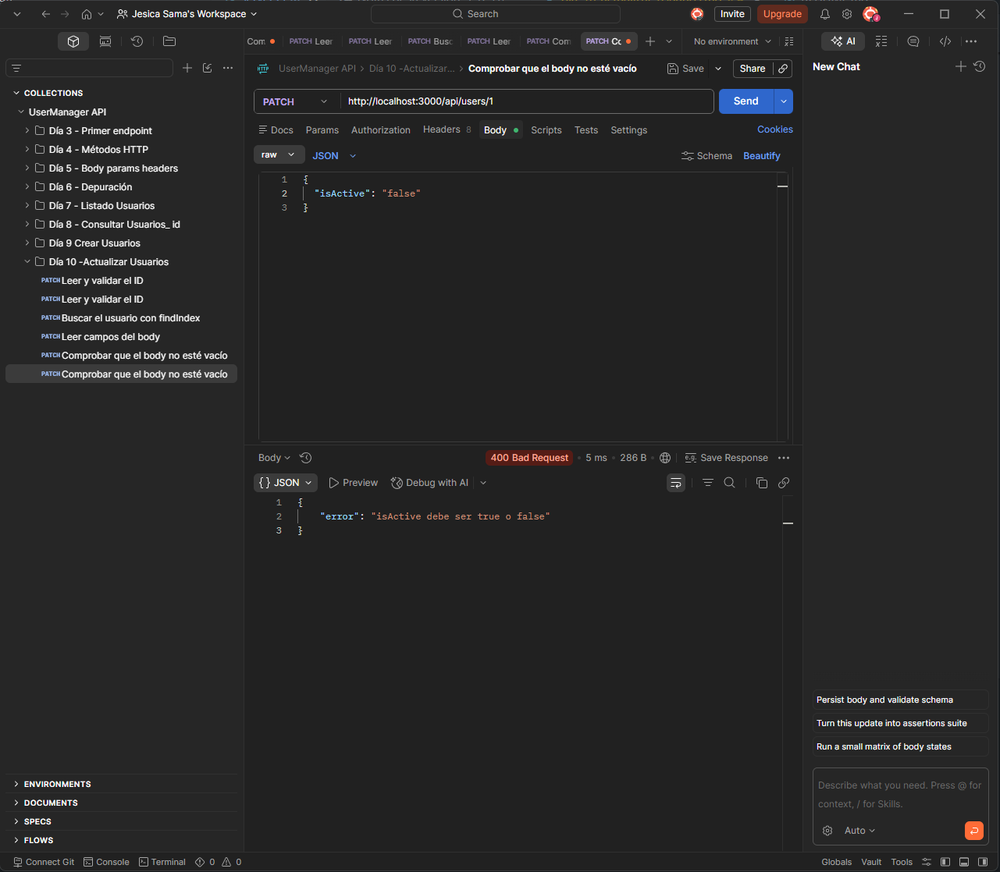

# Día 10: Actualizar usuarios en memoria

## Objetivo del día

El objetivo del día 10 ha sido implementar la actualización parcial de usuarios
existentes en memoria mediante `PATCH /api/users/:id`.

La ruta busca el usuario por su ID, valida los cambios enviados y sustituye su
posición dentro del array `users`. Solo permite modificar `name`, `email` e
`isActive`, mientras que el resto de los datos se conserva.

## Qué he hecho

- He actualizado el endpoint `PATCH /api/users/:id`.
- He leído y convertido el ID recibido en `req.params`.
- He localizado al usuario con `findIndex`.
- He comprobado que el usuario exista.
- He leído los cambios desde `req.body`.
- He validado que llegue al menos un campo permitido.
- He limpiado y validado el nombre.
- He normalizado y validado el email.
- He evitado asignar el email de otro usuario.
- He comprobado que `isActive` sea un booleano.
- He actualizado automáticamente `updatedAt`.
- He sustituido el usuario dentro del array.

## Endpoint trabajado

```http
PATCH /api/users/:id
```

Ejemplo:

```http
PATCH /api/users/1
```

## Campos permitidos

La ruta permite modificar estos campos:

| Campo | Validación |
| --- | --- |
| `name` | No puede estar vacío |
| `email` | Debe contener `@` y no pertenecer a otro usuario |
| `isActive` | Debe ser `true` o `false` |

Los campos `id`, `role`, `createdAt` y `updatedAt` no se toman directamente del
body. El campo `updatedAt` lo genera la propia API al realizar el cambio.

## Body de ejemplo

```json
{
  "name": "Ana Martínez"
}
```

También se pueden actualizar varios campos a la vez:

```json
{
  "name": "Ana Martínez",
  "email": "ana.martinez@email.com",
  "isActive": false
}
```

## Funcionamiento

La ruta sigue estos pasos:

1. Lee el ID desde `req.params.id`.
2. Convierte el ID a número y comprueba que sea válido.
3. Busca la posición del usuario con `findIndex`.
4. Devuelve `404` si el usuario no existe.
5. Lee `name`, `email` e `isActive` desde el body.
6. Comprueba que se haya enviado al menos uno de esos campos.
7. Limpia y valida los valores recibidos.
8. Crea un usuario actualizado conservando los campos anteriores.
9. Genera un nuevo valor para `updatedAt`.
10. Sustituye el usuario dentro del array y devuelve la respuesta.

## Código trabajado

```ts
app.patch("/api/users/:id", (req, res) => {
  const idParam = req.params.id;
  const id = Number(idParam);

  if (Number.isNaN(id)) {
    return res.status(400).json({
      error: "El ID debe ser un número",
      received: idParam
    });
  }

  const userIndex = users.findIndex((user) => user.id === id);

  if (userIndex === -1) {
    return res.status(404).json({
      error: "Usuario no encontrado",
      id
    });
  }

  const { name, email, isActive } = req.body;

  const hasChanges =
    name !== undefined ||
    email !== undefined ||
    isActive !== undefined;

  if (!hasChanges) {
    return res.status(400).json({
      error: "Debes enviar al menos un campo para actualizar"
    });
  }

  let cleanName: string | undefined;

  if (name !== undefined) {
    cleanName = String(name).trim();

    if (cleanName.length === 0) {
      return res.status(400).json({
        error: "El nombre no puede estar vacío"
      });
    }
  }

  let cleanEmail: string | undefined;

  if (email !== undefined) {
    cleanEmail = String(email).trim().toLowerCase();

    if (!cleanEmail.includes("@")) {
      return res.status(400).json({
        error: "El email no tiene un formato válido"
      });
    }

    const emailAlreadyExists = users.some(
      (user) => user.email === cleanEmail && user.id !== id
    );

    if (emailAlreadyExists) {
      return res.status(409).json({
        error: "El email ya está registrado"
      });
    }
  }

  if (isActive !== undefined && typeof isActive !== "boolean") {
    return res.status(400).json({
      error: "isActive debe ser true o false"
    });
  }

  const currentUser = users[userIndex];

  const updatedUser: User = {
    ...currentUser,
    name: cleanName ?? currentUser.name,
    email: cleanEmail ?? currentUser.email,
    isActive: isActive ?? currentUser.isActive,
    updatedAt: new Date().toISOString()
  };

  users[userIndex] = updatedUser;

  return res.status(200).json({
    message: "Usuario actualizado correctamente",
    data: updatedUser
  });
});
```

## Respuesta correcta

La actualización devuelve `200 OK`:

```json
{
  "message": "Usuario actualizado correctamente",
  "data": {
    "id": 1,
    "name": "Ana Martínez",
    "email": "ana@email.com",
    "role": "USER",
    "isActive": true,
    "createdAt": "2026-01-01T10:00:00.000Z",
    "updatedAt": "2026-01-01T11:00:00.000Z"
  }
}
```

Las fechas reales dependen del momento en que se inicia el servidor y se
realiza la actualización.

## Casos probados

| Caso | Código esperado | Resultado |
| --- | ---: | --- |
| Actualización correcta | 200 |  |
| ID no válido | 400 |  |
| Usuario inexistente | 404 |  |
| Body vacío | 400 |  |
| Nombre vacío | 400 |  |
| Email inválido | 400 |  |
| Email duplicado | 409 |  |
| isActive incorrecto | 400 |  |

## Errores controlados

Un ID no numérico devuelve:

```json
{
  "error": "El ID debe ser un número",
  "received": "abc"
}
```

Si el usuario no existe:

```json
{
  "error": "Usuario no encontrado",
  "id": 999
}
```

Si no se envía ningún campo permitido:

```json
{
  "error": "Debes enviar al menos un campo para actualizar"
}
```

Otros errores de validación posibles son:

```json
{
  "error": "El nombre no puede estar vacío"
}
```

```json
{
  "error": "El email no tiene un formato válido"
}
```

```json
{
  "error": "El email ya está registrado"
}
```

```json
{
  "error": "isActive debe ser true o false"
}
```

## `findIndex`

Para actualizar el elemento correcto es necesario conocer su posición dentro
del array. `findIndex` devuelve esa posición o `-1` si no encuentra el usuario:

```ts
const userIndex = users.findIndex((user) => user.id === id);
```

Una vez creado el objeto actualizado, se guarda en la misma posición:

```ts
users[userIndex] = updatedUser;
```

## PATCH

`PATCH` sirve para actualizar parcialmente un recurso. El cliente solo necesita
enviar los campos que quiere cambiar; si envía únicamente `name`, el email, el
rol, el estado y las fechas anteriores se conservan.

Esto es diferente de reemplazar el usuario completo. Una sustitución completa
obligaría a enviar todos sus campos, incluso aquellos que no necesitan cambios.

La ruta solo lee `name`, `email` e `isActive` porque campos como `id`, `role` o
`createdAt` requieren reglas distintas y no deben modificarse desde una edición
general del perfil.

## Actualización de `updatedAt`

Cada modificación genera automáticamente una nueva fecha:

```ts
updatedAt: new Date().toISOString()
```

Esto permite saber cuándo se cambió el usuario por última vez sin confiar en una
fecha enviada por el cliente.

## Persistencia en memoria

Los cambios se mantienen mientras el servidor siga encendido. Después de hacer
el `PATCH`, se puede consultar `GET /api/users/:id` para comprobar el resultado.

Al reiniciar el servidor, el array vuelve a los usuarios definidos inicialmente
en `src/server.ts`.

## Explicación personal

Para actualizar un usuario primero se valida el ID y se localiza su posición en
el array. Después se comprueban únicamente los campos recibidos en el body. El
spread operator conserva los valores anteriores y el operador `??` permite
sustituir solo los que han llegado en la petición.

Cuando todos los datos son válidos, el objeto actualizado reemplaza al usuario
anterior dentro de `users`. De esta forma la siguiente consulta devuelve los
cambios mientras el servidor permanece encendido.

## Resumen

En el día 10 se ha implementado la actualización parcial de usuarios en
memoria. La API ya valida el ID, la existencia del usuario, el contenido del
body y los campos editables antes de guardar los cambios y renovar `updatedAt`.