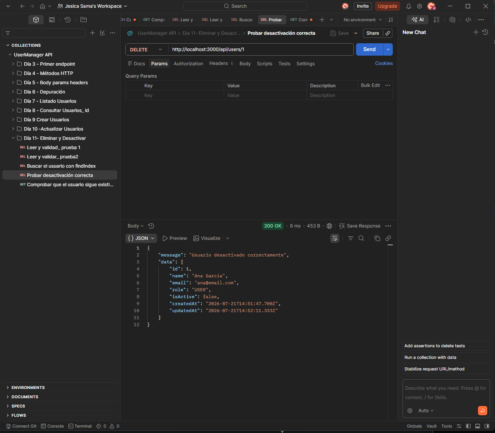
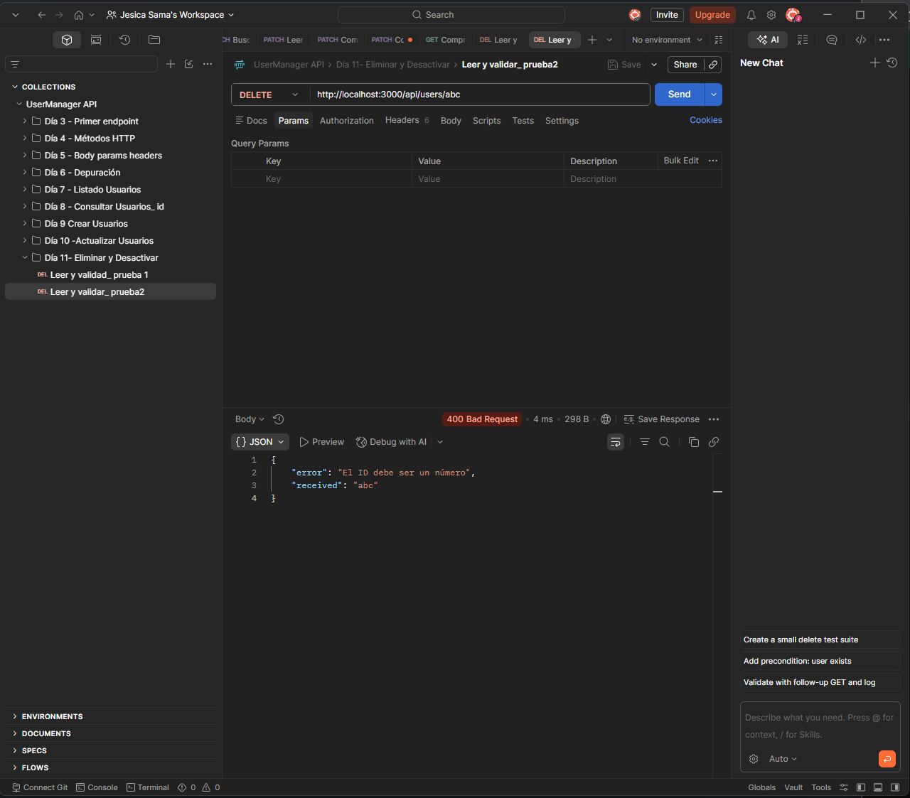
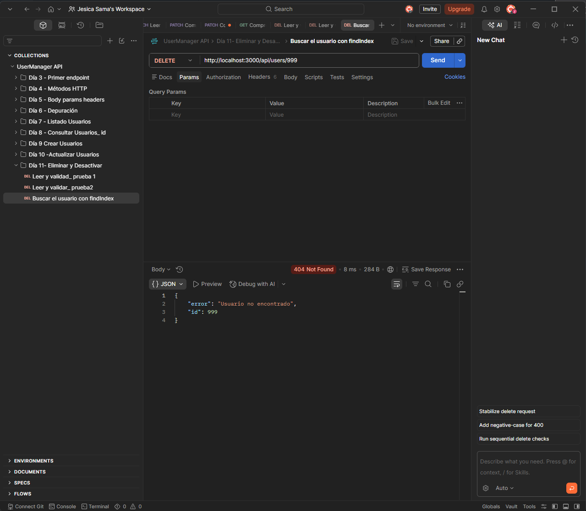

# Día 11: Eliminar o desactivar usuarios en memoria

## Objetivo del día

El objetivo del día 11 ha sido completar el CRUD básico de usuarios en memoria
mediante `DELETE /api/users/:id`.

En este proyecto, eliminar un usuario no significa borrarlo del array. La ruta
realiza un borrado lógico, conserva sus datos y cambia `isActive` a `false`.

## Qué he hecho

- He actualizado el endpoint `DELETE /api/users/:id`.
- He leído el ID desde `req.params`.
- He convertido y validado el ID.
- He localizado al usuario mediante `findIndex`.
- He comprobado que el usuario exista.
- He aplicado un borrado lógico con `isActive: false`.
- He actualizado automáticamente `updatedAt`.
- He sustituido el usuario dentro del array.
- He comprobado que el usuario sigue existiendo después de desactivarlo.
- He preparado pruebas para los casos correctos y los errores.

## Endpoint trabajado

```http
DELETE /api/users/:id
```

Ejemplo:

```http
DELETE /api/users/1
```

Esta petición no necesita body porque el ID del usuario se recibe en la URL.

## Funcionamiento

La ruta sigue estos pasos:

1. Lee el ID desde `req.params.id`.
2. Convierte el valor a número.
3. Devuelve `400` si el ID no es numérico.
4. Busca la posición del usuario con `findIndex`.
5. Devuelve `404` si el usuario no existe.
6. Copia los datos actuales del usuario.
7. Cambia `isActive` a `false`.
8. Genera una nueva fecha para `updatedAt`.
9. Sustituye el usuario en el array.
10. Devuelve el usuario desactivado con `200 OK`.

## Código trabajado

```ts
app.delete("/api/users/:id", (req, res) => {
  const idParam = req.params.id;
  const id = Number(idParam);

  if (Number.isNaN(id)) {
    return res.status(400).json({
      error: "El ID debe ser un número",
      received: idParam
    });
  }

  const userIndex = users.findIndex((user) => user.id === id);

  if (userIndex === -1) {
    return res.status(404).json({
      error: "Usuario no encontrado",
      id
    });
  }

  const currentUser = users[userIndex];

  const updatedUser: User = {
    ...currentUser,
    isActive: false,
    updatedAt: new Date().toISOString()
  };

  users[userIndex] = updatedUser;

  return res.status(200).json({
    message: "Usuario desactivado correctamente",
    data: updatedUser
  });
});
```

## Respuesta correcta

La desactivación devuelve `200 OK`:

```json
{
  "message": "Usuario desactivado correctamente",
  "data": {
    "id": 1,
    "name": "Ana García",
    "email": "ana@email.com",
    "role": "USER",
    "isActive": false,
    "createdAt": "2026-01-01T10:00:00.000Z",
    "updatedAt": "2026-01-01T12:00:00.000Z"
  }
}
```

Las fechas reales dependen del momento en que se inicia el servidor y se
desactiva el usuario.

## Casos probados

| Caso | Código esperado | Resultado |
| --- | ---: | --- |
| Desactivar usuario existente | 200 |  |
| ID no válido | 400 |  |
| Usuario inexistente | 404 |  |
| Consultar usuario desactivado | 200 |  |
| Consultar listado después de desactivar | 200 |  |

## Errores controlados

Si el ID no es numérico:

```json
{
  "error": "El ID debe ser un número",
  "received": "abc"
}
```

Si el usuario no existe:

```json
{
  "error": "Usuario no encontrado",
  "id": 999
}
```

## Borrado físico vs borrado lógico

El borrado físico elimina completamente el elemento del array. Después de esa
operación ya no sería posible consultar sus datos ni recuperar el usuario.

El borrado lógico mantiene el objeto y cambia un campo que representa su
estado:

```ts
isActive: false
```

En este proyecto se utiliza borrado lógico porque permite conservar la
información del usuario y evita pérdidas accidentales. En una aplicación real,
esos datos podrían estar relacionados con pedidos, comentarios, reservas o
registros de actividad.

| Borrado físico | Borrado lógico |
| --- | --- |
| Elimina el usuario del array | Conserva el usuario |
| Se pierden sus datos | Mantiene su información |
| Es difícil de recuperar | Puede reactivarse |
| Reduce el número de elementos | Cambia el estado del elemento |

## Comprobación del borrado lógico

Después de ejecutar:

```http
DELETE /api/users/1
```

La consulta siguiente continúa encontrando el usuario:

```http
GET /api/users/1
```

La diferencia es que ahora devuelve:

```json
{
  "isActive": false
}
```

El usuario también sigue apareciendo en el listado completo:

```http
GET /api/users
```

Sin embargo, ya no aparece entre los usuarios activos:

```http
GET /api/users/active
```

## Usuario ya desactivado

La implementación actual permite ejecutar `DELETE` sobre un usuario que ya está
inactivo. La operación vuelve a responder con `200 OK`, mantiene
`isActive: false` y genera un nuevo valor para `updatedAt`.

Más adelante se podría devolver un mensaje específico para distinguir este
caso, pero no es necesario para completar el ejercicio.

## Actualización de `updatedAt`

Aunque el usuario no se borre físicamente, su estado sí cambia. Por eso la API
actualiza la fecha:

```ts
updatedAt: new Date().toISOString()
```

Esto permite registrar cuándo se realizó la desactivación.

## Persistencia en memoria

La desactivación permanece mientras el servidor siga encendido. Al reiniciarlo,
el array vuelve al estado inicial definido en `src/server.ts`.

Cuando el proyecto utilice una base de datos, el estado inactivo podrá
conservarse incluso después de reiniciar el servidor.

## Explicación personal

Para desactivar un usuario primero se valida el ID y se busca su posición en el
array. En vez de eliminar el elemento, se crea una copia con `isActive: false`
y una nueva fecha en `updatedAt`. Después, esa copia sustituye al usuario
anterior en la misma posición.

Este borrado lógico permite que el usuario deje de estar operativo sin perder
su información. Así puede seguir consultándose, mantenerse como parte del
histórico y reactivarse en el futuro si fuera necesario.

## Resumen

En el día 11 se ha completado el CRUD básico de usuarios en memoria. El endpoint
`DELETE /api/users/:id` valida el ID, comprueba que el usuario exista y lo
desactiva mediante borrado lógico sin eliminarlo del array.