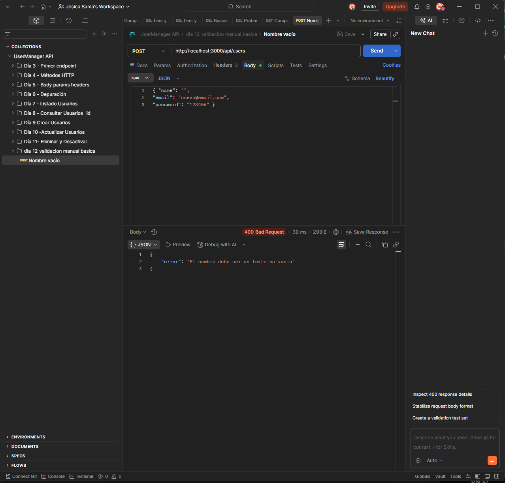
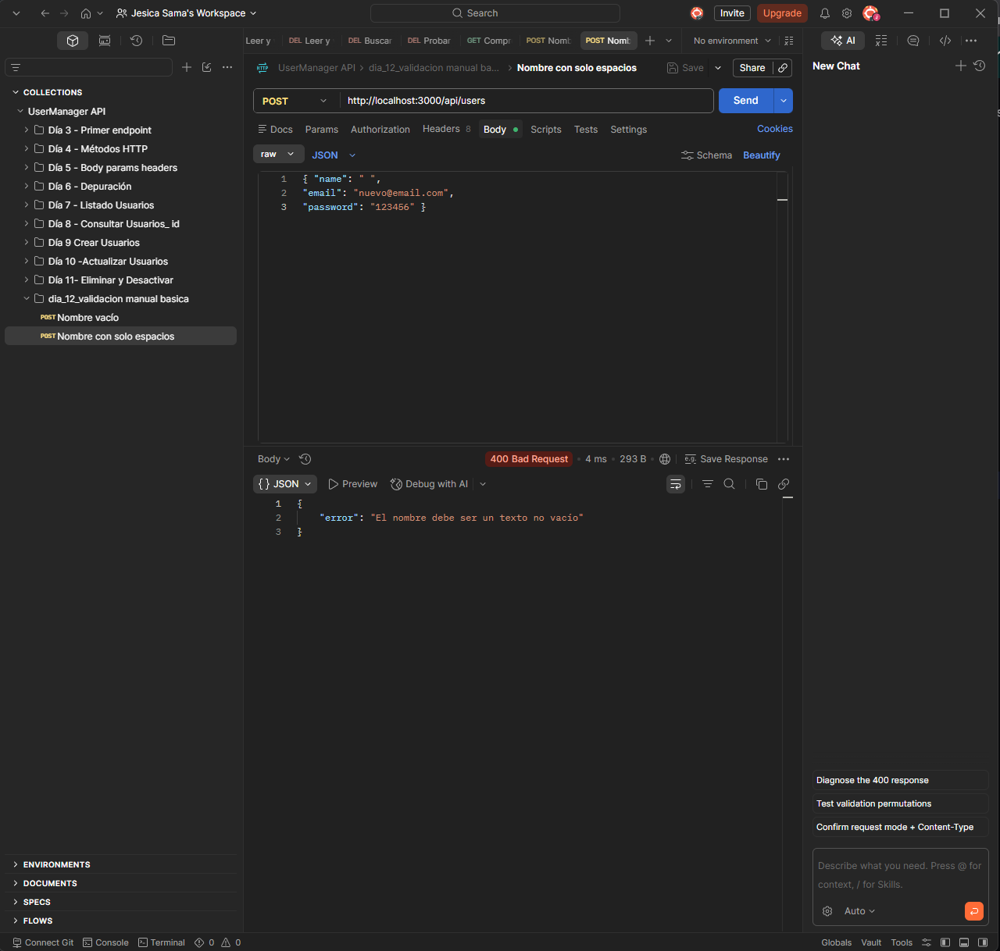
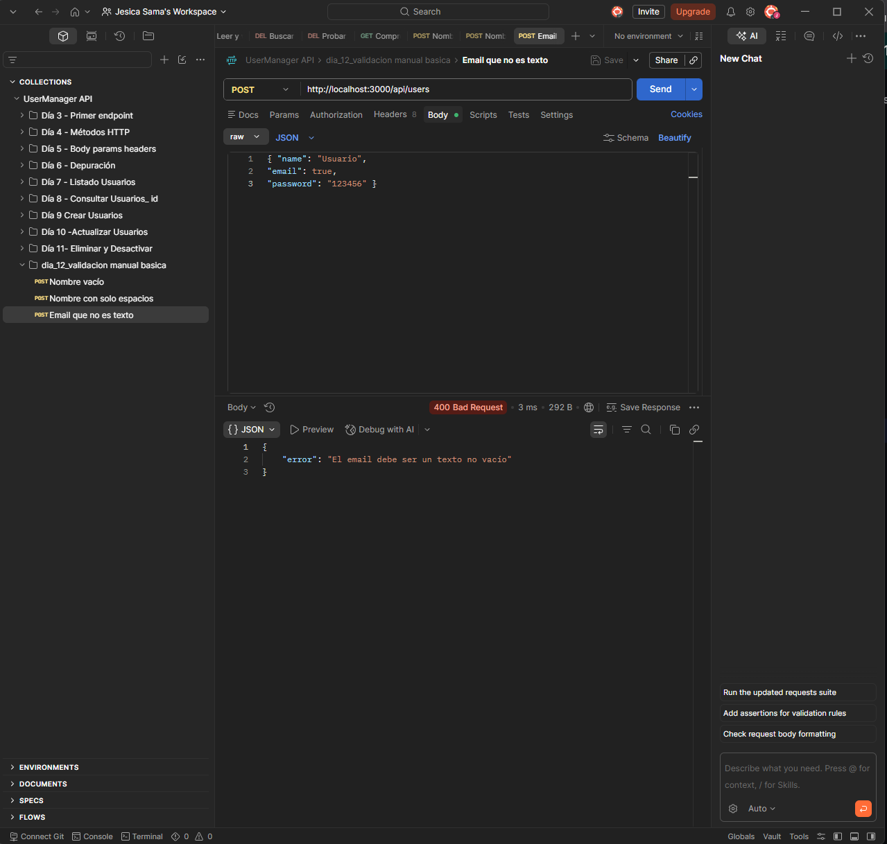
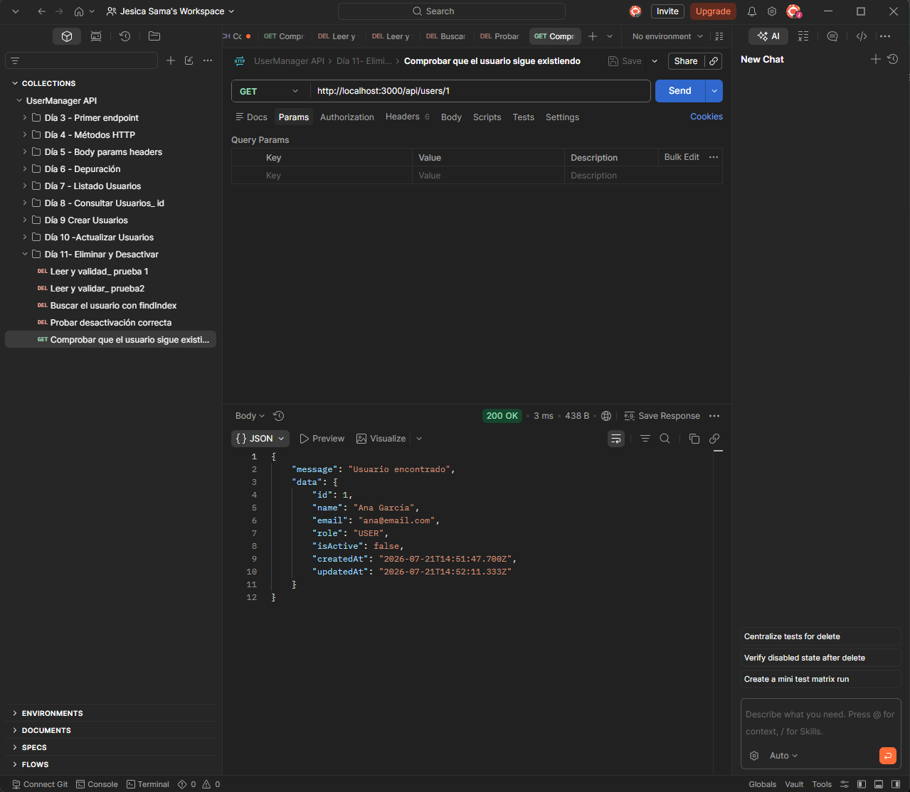
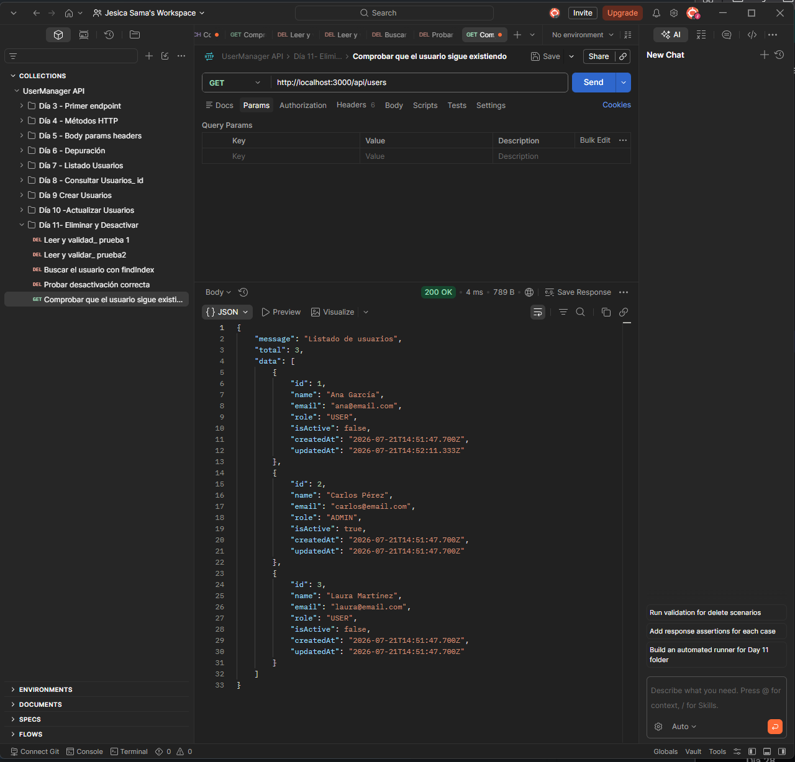
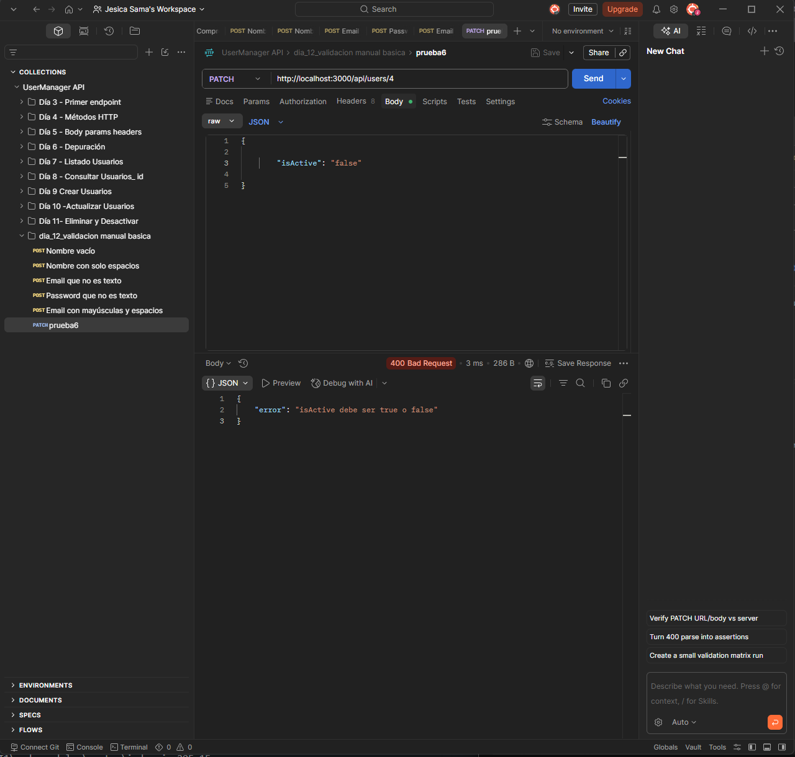

# Día 12: Validación manual básica

## Objetivo del día

El objetivo del día 12 ha sido mejorar la validación manual de los datos que
reciben las rutas de creación y actualización de usuarios. La API comprueba los
tipos, rechaza textos vacíos y normaliza los valores antes de modificar los
datos en memoria.

## Qué he hecho

- He revisado las validaciones existentes de `POST` y `PATCH`.
- He creado funciones auxiliares reutilizables.
- He validado que `name`, `email` y `password` sean strings no vacíos.
- He validado que `isActive` sea un booleano real.
- He limpiado `name`, `email` y `password` mediante `trim()`.
- He normalizado los emails a minúsculas.
- He comprobado la longitud mínima de la contraseña.
- He añadido una comprobación básica del formato del email.
- He mantenido el control de emails duplicados.
- He preparado peticiones para comprobar casos correctos e incorrectos.

## Funciones auxiliares

Las comprobaciones repetidas se han extraído a dos funciones:

```ts
function isNonEmptyString(value: unknown): value is string {
  return typeof value === "string" && value.trim().length > 0;
}

function isBoolean(value: unknown): value is boolean {
  return typeof value === "boolean";
}
```

`isNonEmptyString` comprueba simultáneamente el tipo del valor y que no quede
vacío después de eliminar sus espacios exteriores. `isBoolean` evita aceptar
textos como `"false"` cuando la API espera el booleano `false`.

## Validación al crear usuarios

La ruta trabajada es:

```http
POST /api/users
```

Los tres campos recibidos son obligatorios:

| Campo | Regla |
| --- | --- |
| `name` | String no vacío |
| `email` | String no vacío que contiene `@` |
| `password` | String no vacío de al menos 6 caracteres |

Después de validar los tipos, se preparan valores limpios:

```ts
const cleanName = name.trim();
const cleanEmail = email.trim().toLowerCase();
const cleanPassword = password.trim();
```

Así, una petición válida como esta:

```json
{
  "name": " Usuario Limpio ",
  "email": " USUARIO@EMAIL.COM ",
  "password": "123456"
}
```

crea un usuario con estos valores normalizados:

```json
{
  "name": "Usuario Limpio",
  "email": "usuario@email.com"
}
```

La contraseña se valida, pero todavía no se guarda ni se devuelve.

## Validación al actualizar usuarios

La ruta trabajada es:

```http
PATCH /api/users/:id
```

Una actualización es parcial, por lo que no exige todos los campos. Sin
embargo, debe recibir al menos uno de los campos modificables: `name`, `email`
o `isActive`.

Cuando llegan `name` o `email`, se comprueba que sean textos no vacíos y se
normalizan antes de guardarlos. Si llega `isActive`, su tipo debe ser
`boolean`; los strings `"true"` y `"false"` no son válidos.

## Errores de validación

| Error | Cuándo ocurre | Código |
| --- | --- | ---: |
| Nombre no válido | Falta, no es string o está vacío | 400 |
| Email no válido | Falta, no es string, está vacío o no contiene `@` | 400 |
| Contraseña no válida | Falta, no es string o está vacía | 400 |
| Contraseña corta | Tiene menos de 6 caracteres después de `trim()` | 400 |
| Body sin cambios | `PATCH` no recibe ningún campo modificable | 400 |
| `isActive` incorrecto | El valor recibido no es booleano | 400 |
| Email duplicado | Otro usuario ya utiliza el email normalizado | 409 |

Ejemplo de respuesta de validación:

```json
{
  "error": "El nombre debe ser un texto no vacío"
}
```

## Casos probados

Las peticiones están disponibles en `requests.http` bajo el bloque del día 12.

| Caso | Código esperado | Resultado esperado |
| --- | ---: | --- |
| Nombre vacío en `POST` | 400 | |
| Nombre con solo espacios en `POST` | 400 |  |
| Email no string en `POST` | 400 |  |
| Password no string en `POST` | 400 |  |
| Nombre y email con espacios | 201 |  |
| `isActive` como string en `PATCH` | 400 |  |

Las peticiones modifican un array en memoria. Para repetir todas las pruebas
desde el mismo estado inicial basta con reiniciar el servidor.

## ¿Por qué no debemos confiar en el cliente?

Aunque un frontend valide sus formularios, cualquier persona puede enviar una
petición directamente a la API mediante otro cliente HTTP. Además, una versión
antigua del frontend o un error de programación pueden producir datos
incorrectos.

La API es la última barrera antes de modificar la información y debe aplicar
siempre sus propias reglas. De este modo, todos los clientes reciben el mismo
comportamiento y los datos se mantienen coherentes.

## Explicación personal

Validar datos significa comprobar que lo recibido tiene el tipo y el formato
esperados antes de utilizarlo. En estas rutas, primero se rechazan los valores
incorrectos con una respuesta clara y después se limpian los valores válidos.
Esto evita guardar nombres vacíos, emails incoherentes o estados representados
con un tipo incorrecto.

## Resumen

En el día 12 se han reforzado `POST /api/users` y `PATCH /api/users/:id` con
validaciones manuales reutilizables. La API distingue los errores de entrada
con `400 Bad Request`, los conflictos por email duplicado con `409 Conflict` y
solo modifica los usuarios cuando los datos han superado todas las
comprobaciones.