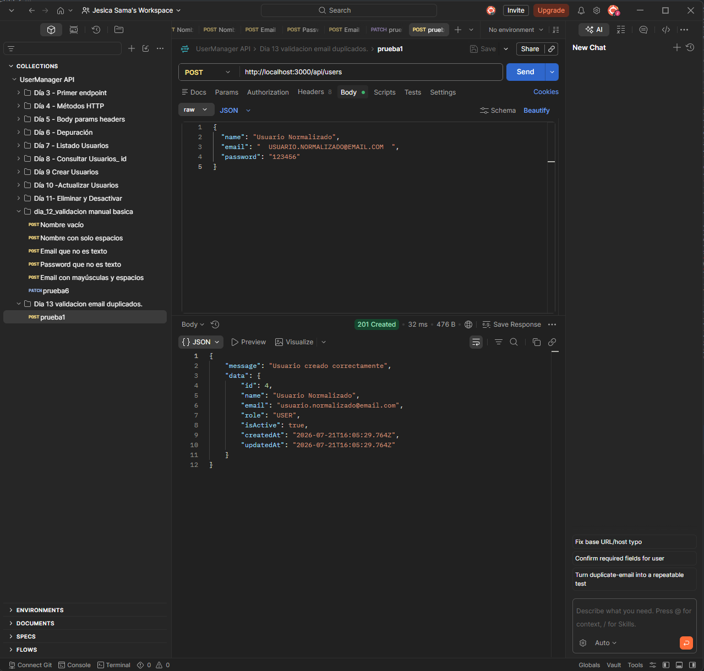
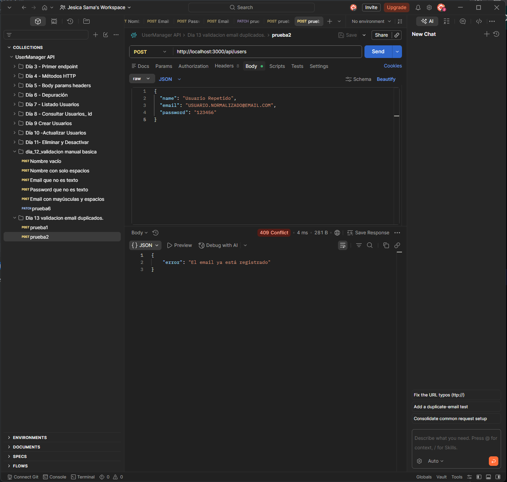
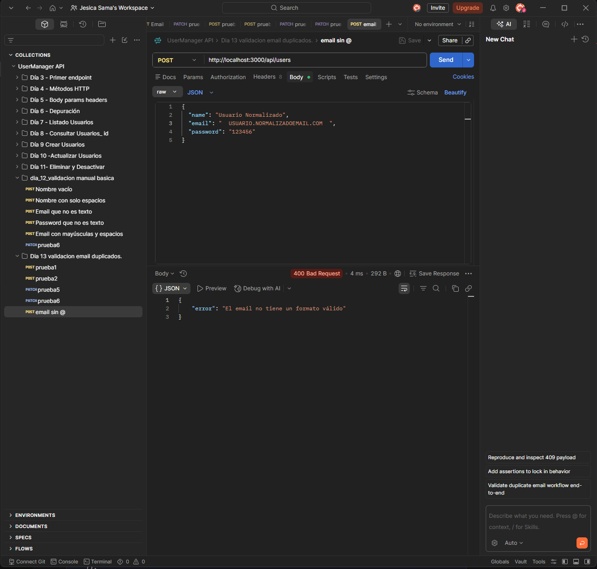
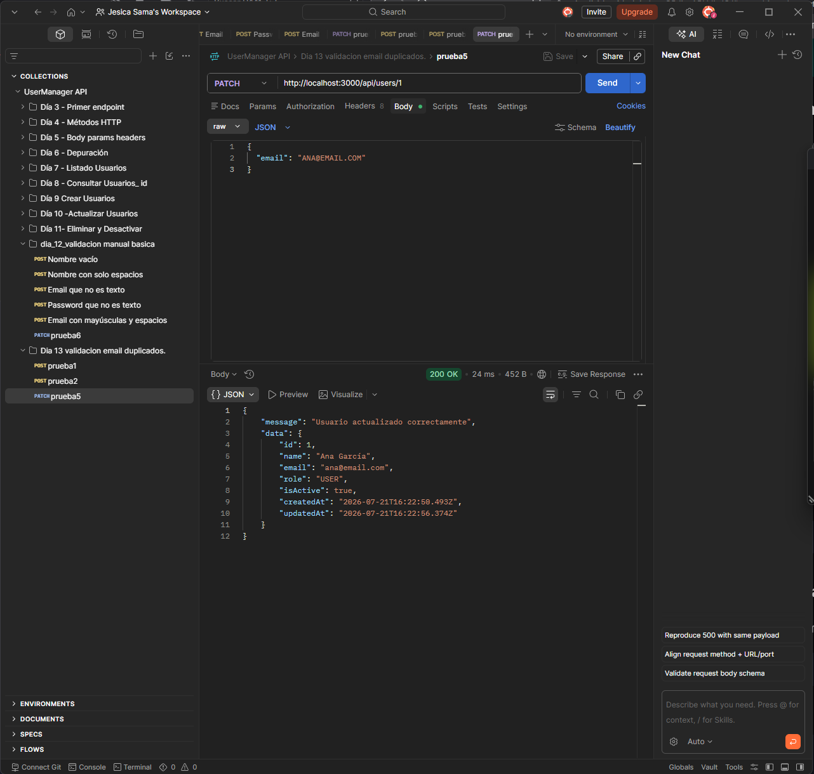

# Día 13: Validación de email y control de duplicados

## Objetivo del día

El objetivo del día 13 ha sido normalizar y validar los emails, además de
impedir que dos usuarios compartan la misma dirección. Las mismas reglas se
aplican al crear y al actualizar usuarios.

## Qué he hecho

- He creado una función para normalizar emails.
- He creado una función para validar su formato básico.
- He creado una función reutilizable para detectar emails ocupados.
- He aplicado la normalización antes de comparar o guardar un email.
- He mejorado la validación de `POST /api/users`.
- He mejorado la validación de `PATCH /api/users/:id`.
- He controlado duplicados provocados por espacios o mayúsculas.
- He permitido que un usuario conserve su propio email al actualizarse.
- He diferenciado los errores de formato `400` de los conflictos `409`.

## Funciones auxiliares

La lógica del email se ha separado en tres funciones:

```ts
function normalizeEmail(email: string): string {
  return email.trim().toLowerCase();
}

function isValidBasicEmail(value: string): boolean {
  return value.includes("@") && value.includes(".");
}

function isEmailTaken(email: string, userIdToIgnore?: number): boolean {
  const normalizedEmail = normalizeEmail(email);

  return users.some(
    (user) => user.email === normalizedEmail && user.id !== userIdToIgnore
  );
}
```

Cada función tiene una responsabilidad concreta: normalizar el valor, validar
su formato o buscar un duplicado.

## Normalización del email

Normalizar consiste en transformar el email a un formato común antes de
compararlo o guardarlo:

```text
"  Ana@Email.COM  " -> "ana@email.com"
```

Para ello se aplican dos operaciones:

1. `trim()` elimina los espacios del principio y del final.
2. `toLowerCase()` convierte todos los caracteres a minúsculas.

Gracias a esta normalización, `ana@email.com`, `ANA@EMAIL.COM` y
`"  Ana@Email.com  "` se consideran la misma dirección.

## Validación básica del formato

Después de comprobar que el valor sea un string no vacío y de normalizarlo, la
API exige que contenga un carácter `@` y un punto.

| Email | Resultado |
| --- | --- |
| `ana@email.com` | Válido |
| `usuario.prueba@gmail.com` | Válido |
| `anaemail.com` | No válido: falta `@` |
| `ana@email` | No válido: falta el punto |

Esta regla es intencionadamente sencilla. No pretende cubrir todos los casos
del estándar de email, sino rechazar formatos claramente incorrectos durante
esta fase del proyecto.

## Control de duplicados al crear

Antes de crear un usuario mediante:

```http
POST /api/users
```

la API normaliza el email y llama a `isEmailTaken(cleanEmail)`. Si otro usuario
ya tiene el mismo valor, la creación se detiene y devuelve:

```http
409 Conflict
```

```json
{
  "error": "El email ya está registrado"
}
```

Por tanto, crear primero `usuario@email.com` e intentar después crear
`USUARIO@EMAIL.COM` produce un conflicto.

## Control de duplicados al actualizar

En una actualización se debe excluir al propio usuario de la búsqueda:

```ts
isEmailTaken(cleanEmail, id);
```

Esto permite que el usuario 1 envíe otra vez su propio email, incluso con
espacios o mayúsculas. En cambio, si el usuario 2 intenta utilizar el email del
usuario 1, la API devuelve `409 Conflict`.

## Orden de las comprobaciones

La validación sigue este orden:

1. Comprobar que el valor sea un string no vacío.
2. Normalizar el email.
3. Comprobar el formato básico.
4. Buscar posibles duplicados.
5. Continuar con la creación o actualización.

Este orden evita buscar duplicados con valores que todavía no tienen un tipo o
formato válido.

## Códigos de respuesta

| Situación | Código | Motivo |
| --- | ---: | --- |
| Email válido y disponible al crear | 201 | Usuario creado |
| Email válido al actualizar | 200 | Usuario actualizado |
| Email vacío o con tipo incorrecto | 400 | Petición no válida |
| Email sin `@` o sin punto | 400 | Formato básico incorrecto |
| Email utilizado por otro usuario | 409 | Conflicto con los datos actuales |

## Casos probados

Las peticiones se encuentran en el bloque del Día 13 de `requests.http` y están
ordenadas para poder ejecutarlas de arriba abajo.

| Caso | Código esperado | Resultado |
| --- | ---: | --- |
| Crear usuario con email normalizado | 201 |  |
| Crear usuario con email duplicado | 409 |  |
| Crear usuario con email sin @ | 400 |  |
| Crear usuario con email sin punto | 400 |  |
| Actualizar usuario con su mismo email | 200 |  |
| Actualizar usuario con email de otro usuario | 409 |  |

Como los usuarios viven en memoria, es recomendable reiniciar el servidor
antes de ejecutar la secuencia completa.

## Explicación personal

Normalizar un email significa limpiarlo y transformarlo a una representación
común antes de guardarlo o compararlo. En este proyecto se eliminan los
espacios exteriores y se convierte el valor a minúsculas. Así se evita que una
misma dirección pueda registrarse varias veces por pequeñas diferencias de
escritura.

El código `400 Bad Request` indica que el email recibido no cumple el formato
esperado. El código `409 Conflict` indica algo distinto: el email tiene un
formato aceptable, pero ya está ocupado por otro usuario.

## Resumen

En el día 13 se ha centralizado la lógica del email mediante funciones
auxiliares reutilizables. La API normaliza los valores, aplica una validación
básica y evita duplicados tanto en creación como en actualización, manteniendo
los datos del array coherentes.