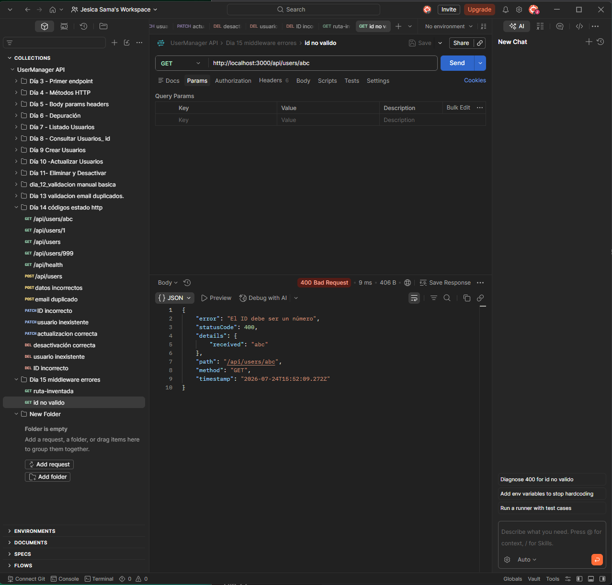
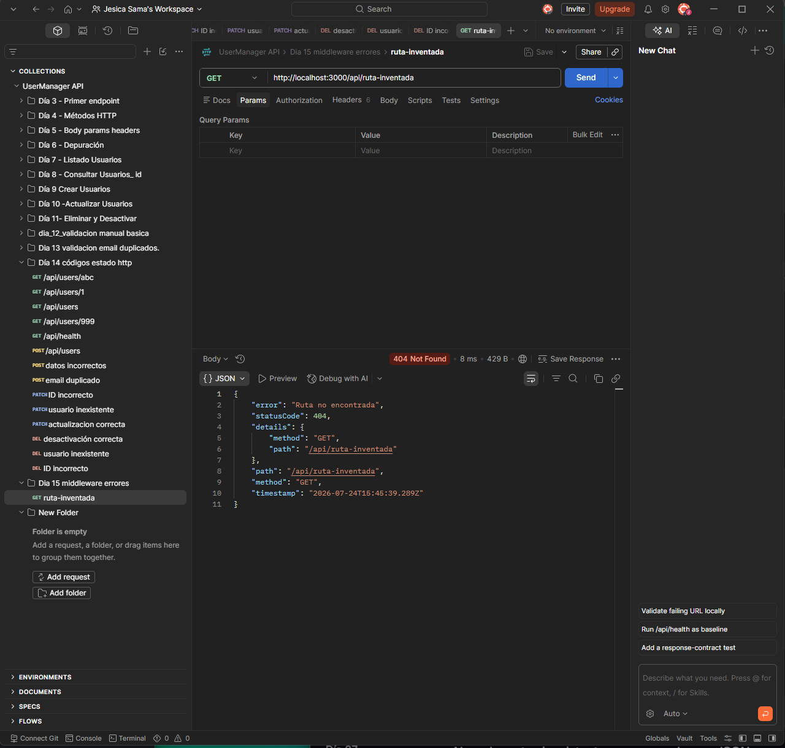

# Día 15: Middleware centralizado de errores

## Objetivo del día

El objetivo del día 15 ha sido centralizar la gestión de errores para que todos
los endpoints devuelvan una estructura JSON coherente. Para ello se utiliza un
error personalizado, un middleware para rutas inexistentes y un middleware
global de errores.

## Qué he hecho

- He aprendido qué es un middleware y para qué sirve `next()`.
- He creado la clase `AppError`.
- He creado un middleware para rutas no encontradas.
- He creado un middleware global de errores.
- He colocado los middlewares en el orden correcto.
- He adaptado `GET /api/users/:id` para delegar sus errores.
- He adaptado `POST`, `PATCH` y `DELETE` para usar el mismo sistema.
- He preparado pruebas para errores `400`, `404` y `500`.
- He documentado el formato común de las respuestas de error.

## Clase `AppError`

La clase personalizada almacena el mensaje, el código HTTP y detalles
opcionales sobre el problema:

```ts
class AppError extends Error {
  statusCode: number;
  details?: unknown;

  constructor(message: string, statusCode: number = 500, details?: unknown) {
    super(message);
    this.statusCode = statusCode;
    this.details = details;
  }
}
```

Por ejemplo, un ID incorrecto se representa así:

```ts
new AppError("El ID debe ser un número", 400, {
  received: idParam
});
```

## Delegación mediante `next()`

Una ruta detecta el problema, pero ya no necesita construir toda la respuesta:

```ts
if (Number.isNaN(id)) {
  return next(
    new AppError("El ID debe ser un número", 400, {
      received: idParam
    })
  );
}
```

Al recibir un error en `next(error)`, Express omite los manejadores normales y
continúa hasta el middleware de errores.

## Middleware de rutas no encontradas

Si ninguna ruta anterior responde, este middleware genera un error `404`:

```ts
function notFoundMiddleware(
  req: Request,
  res: Response,
  next: NextFunction
) {
  next(
    new AppError("Ruta no encontrada", 404, {
      method: req.method,
      path: req.originalUrl
    })
  );
}
```

Así, una petición a `GET /api/ruta-inventada` recibe JSON en lugar de la
respuesta predeterminada de Express.

## Middleware global de errores

El middleware global recibe cuatro parámetros, lo que permite a Express
reconocerlo como manejador de errores:

```ts
function errorMiddleware(
  err: AppError,
  req: Request,
  res: Response,
  _next: NextFunction
) {
  const statusCode = err.statusCode || 500;

  return res.status(statusCode).json({
    error: err.message || "Error interno del servidor",
    statusCode,
    details: err.details,
    path: req.originalUrl,
    method: req.method,
    timestamp: new Date().toISOString()
  });
}
```

El cuarto parámetro se llama `_next` porque Express lo necesita para identificar
el middleware, aunque la función no tenga que utilizarlo.

## Formato común de error

Todos los errores gestionados incluyen información suficiente para entender
qué ocurrió y en qué petición:

```json
{
  "error": "El ID debe ser un número",
  "statusCode": 400,
  "details": {
    "received": "abc"
  },
  "path": "/api/users/abc",
  "method": "GET",
  "timestamp": "2026-01-01T10:00:00.000Z"
}
```

| Campo | Significado |
| --- | --- |
| `error` | Mensaje principal del problema |
| `statusCode` | Código HTTP que se devuelve |
| `details` | Información adicional opcional |
| `path` | Ruta que originó el error |
| `method` | Método HTTP utilizado |
| `timestamp` | Momento en que se generó la respuesta |

## Errores controlados e inesperados

Los errores controlados representan situaciones previstas por la aplicación:
un ID incorrecto, un usuario inexistente o un email duplicado. Se crean con
`AppError` y conservan su código `400`, `404` o `409`.

Un error inesperado es un fallo interno no previsto. Si no aporta un
`statusCode`, el middleware utiliza `500 Internal Server Error` como valor
predeterminado.

## Casos de prueba

Las peticiones están disponibles en el bloque del Día 15 de `requests.http`.

| Petición | Caso | Código esperado | Resultado esperado |
| --- | --- | ---: | --- |
| `GET /api/users/1` | Usuario existente | 200 |  |
| `GET /api/users/abc` | ID no válido | 400 |  |
| `GET /api/users/999` | Usuario inexistente | 404 |  |
| `GET /api/ruta-inventada` | Ruta inexistente | 404 |  |
| `GET /api/debug/error` | Error interno de prueba | 500 |  |

La ruta temporal `/api/debug/error` debe estar registrada antes del middleware
404 para que la última prueba genere el `500` esperado.

## Orden de middlewares

El orden correcto al final del servidor es:

```ts
app.use(notFoundMiddleware);
app.use(errorMiddleware);

app.listen(PORT, () => {
  console.log(`Servidor escuchando en http://localhost:${PORT}`);
});
```

El middleware 404 debe ir después de todas las rutas porque solo debe ejecutarse
cuando ninguna de ellas coincide. Si estuviera antes, interceptaría peticiones
válidas antes de que alcanzaran su endpoint.

El middleware global va después del middleware 404 para poder procesar tanto
los errores enviados desde las rutas como el `AppError` que representa una ruta
inexistente.

## Ventajas de centralizar errores

- Todas las rutas utilizan el mismo formato de respuesta.
- Se reduce el código repetido en los endpoints.
- La lógica normal queda separada de la construcción de errores.
- Los clientes pueden procesar las respuestas de forma predecible.
- Resulta más sencillo añadir registros o cambiar el formato en el futuro.

## Explicación personal

Un middleware de errores concentra en un único lugar la forma en que la API
responde cuando ocurre un problema. Las rutas siguen siendo responsables de
detectar el error, pero lo describen con `AppError` y lo delegan mediante
`next()`.

Esta separación hace que el código sea más fácil de mantener y evita que cada
endpoint invente una estructura distinta. Además, el middleware 404 garantiza
que incluso una ruta inexistente respete el contrato JSON de la API.

## Resumen

En el día 15 se ha creado una primera gestión centralizada de errores. Las
rutas delegan errores controlados mediante `AppError`, las rutas inexistentes
se convierten en errores `404` y el middleware global construye una respuesta
uniforme con código, detalles y contexto de la petición.