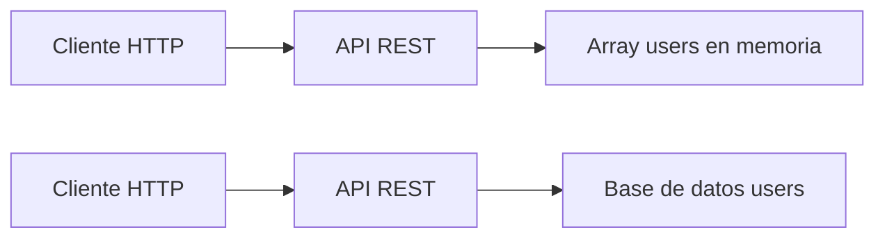

# Día 16: Base de datos y persistencia

## Objetivo del día

El objetivo del día 16 ha sido entender por qué los datos en memoria no son
suficientes para una aplicación real y diseñar la tabla `users` que utilizaremos
cuando conectemos la API a una base de datos.

## Qué he hecho

- He comprobado que los datos en memoria se pierden al reiniciar el servidor.
- He entendido qué significa persistencia.
- He comparado el almacenamiento en memoria con una base de datos.
- He diseñado los campos de la futura tabla `users`.
- He definido sus tipos conceptuales y restricciones.
- He traducido los nombres de TypeScript a nombres propios de SQL.
- He escrito una primera propuesta SQL conceptual.
- He analizado cómo cambiará la arquitectura sin afectar al cliente.

## Problema detectado

Actualmente los usuarios se almacenan en el array `users` dentro del proceso de
Node.js. Para comprobar su limitación he seguido estos pasos:

1. He arrancado la API con `npm run dev`.
2. He creado un usuario mediante `POST /api/users`.
3. He confirmado que aparecía en `GET /api/users`.
4. He detenido y vuelto a arrancar el servidor.
5. He consultado de nuevo el listado.

El usuario creado había desaparecido. Al iniciar otra vez la aplicación, el
array recupera únicamente sus valores iniciales porque la memoria del proceso
anterior ya no existe.

## ¿Qué es la persistencia?

Persistencia significa que los datos se conservan aunque la aplicación se
detenga o se reinicie. Una base de datos almacena la información fuera del
proceso de Node.js, por lo que la API puede recuperarla cuando vuelve a arrancar.

El flujo actual es:

```text
Cliente HTTP -> API REST -> Array users en memoria
```

El flujo futuro será:

```text
Cliente HTTP -> API REST -> Base de datos -> Tabla users
```

## Memoria frente a base de datos

| Aspecto | Memoria | Base de datos |
| --- | --- | --- |
| ¿Los datos se conservan al reiniciar? | No | Sí |
| ¿Sirve para pruebas iniciales? | Sí | Sí, aunque requiere más preparación |
| ¿Sirve para una aplicación real? | No como almacenamiento principal | Sí |
| ¿Permite trabajar con muchos datos? | De forma muy limitada | Sí |
| ¿Permite consultas avanzadas? | Requiere programarlas en la aplicación | Sí |
| ¿Permite restricciones como `UNIQUE`? | No de forma nativa | Sí |
| ¿Facilita copias de seguridad? | No | Sí |

El array ha sido útil para aprender el comportamiento del CRUD rápidamente. La
base de datos añadirá durabilidad, consultas, restricciones y una gestión más
segura de la información.

## Diseño de la tabla `users`

En TypeScript es habitual utilizar `camelCase`, mientras que en una base de
datos SQL suele utilizarse `snake_case`. El modelo se traducirá así:

| Campo TypeScript | Campo en base de datos | Tipo conceptual | Descripción |
| --- | --- | --- | --- |
| `id` | `id` | número | Identificador único |
| `name` | `name` | texto | Nombre del usuario |
| `email` | `email` | texto | Email normalizado y único |
| `passwordHash` | `password_hash` | texto | Contraseña hasheada |
| `role` | `role` | texto | Rol `USER` o `ADMIN` |
| `isActive` | `is_active` | booleano | Estado del usuario |
| `createdAt` | `created_at` | fecha | Fecha de creación |
| `updatedAt` | `updated_at` | fecha | Fecha de última modificación |

`password_hash` almacenará un hash, nunca la contraseña en texto plano, y no se
incluirá en las respuestas enviadas al cliente.

## Restricciones

Las restricciones permiten que la propia base de datos refuerce algunas reglas
que también valida la API.

| Campo | Restricción | Motivo |
| --- | --- | --- |
| `id` | `PRIMARY KEY` | Identifica cada usuario de forma única |
| `name` | `NOT NULL` | Todo usuario debe tener nombre |
| `email` | `NOT NULL`, `UNIQUE` | Es obligatorio y no puede repetirse |
| `password_hash` | `NOT NULL` | Todo usuario necesita credenciales |
| `role` | `NOT NULL` | Todo usuario debe tener un rol |
| `is_active` | `NOT NULL`, `DEFAULT true` | Todo usuario debe tener un estado |
| `created_at` | `NOT NULL` | Debe registrarse cuándo se creó |
| `updated_at` | `NOT NULL` | Debe registrarse cuándo se modificó |

La restricción `UNIQUE` sobre `email` aporta una segunda capa de protección ante
duplicados, incluso si dos peticiones superasen la validación de la API casi al
mismo tiempo.

## Dibujar el cambio de arquitectura



## Propuesta SQL conceptual

Una primera representación de este diseño podría ser:

```sql
CREATE TABLE users (
  id SERIAL PRIMARY KEY,
  name VARCHAR(100) NOT NULL,
  email VARCHAR(150) NOT NULL UNIQUE,
  password_hash VARCHAR(255) NOT NULL,
  role VARCHAR(20) NOT NULL,
  is_active BOOLEAN NOT NULL DEFAULT true,
  created_at TIMESTAMP NOT NULL DEFAULT CURRENT_TIMESTAMP,
  updated_at TIMESTAMP NOT NULL DEFAULT CURRENT_TIMESTAMP
);
```

Esta sentencia todavía es conceptual. En los próximos días se elegirá y
configurará la base de datos antes de crear la tabla real.

## Posible mejora del modelo

Un campo útil para una versión posterior sería `last_login_at`:

| Campo | Tipo conceptual | Obligatorio | Utilidad |
| --- | --- | --- | --- |
| `last_login_at` | fecha | No | Registrar el último inicio de sesión correcto |

Debe ser opcional porque un usuario recién registrado todavía no habrá iniciado
sesión. Serviría para mostrar actividad reciente o detectar cuentas inactivas.

## Independencia entre API y base de datos

El cliente consume rutas como `GET /api/users` y recibe JSON. No necesita saber
si internamente los usuarios proceden de un array, PostgreSQL, MySQL u otro
sistema.

Mientras la API mantenga los mismos endpoints, códigos HTTP y estructuras de
respuesta, el origen de los datos puede cambiar sin obligar a modificar el
frontend, Postman o una aplicación móvil. La API actúa como una capa intermedia
que protege la base de datos y conserva un contrato estable para sus clientes.

## Resumen

Los datos en memoria son apropiados para aprender y hacer pruebas, pero se
pierden al reiniciar el servidor. Una base de datos permitirá conservarlos,
consultarlos y aplicar restricciones. Como preparación, se ha diseñado la tabla
`users`, se han definido sus reglas y se ha escrito una propuesta SQL inicial.

El siguiente cambio afectará al origen interno de los datos, no al contrato que
la API ofrece a sus clientes.