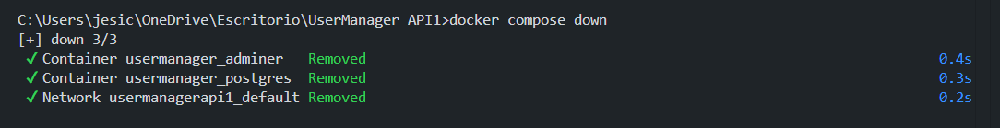
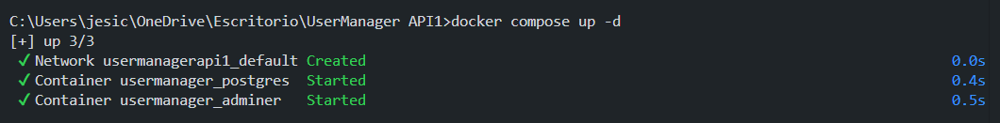
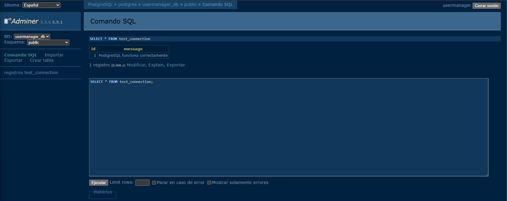
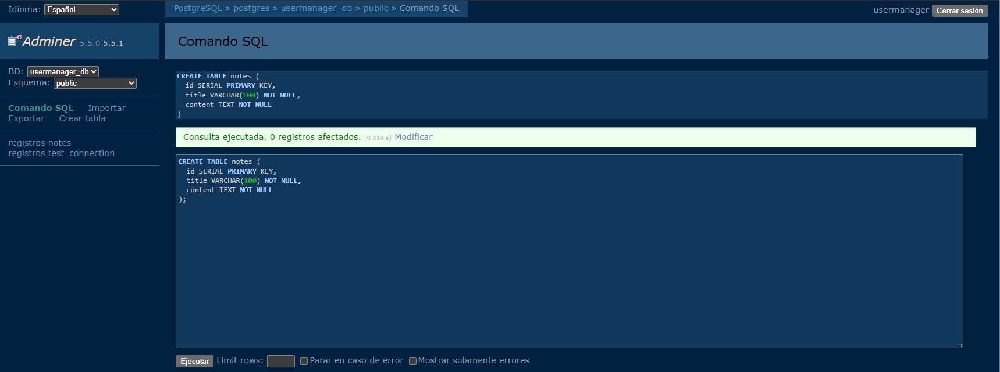
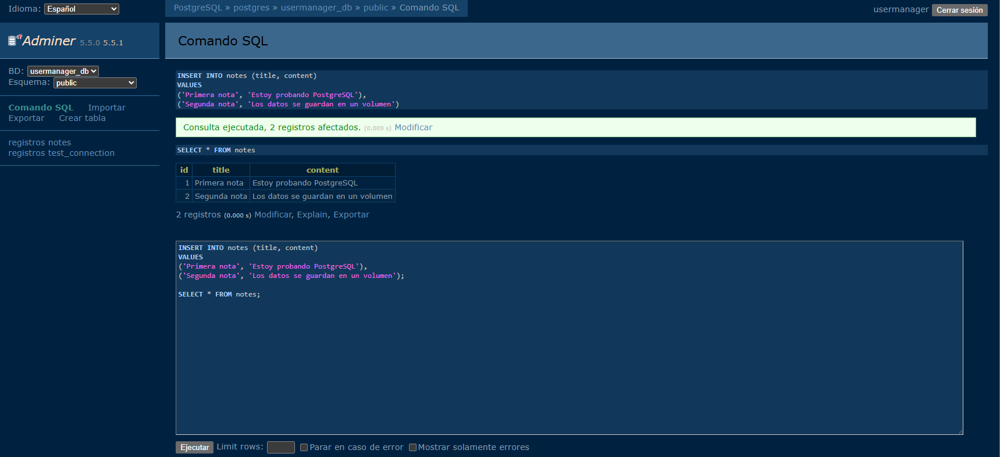
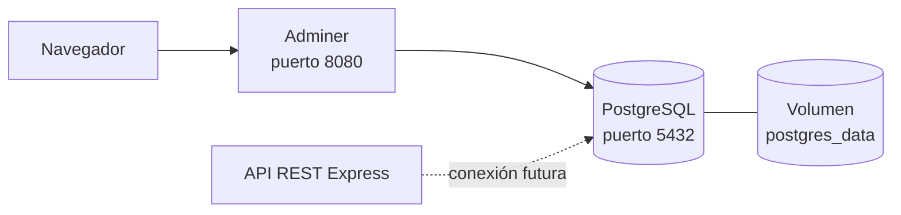

# Día 17: PostgreSQL con Docker Compose

## Objetivo del día

El objetivo del día 17 ha sido preparar el entorno de persistencia del proyecto
levantando PostgreSQL y Adminer con Docker Compose. La API todavía no se conecta
a la base de datos; esa integración se realizará más adelante.

## Qué he hecho

- He comprobado que Docker y Docker Compose están disponibles.
- He preparado el archivo `docker-compose.yml`.
- He levantado PostgreSQL y Adminer en contenedores separados.
- He comprobado que ambos servicios están en ejecución.
- He accedido a PostgreSQL con las credenciales configuradas.
- He creado y consultado una tabla de prueba.
- He preparado un volumen para conservar los datos.
- He aprendido la diferencia entre detener contenedores y borrar volúmenes.

## Servicios creados

| Servicio | Imagen | Puerto | Función |
| --- | --- | ---: | --- |
| `postgres` | `postgres:16` | 5432 | Base de datos PostgreSQL |
| `adminer` | `adminer:latest` | 8080 | Interfaz web para consultar la base de datos |

Los contenedores se llaman `usermanager_postgres` y `usermanager_adminer`. La
interfaz de Adminer está disponible en `http://localhost:8080`.

## Datos de conexión

Para conectar Adminer con PostgreSQL se utilizan estos valores:

| Campo | Valor |
| --- | --- |
| Sistema | PostgreSQL |
| Servidor | `postgres` |
| Usuario | `usermanager` |
| Contraseña | `usermanager_password` |
| Base de datos | `usermanager_db` |

El servidor es `postgres` porque los contenedores de un mismo proyecto de
Docker Compose pueden comunicarse utilizando el nombre del servicio. Desde el
ordenador anfitrión, PostgreSQL está expuesto en `localhost:5432`.

## Explicación del `docker-compose.yml`

El archivo contiene estas piezas principales:

| Elemento | Función |
| --- | --- |
| `services` | Agrupa los contenedores que forman el entorno |
| `image` | Indica la plantilla utilizada para crear cada contenedor |
| `container_name` | Asigna un nombre reconocible al contenedor |
| `restart` | Define cuándo debe reiniciarse automáticamente el servicio |
| `environment` | Configura usuario, contraseña y base de datos inicial |
| `ports` | Publica un puerto del contenedor en el ordenador anfitrión |
| `volumes` | Guarda los archivos de PostgreSQL fuera del contenedor |
| `depends_on` | Hace que Compose inicie PostgreSQL antes que Adminer |

El volumen `postgres_data` se monta en `/var/lib/postgresql/data`, la ubicación
en la que PostgreSQL guarda sus datos dentro del contenedor.

## Comandos utilizados

```bash
docker --version
docker compose version
docker compose up -d
docker compose ps
docker compose logs
docker compose down
```

| Comando | Resultado |
| --- | --- |
| `docker compose up -d` | Crea e inicia los servicios en segundo plano |
| `docker compose ps` | Muestra el estado de los servicios del proyecto |
| `docker compose logs` | Muestra los registros de los contenedores |
| `docker compose down` | Elimina los contenedores y conserva el volumen |
| `docker compose down -v` | Elimina también los volúmenes y sus datos |

## Prueba de conexión

Para comprobar el funcionamiento de PostgreSQL se ha utilizado una tabla
temporal:

```sql
CREATE TABLE test_connection (
  id SERIAL PRIMARY KEY,
  message VARCHAR(100) NOT NULL
);

INSERT INTO test_connection (message)
VALUES ('PostgreSQL funciona correctamente');

SELECT * FROM test_connection;
```

El resultado de la consulta es:

| id | message |
| ---: | --- |
| 1 | PostgreSQL funciona correctamente |

Esto confirma que PostgreSQL acepta conexiones, permite crear tablas y conserva
registros. La tabla es únicamente de prueba; la tabla real `users` se creará en
una fase posterior.

## Prueba de persistencia

La persistencia del volumen se comprueba con esta secuencia:

```bash
docker compose down
docker compose up -d
```


Después de recrear los contenedores, se vuelve a ejecutar:

```sql
SELECT * FROM test_connection;
```



Si el registro continúa disponible, PostgreSQL lo ha recuperado desde el
volumen `postgres_data`. Los contenedores pueden desaparecer, pero el volumen
tiene un ciclo de vida independiente y mantiene los archivos de la base de
datos.

No se debe confundir `docker compose down` con `docker compose down -v`. La
opción `-v` elimina también `postgres_data`, por lo que se perderían las tablas y
los registros guardados. No es necesario ejecutar ese comando para completar
la prueba.

## Práctica adicional: tabla `notes`

Como ejercicio posterior se puede crear una segunda tabla e insertar dos notas:

```sql
CREATE TABLE notes (
  id SERIAL PRIMARY KEY,
  title VARCHAR(100) NOT NULL,
  content TEXT NOT NULL
);

INSERT INTO notes (title, content)
VALUES
  ('Primera nota', 'Estoy probando PostgreSQL'),
  ('Segunda nota', 'Los datos se guardan en un volumen');

SELECT * FROM notes;
```




Esta práctica es opcional y no forma parte del modelo definitivo de la API.

## Arquitectura del día 17



- **Adminer** permite administrar visualmente la base de datos desde el
  navegador.
- **PostgreSQL** ejecuta la base de datos relacional del proyecto.
- **`postgres_data`** conserva físicamente los datos fuera del ciclo de vida del
  contenedor.
- **La API REST** todavía trabaja con el array en memoria y se conectará a
  PostgreSQL en los próximos días.

## Explicación personal

Docker Compose permite describir y levantar todos los servicios del entorno con
un único archivo. Esto evita instalar PostgreSQL directamente, hace que la
configuración sea reproducible y facilita arrancarla o detenerla.

El volumen es la pieza que aporta persistencia: el contenedor ejecuta
PostgreSQL, pero los archivos de la base de datos se conservan de forma
independiente. Adminer ofrece una manera sencilla de inspeccionar esos datos
mientras se prepara la futura conexión con Express.

## Resumen

El proyecto ya dispone de PostgreSQL y Adminer funcionando mediante Docker
Compose. Se ha verificado la conexión con `test_connection` y se ha configurado
`postgres_data` para conservar la información. El siguiente paso será crear el
modelo real de usuarios y conectar la API a PostgreSQL.