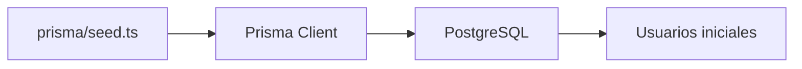

# Día 24 - Seed de datos iniciales

## Qué he hecho

- He creado el archivo prisma/seed.ts.
- He usado Prisma Client dentro del seed.
- He creado un usuario ADMIN inicial.
- He creado un usuario USER activo.
- He creado un usuario USER inactivo.
- He usado upsert para evitar duplicados.
- He configurado el comando de seed.
- He ejecutado prisma db seed.
- He comprobado los datos con Prisma Studio.
- He ejecutado el seed más de una vez para comprobar que no duplica usuarios.

## Comando principal

```bash
npx prisma db seed
```

O mediante script:

```bash
npm run prisma:seed
```

## Usuarios creados

| Nombre | Email | Role | Activo |
| --- | --- | --- |---|
| Admin Principal | admin@email.com | ADMIN | sí |
| Usuario Demo | user@email.com | USER | sí |
| Usuario Inactivo | inactive@email.com | USER | no |

## Archivo creado

```text
prisma/seed.ts
```

## Explicación de upsert

`upsert` permite crear un registro si no existe o actualizarlo si ya existe.

En este seed se usa para que los usuarios iniciales no se dupliquen aunque ejecutemos el comando varias veces.

## Nota sobre passwordHash

De momento se usan valores temporales como:

```text
hash_temporal_admin123
```

Más adelante, en la fase de seguridad, estos valores se sustituirán por hashes reales generados con bcrypt.

## Diagrama Mermaid


El archivo seed.ts usa Prisma Client para insertar usuarios iniciales en PostgreSQL. Después podemos comprobarlos con Prisma Studio.

Creación de seed:

 

Comprobación de seed en prisma y postgres:

 
