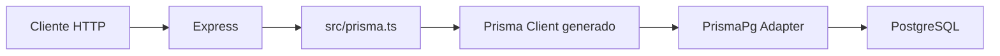

# Día 25 - Consultas básicas con Prisma Client

## Qué he hecho

- He comprobado que PostgreSQL está funcionando.
- He ejecutado el seed del día 24.
- He generado Prisma Client.
- He creado src/prisma.ts.
- He configurado Prisma Client con PrismaPg.
- He importado el cliente generado desde src/generated/prisma/client.
- He creado rutas temporales de debug.
- He consultado usuarios con findMany.
- He consultado usuarios activos con where.
- He buscado usuarios por ID con findUnique.
- He creado usuarios con prisma.user.create.
- He usado select para no devolver passwordHash.
- He comprobado los datos con Prisma Studio.
- He ejecutado npm run build.

## Rutas creadas

| Método | Ruta | Acción |
| --- | --- |---|
| GET | `/api/debug/prisma/users` |  |
| GET | `/api/debug/prisma/users-active` |  |
| GET | `/api/debug/prisma/users/:id` |  |
| POST | `/api/debug/prisma/users` |  |

## Archivo creado

```text
src/prisma.ts
```

## Configuración usada

```ts
import "dotenv/config";
import { PrismaPg } from "@prisma/adapter-pg";
import { PrismaClient } from "./generated/prisma/client";

const connectionString = process.env.DATABASE_URL;

if (!connectionString) {
  throw new Error("DATABASE_URL no está configurada");
}

const adapter = new PrismaPg({
  connectionString
});

export const prisma = new PrismaClient({ adapter });
```

## Selector seguro

```ts
const userSafeSelect = {
  id: true,
  name: true,
  email: true,
  role: true,
  isActive: true,
  createdAt: true,
  updatedAt: true
} as const;
```

## Regla importante

```text
passwordHash no debe devolverse en las respuestas de la API.
```

## Consultas trabajadas

```text
findMany
findUnique
create
where
select
orderBy
```

## Explicación personal

Hoy la API ha empezado a comunicarse con PostgreSQL mediante Prisma Client. Las rutas creadas son temporales y sirven para comprobar que Express puede leer y crear usuarios reales en la base de datos.

## Diagrama Mermaid



La API usa una instancia compartida de Prisma Client configurada con el adapter de PostgreSQL. Las rutas de Express llaman a Prisma y Prisma consulta la base de datos.

## Añadir comparacion con el GRUD en memoria

## Antes y después

| Antes | Ahora |
| --- | --- |
| Los usuarios estaban en un array | Los usuarios están en PostgreSQL |
| Al reiniciar se perdían los datos | Los datos persisten |
| Se usaba `users.find(...)` | Se usa `prisma.user.findUnique(...)` |
| Se usaba `users.push(...)` | Se usa `prisma.user.create(...)` |
| No había base de datos real | Prisma consulta PostgreSQL |