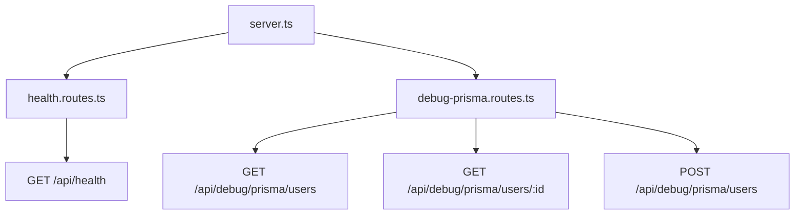

# Día 26 - Separar rutas

## Qué he hecho

- He empezado la fase de arquitectura por capas.
- He creado la carpeta src/routes.
- He creado health.routes.ts.
- He movido la ruta GET /api/health fuera de server.ts.
- He creado debug-prisma.routes.ts.
- He movido las rutas temporales de Prisma fuera de server.ts.
- He montado los routers usando app.use.
- He comprobado que las rutas siguen funcionando.
- He dejado server.ts más limpio.

## Archivos creados

```text
src/routes/health.routes.ts
src/routes/debug-prisma.routes.ts
```

## Estructura actual

```text
src/
  prisma.ts
  server.ts
  routes/
    health.routes.ts
    debug-prisma.routes.ts
```

## Rutas montadas

| Router | Prefijo en server.ts | Ruta interna | Ruta final |
|---|---|---|---|
| healthRouter | `/api/health` | `/` | `/api/health` |
| debugPrismaRouter | `/api/debug/prisma` | `/users` | `/api/debug/prisma/users` |
| debugPrismaRouter | `/api/debug/prisma` | `/users/:id` | `/api/debug/prisma/users/:id` |
| debugPrismaRouter | `/api/debug/prisma` | `/users-active` | `/api/debug/prisma/users-active` |

## Explicación personal

Separar rutas permite que server.ts no tenga toda la lógica de la API. A partir de ahora, server.ts se encarga de configurar la aplicación y montar routers, mientras que los archivos de routes agrupan endpoints relacionados.

## Diagrama



server.ts ya no define todas las rutas directamente. Ahora monta routers separados, y cada router agrupa rutas relacionadas.