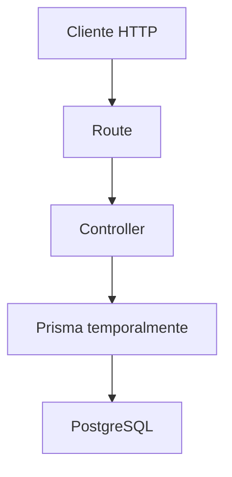

# Día 27 - Controladores

## Qué he hecho

- He creado la carpeta src/controllers.
- He creado health.controller.ts.
- He movido la lógica de GET /api/health a getHealth.
- He creado user.controller.ts.
- He movido la lógica de usuarios a funciones controladoras.
- He simplificado health.routes.ts.
- He simplificado debug-prisma.routes.ts.
- He comprobado que las rutas siguen funcionando.
- He comprobado que los datos siguen llegando a PostgreSQL mediante Prisma.

## Archivos creados

```text
src/controllers/health.controller.ts
src/controllers/user.controller.ts
```

## Estructura actual

```text
src/
  prisma.ts
  server.ts
  routes/
    health.routes.ts
    debug-prisma.routes.ts
  controllers/
    health.controller.ts
    user.controller.ts
```

## Controladores creados

| Controlador | Función |
| --- | --- |
| `getHealth` | Devuelve el estado de la API |
| `getUsers` | Lista usuarios |
| `getActiveUsers` | Lista usuarios activos |
| `getUserById` | Busca un usuario por ID |
| `createDebugUser` | Crea un usuario temporal con Prisma |

## Antes y después

Antes:

```ts
debugPrismaRouter.get("/users", async (req, res, next) => {
  // lógica completa aquí
});
```

Después:

```ts
debugPrismaRouter.get("/users", getUsers);
```

## Explicación personal

Los controladores permiten separar la definición de rutas de la lógica que responde a cada petición. Esto hace que los archivos de rutas sean más fáciles de leer y prepara el proyecto para añadir servicios y repositorios.

## Diagrama



En este día el controlador todavía usa Prisma directamente. En los próximos días se añadirá una capa de servicio y una capa de repositorio para separar mejor las responsabilidades.
