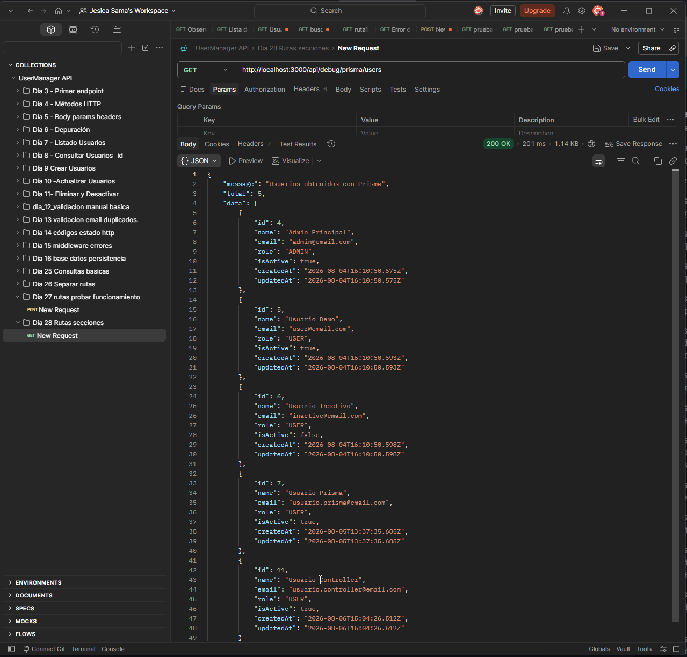
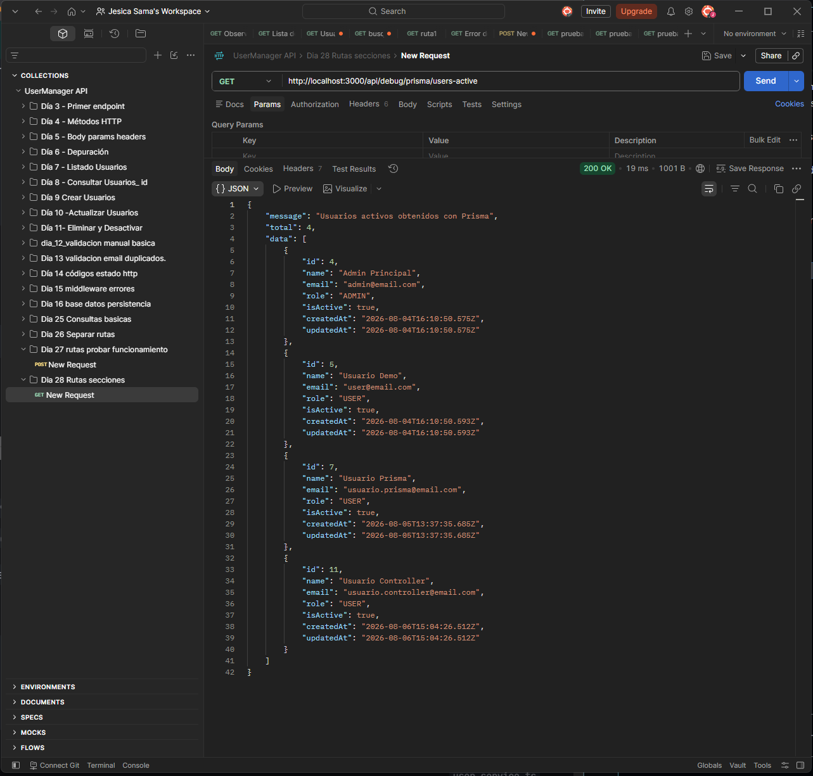
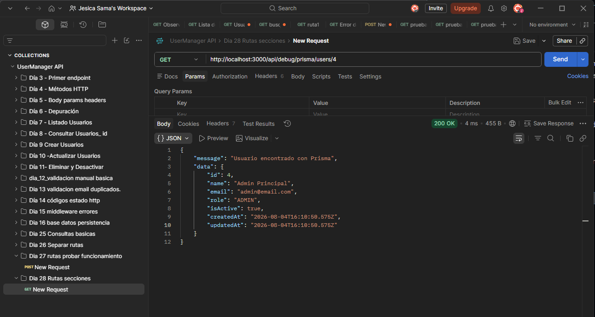
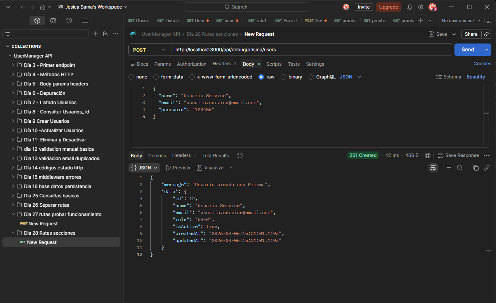
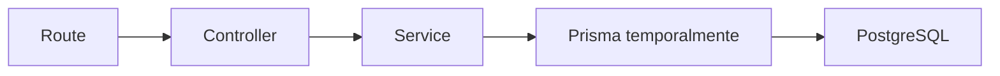

# Día 28 - Servicios

## Qué he hecho

- He creado la carpeta src/services.
- He creado la carpeta src/errors.
- He creado la clase AppError.
- He creado user.service.ts.
- He movido lógica de negocio desde el controlador al servicio.
- He creado getUsersService.
- He creado getActiveUsersService.
- He creado getUserByIdService.
- He creado createDebugUserService.
- He limpiado user.controller.ts.
- He comprobado que las rutas siguen funcionando.
- He probado errores de validación y email duplicado.

## Archivos creados

```text
src/errors/AppError.ts
src/services/user.service.ts
```

## Estructura actual

```text
src/
  prisma.ts
  server.ts
  controllers/
    health.controller.ts
    user.controller.ts
  errors/
    AppError.ts
  routes/
    health.routes.ts
    debug-prisma.routes.ts
  services/
    user.service.ts
```

## Servicios creados

| Servicio | Responsabilidad | Resultado esperado |
| --- | --- | --- |
| `getUsersService` | Obtener todos los usuarios |  |
| `getActiveUsersService` | Obtener usuarios activos |  |
| `getUserByIdService` | Buscar un usuario por ID |  |
| `createDebugUserService` | Validar y crear un usuario temporal |  |

## Antes y después

Antes, el controlador validaba datos y consultaba Prisma directamente.

Ahora, el controlador llama al servicio:

```ts
const createdUser = await createDebugUserService(req.body);
```

Y el servicio contiene la lógica de validación y creación.

## Explicación personal

Un servicio contiene reglas de negocio. En este proyecto, user.service.ts se encarga de validar datos, normalizar email, comprobar errores y crear usuarios. El controlador queda más centrado en recibir la petición y devolver la respuesta HTTP.

## Diagrama



En este día el servicio todavía usa Prisma directamente. En el próximo paso se creará una capa de repositorio para separar el acceso a datos.

## Responsabilidades actuales

| Capa | Responsabilidad |
| --- | --- |
| Route | Define URL y método HTTP |
| Controller | Lee req, llama al servicio y responde |
| Service | Aplica reglas de negocio |
| Prisma | Accede temporalmente a PostgreSQ |

