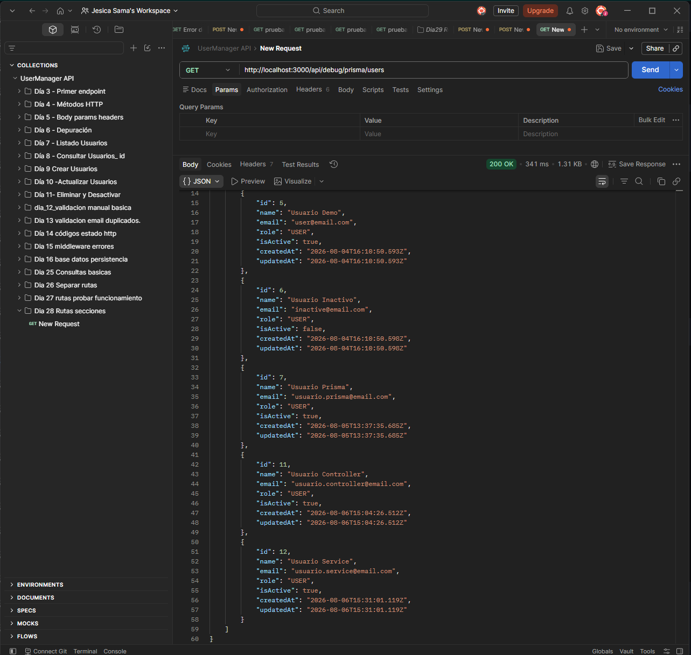
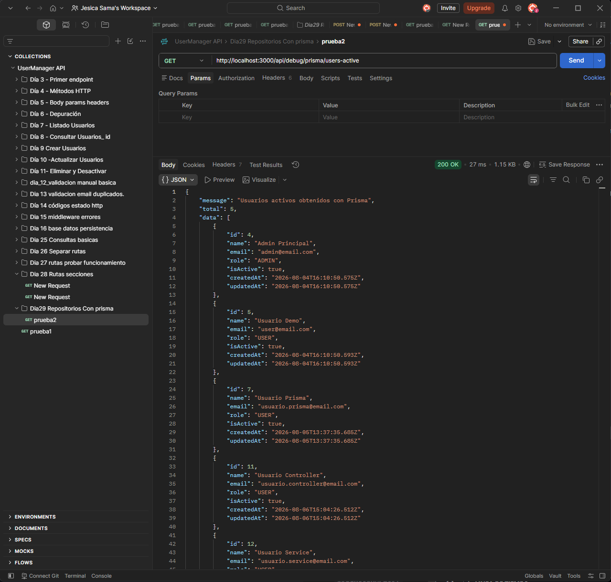
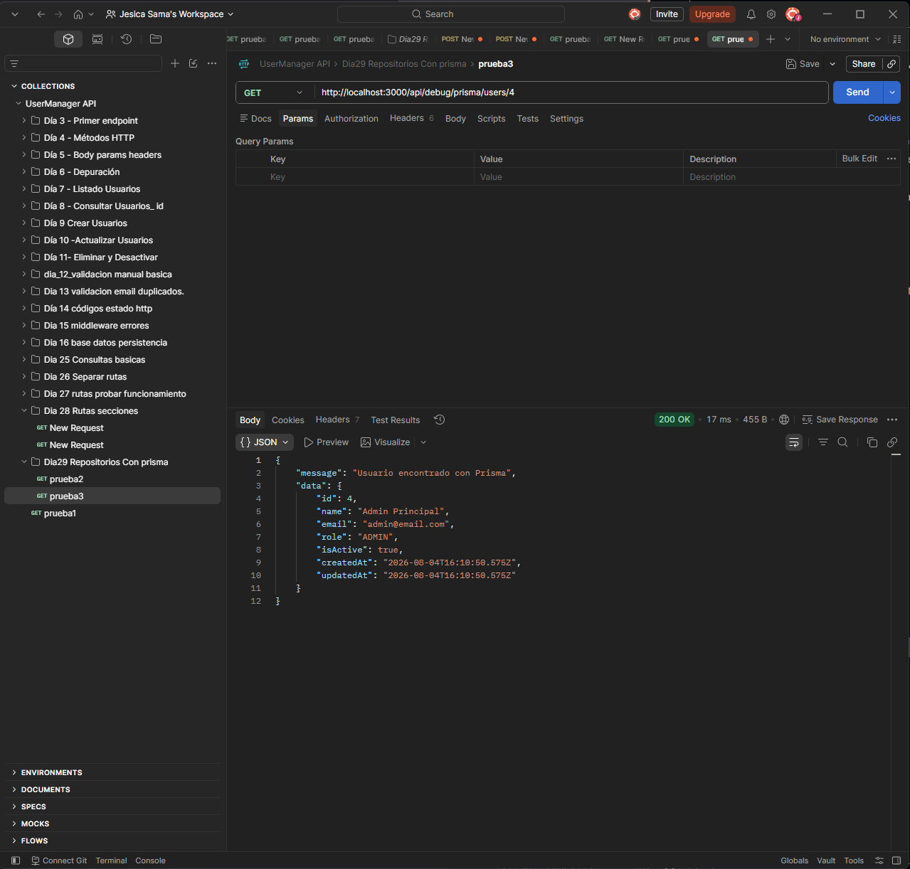
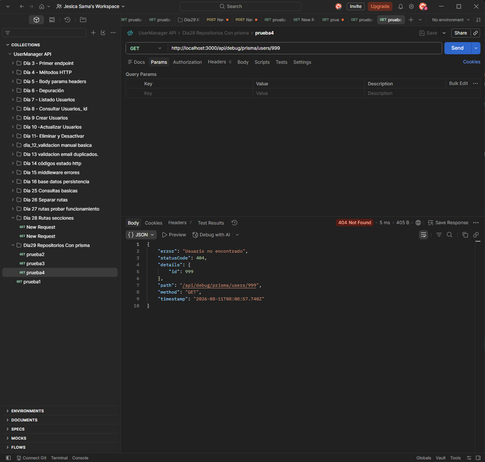
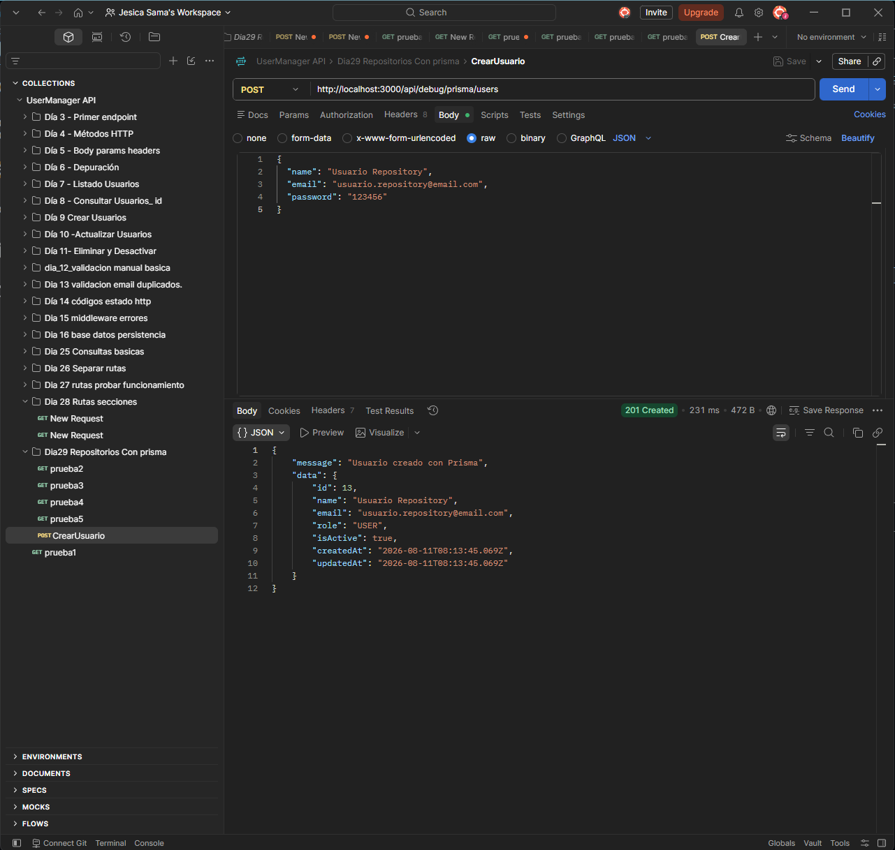
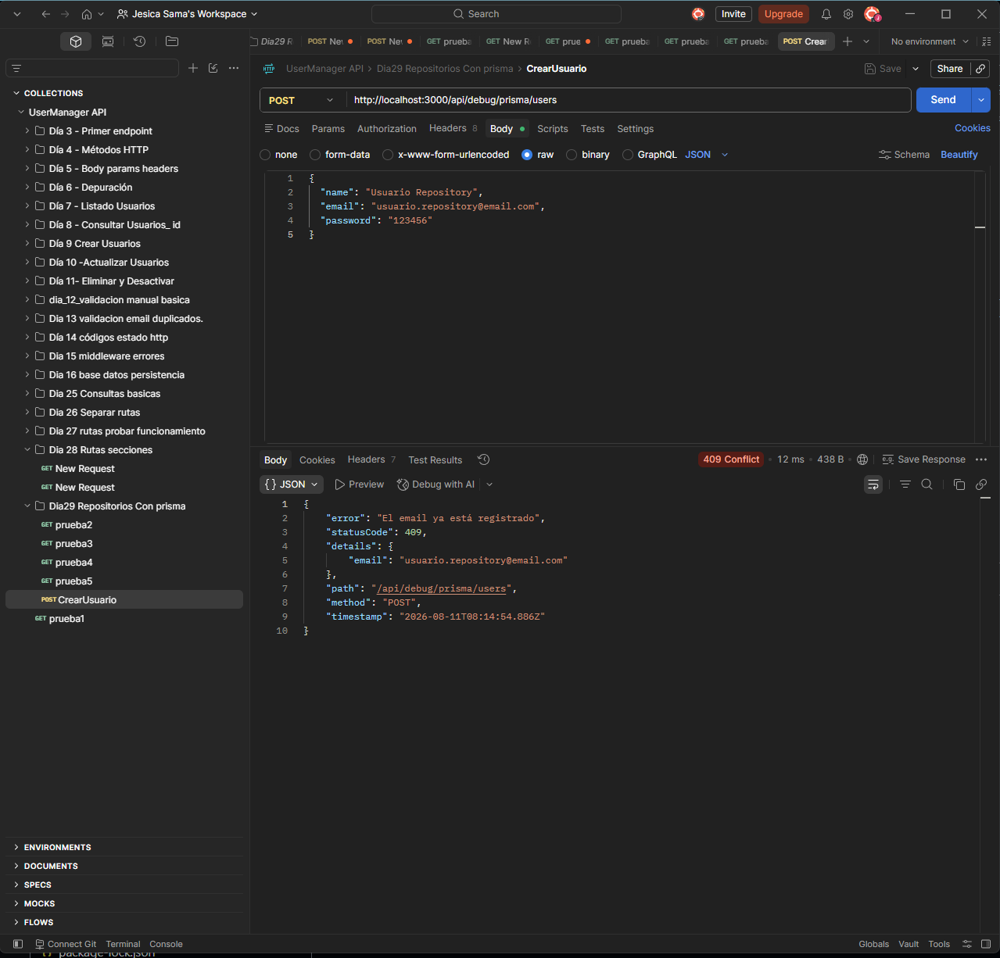
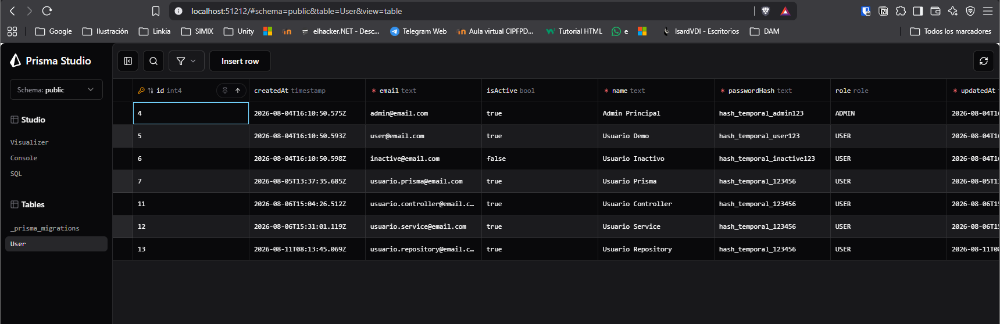
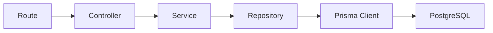

# Día 29 - Repositorio con Prisma

## Qué he hecho

- He creado la carpeta src/repositories.
- He creado user.repository.ts.
- He movido las consultas Prisma desde el servicio al repositorio.
- He creado funciones de acceso a datos.
- He creado findAllUsers.
- He creado findActiveUsers.
- He creado findUserById.
- He creado findUserByEmail.
- He creado createUser.
- He modificado user.service.ts para usar el repositorio.
- He comprobado que user.controller.ts no necesita conocer el repositorio.
- He probado que las rutas siguen funcionando.

## Archivos creados

```text
src/repositories/user.repository.ts
```

## Estructura actual

```text
src/
  prisma.ts
  server.ts
  controllers/
    health.controller.ts
    user.controller.ts
  errors/
    AppError.ts
  repositories/
    user.repository.ts
  routes/
    health.routes.ts
    debug-prisma.routes.ts
  services/
    user.service.ts
```

## Funciones del repositorio

| Función | Responsabilidad | Captura |
| --- | --- | --- |
| `findAllUsers` | Obtener todos los usuarios |  |
| `findActiveUsers` | Obtener usuarios activos |  |
| `findUserById` | Buscar usuario por ID | 200 OK:  404 Not Found:  400 Bad Request:  |
| `findUserByEmail` | Buscar usuario por email |
| `createUser` | Crear usuario | 201 Created:  EMAIL REPETIDO:  |

Comprobación en Prisma y Posgres:


## Flujo actual

```text
Route → Controller → Service → Repository → Prisma → PostgreSQL
```

## Explicación personal

El repositorio se encarga del acceso a datos. El servicio ya no usa Prisma directamente, sino que llama a funciones del repositorio. Esto permite separar mejor las reglas de negocio del acceso a la base de datos.

## Explicación personal

El repositorio se encarga del acceso a datos. El servicio ya no usa Prisma directamente, sino que llama a funciones del repositorio. Esto permite separar mejor las reglas de negocio del acceso a la base de datos.



El repositorio es la capa que usa Prisma Client. El servicio deja de conocer los detalles concretos de acceso a base de datos.

## Comparación entre capas

| Capa | Qué hace | Ejemplo |
| --- | --- | --- |
| Route | Define URL y método | `GET /users` |
| Controller | Lee req y responde con res | `getUsers` |
| Service | Aplica reglas de negocio | `getUserByIdService` |
| Repository | Consulta o modifica datos | `findUserById` |
| Prisma | Ejecuta consultas contra PostgreSQL | `prisma.user.findUnique` |

## Antes y después

Antes, el servicio consultaba Prisma directamente:

```ts
return prisma.user.findMany({
  select: userSafeSelect
});
```

Ahora, el servicio llama al repositorio:

```ts
return findAllUsers();
```

Y el repositorio se encarga de Prisma:

```ts
export function findAllUsers() {
  return prisma.user.findMany({
    select: userSafeSelect
  });
}
```
