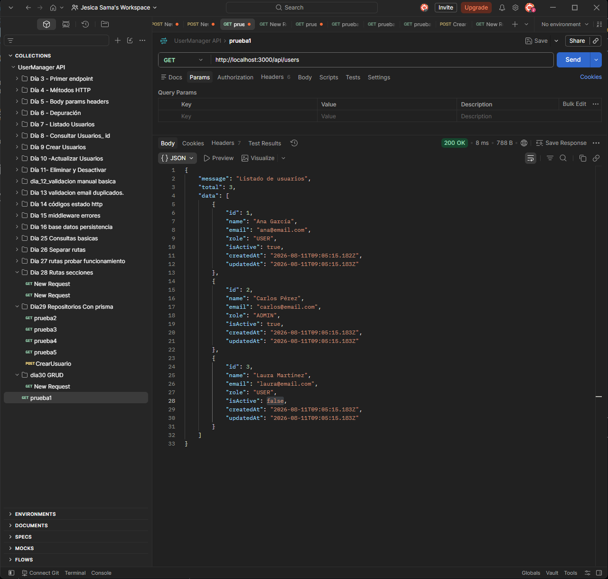
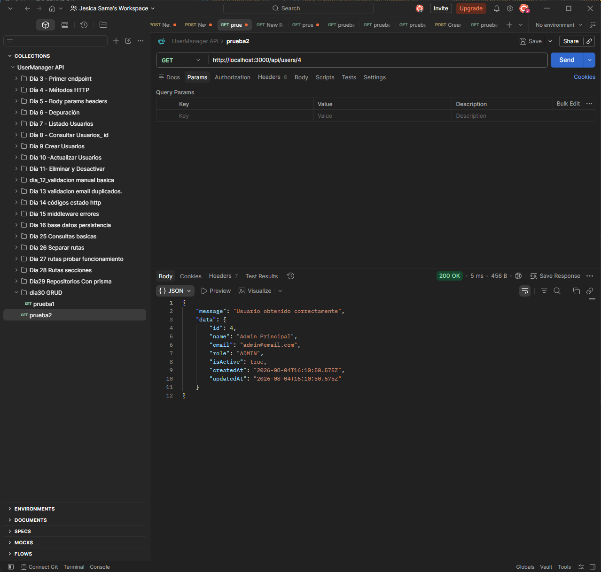
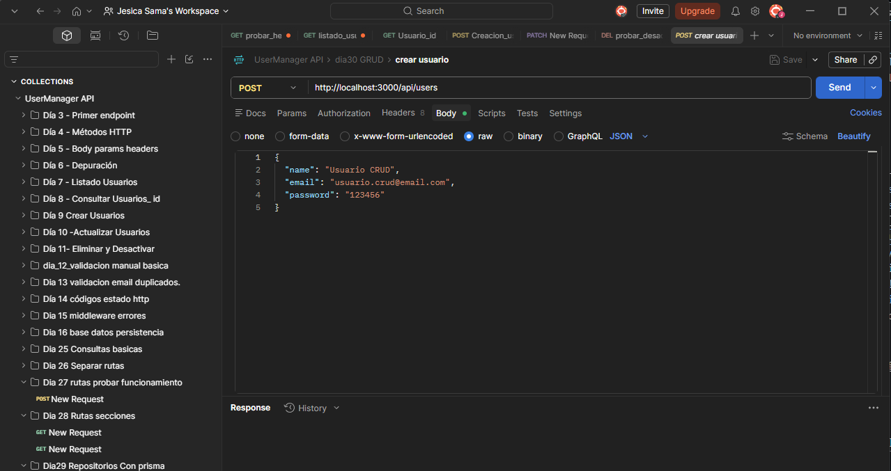
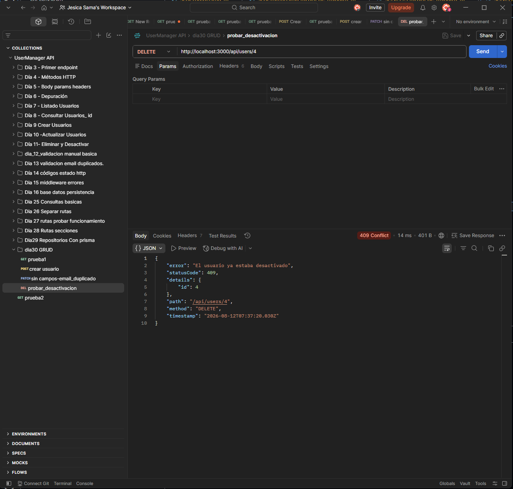
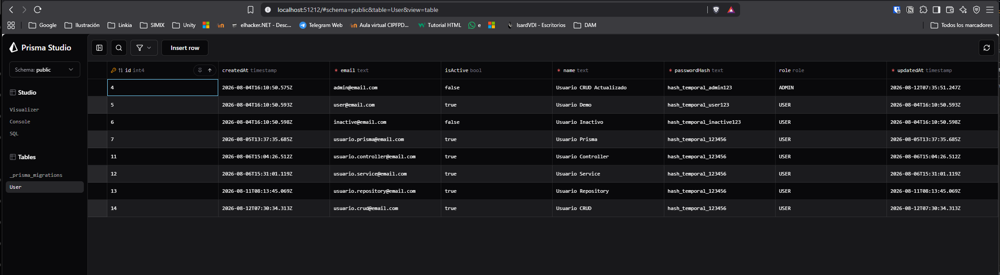
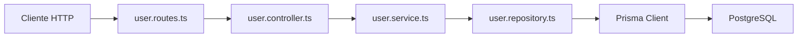

# Día 30 - CRUD persistente ordenado con Prisma y capas

## Qué he hecho

- He creado user.routes.ts.
- He montado userRouter en server.ts.
- He creado rutas reales de usuario.
- He añadido updateUser en el repositorio.
- He añadido deactivateUser en el repositorio.
- He creado createUserService.
- He creado updateUserService.
- He creado deactivateUserService.
- He creado controladores para crear, actualizar y desactivar usuarios.
- He probado GET /api/users.
- He probado GET /api/users/:id.
- He probado POST /api/users.
- He probado PATCH /api/users/:id.
- He probado DELETE /api/users/:id.
- He comprobado los cambios con Prisma Studio.

## Rutas reales creadas

| Método | Ruta | Acción | Captura |
| --- | --- | --- | --- |
| GET | `/api/users` | Listar usuarios |  |
| GET | `/api/users/:id` | Consultar usuario | 200 OK:  404 Not|
| POST | `/api/users` | Crear usuario |  |
| PATCH | `/api/users/:id` | Actualizar usuario | correcto:  actualizacion sin campos:  email duplicado en actualizacion:  |
| DELETE | `/api/users/:id` | Desactivar usuario | Correcto:  Borrado duplicado:  |

Comprobación en Prisma y Posgres:


## Flujo actual

```text
Route → Controller → Service → Repository → Prisma → PostgreSQL
```

## Archivos modificados o creados

```text
src/routes/user.routes.ts
src/controllers/user.controller.ts
src/services/user.service.ts
src/repositories/user.repository.ts
src/server.ts
```

## Borrado lógico

El endpoint DELETE no elimina físicamente el usuario.

En su lugar, actualiza:

```text
isActive = false
```

Esto permite conservar el registro en la base de datos.

## Explicación personal

El CRUD persistente permite que la API gestione usuarios reales guardados en PostgreSQL. La arquitectura por capas ayuda a que cada parte del código tenga una responsabilidad clara.


