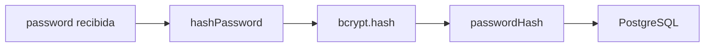
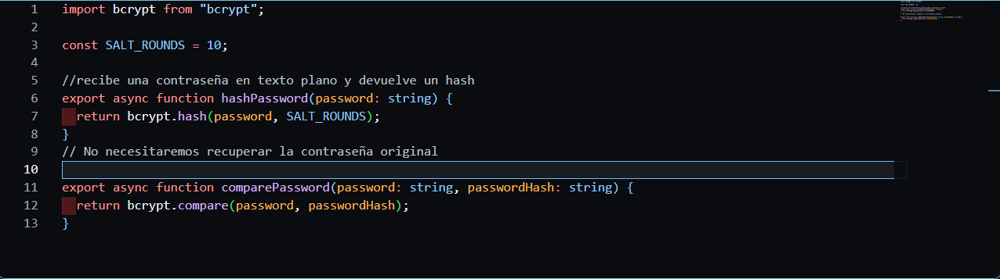
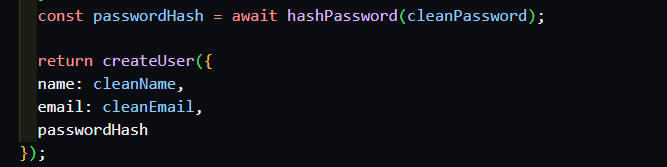
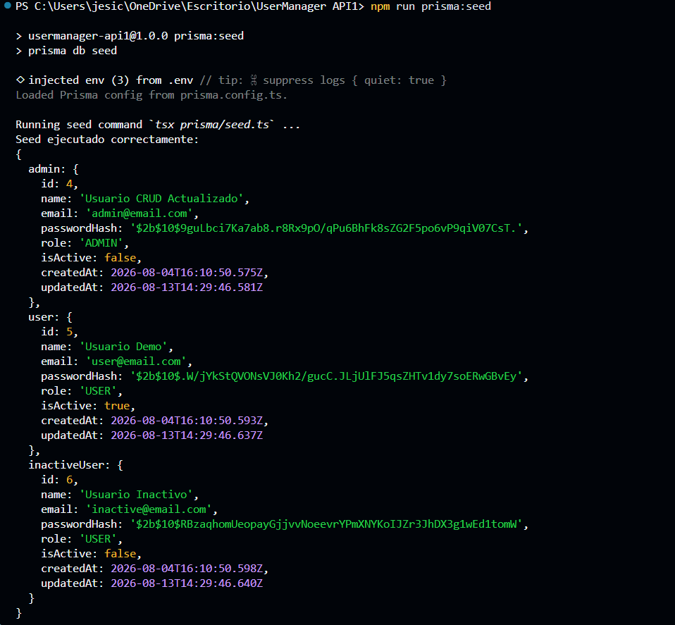
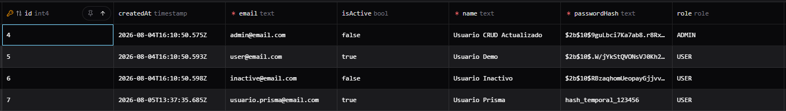
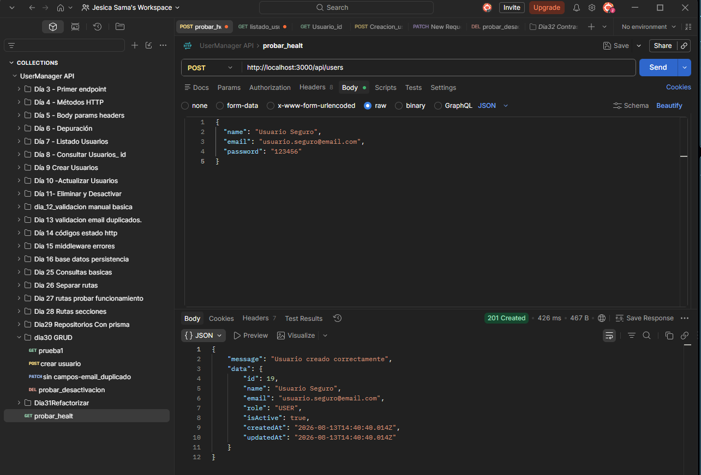
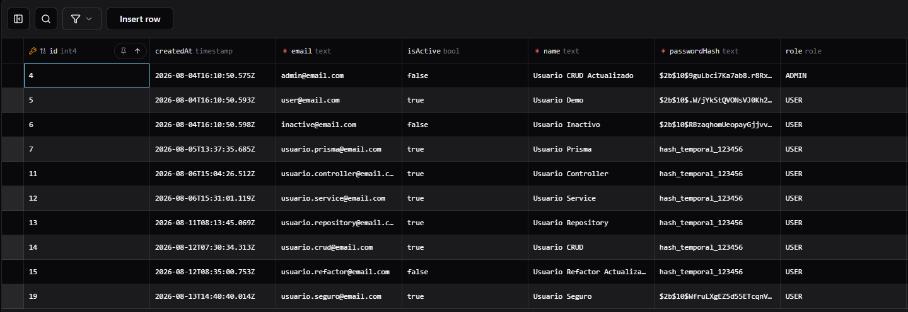
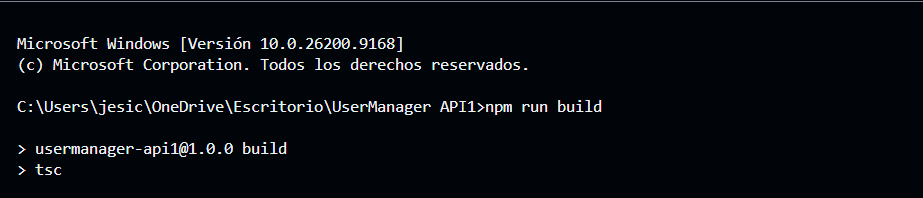

# Día 32 - Contraseñas seguras con bcrypt

## Qué he hecho

- He instalado bcrypt.
- He instalado los tipos de bcrypt para TypeScript.
- He creado password.utils.ts.
- He creado hashPassword.
- He creado comparePassword.
- He sustituido passwordHash temporal por un hash real.
- He actualizado createUserService.
- He actualizado el seed para generar hashes reales.
- He ejecutado el seed.
- He comprobado los hashes en Prisma Studio.
- He creado un usuario desde la API y he comprobado que se guarda con hash bcrypt.

## Dependencias instaladas

```bash
npm install bcrypt
npm install -D @types/bcrypt
```

## Archivo creado

```text
src/utils/password.utils.ts
```

## Funciones creadas

```ts
hashPassword(password)
comparePassword(password, passwordHash)
```

## Diferencia entre password y passwordHash

| Campo | Significado |
| --- | --- |
| `password` | Contraseña que llega en la petición |
| `passwordHash` | Hash seguro que se guarda en la base de datos |

## Regla de seguridad

```text
La contraseña en texto plano nunca se guarda.
passwordHash nunca se devuelve al cliente.
```

## Cambios en el seed

Los usuarios iniciales ya no usan valores temporales como:

```text
hash_temporal_admin123
```

Ahora usan hashes reales generados con bcrypt.

## Explicación personal

bcrypt permite convertir una contraseña en un hash seguro antes de guardarla. De esta forma, aunque alguien accediera a la base de datos, no vería la contraseña original.



## Checklist de comprobación

| Prueba | Resultado |
| --- | --- |
| `npm install bcrypt` ejecutado |  |
| `password.utils.ts` creado |  |
| `createUserService` usa `hashPassword` |  |
| El seed usa bcrypt | ok |
| `npm run prisma:seed` funciona |  |
| Prisma Studio muestra hashes reales |  |
| `POST /api/users` crea usuario con hash real |  |
| La respuesta no incluye `passwordHash` |  |
| `npm run build` funciona |  |
