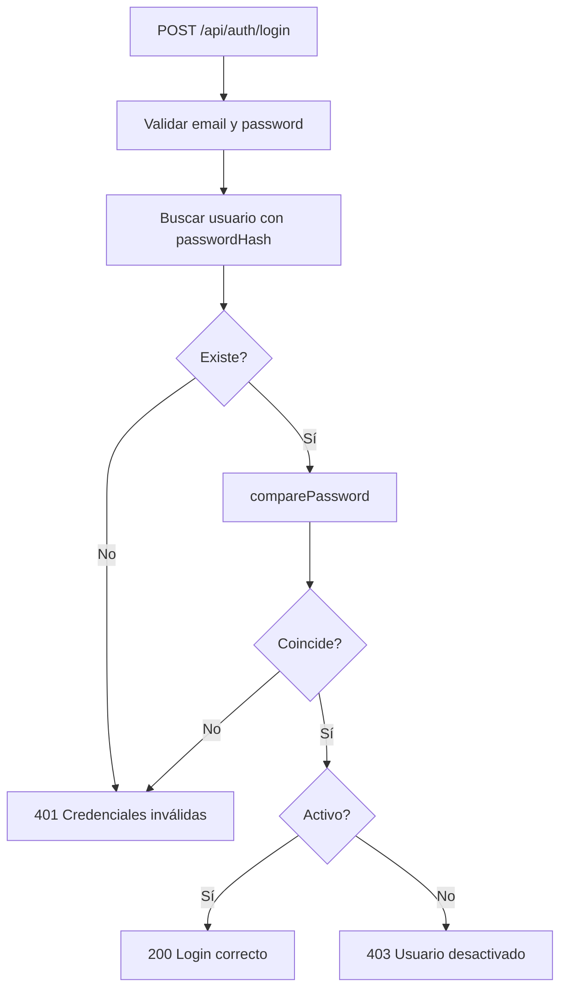
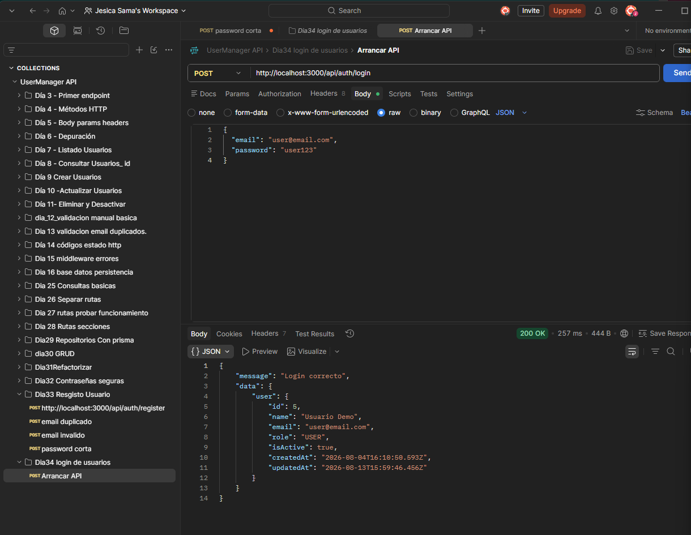
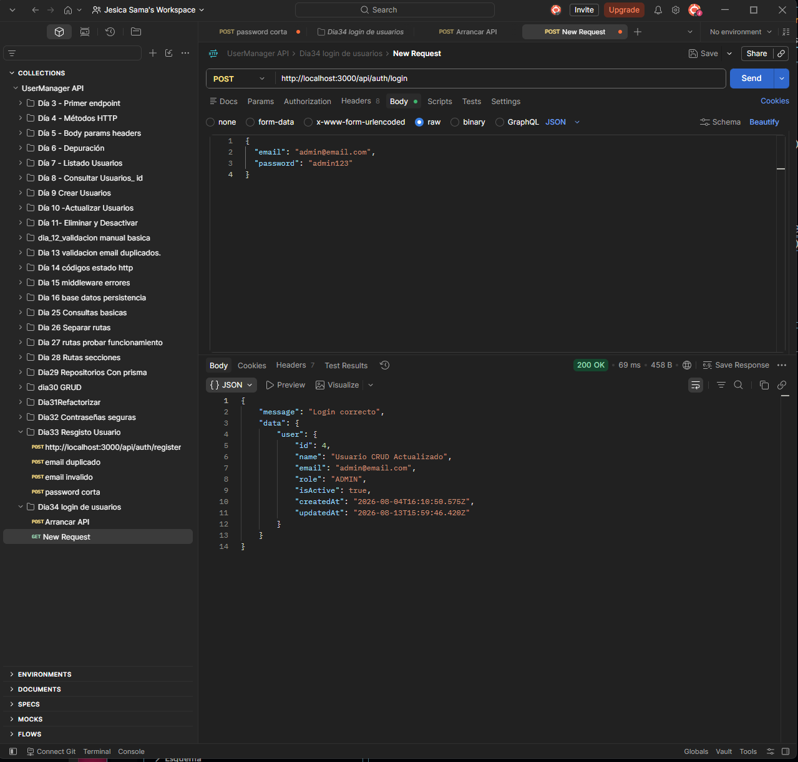
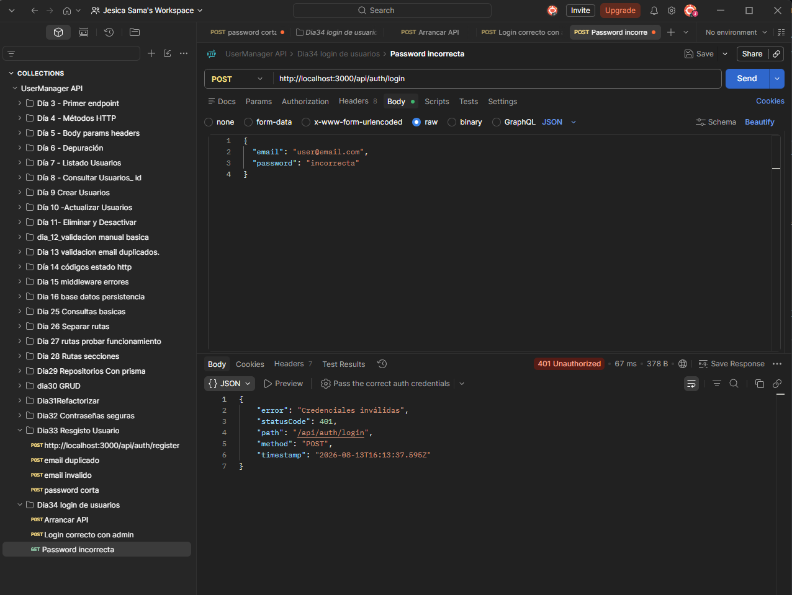
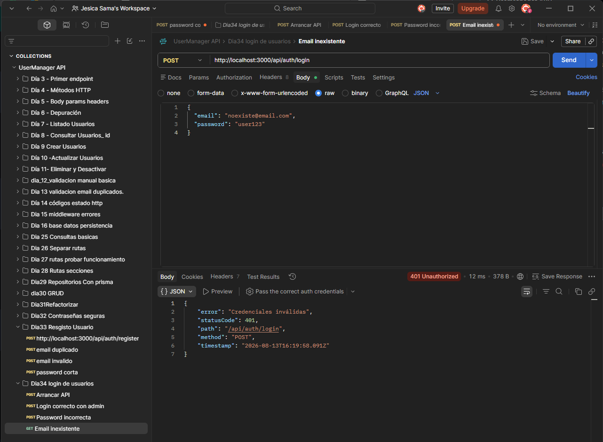
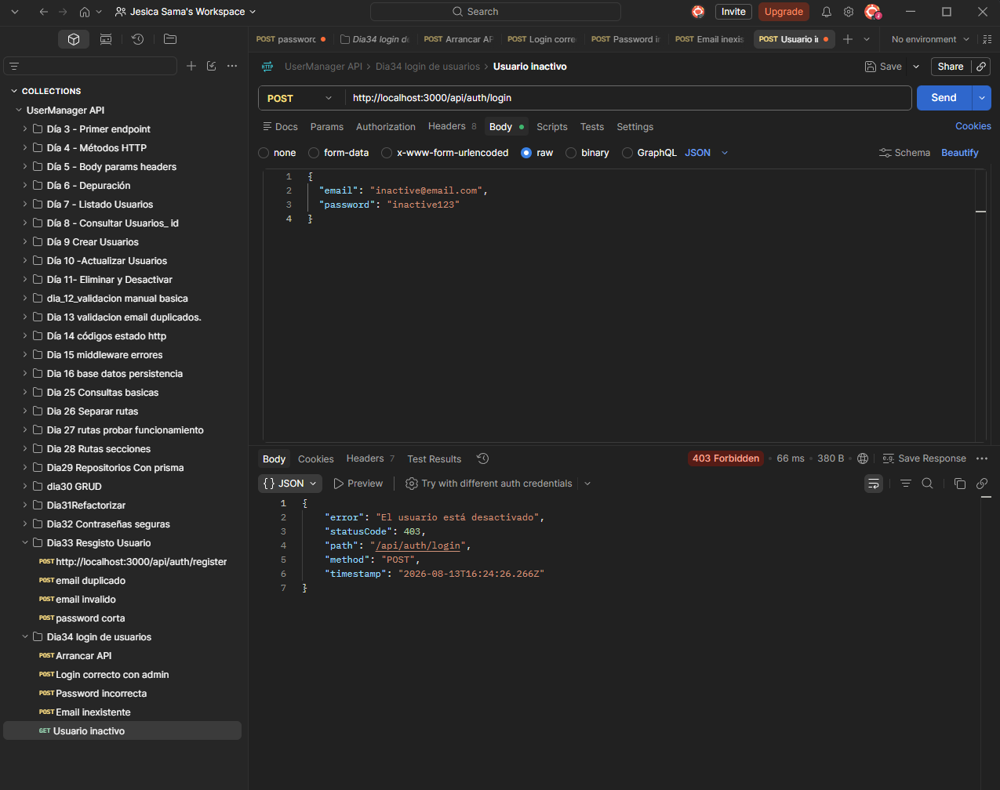
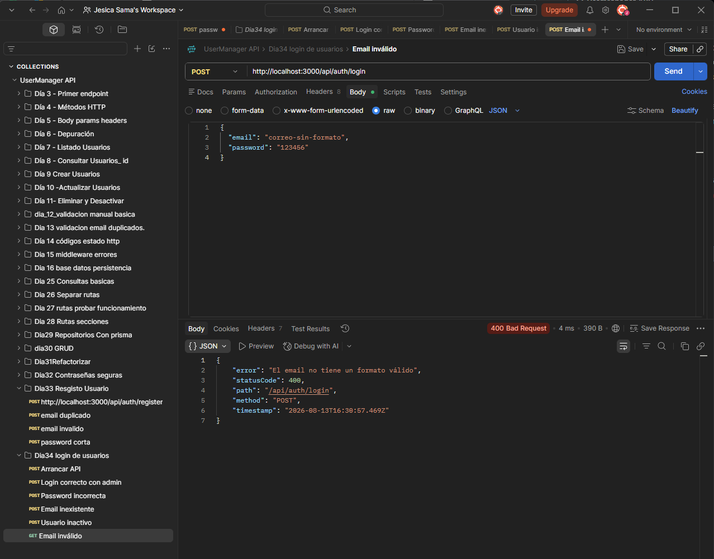
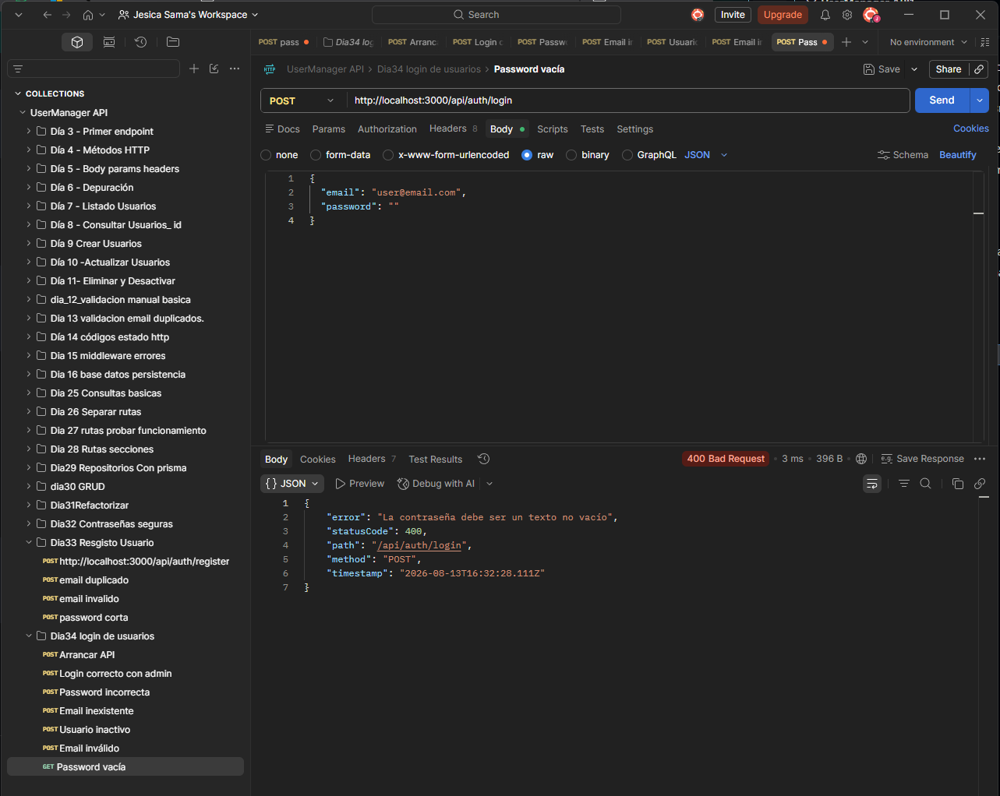
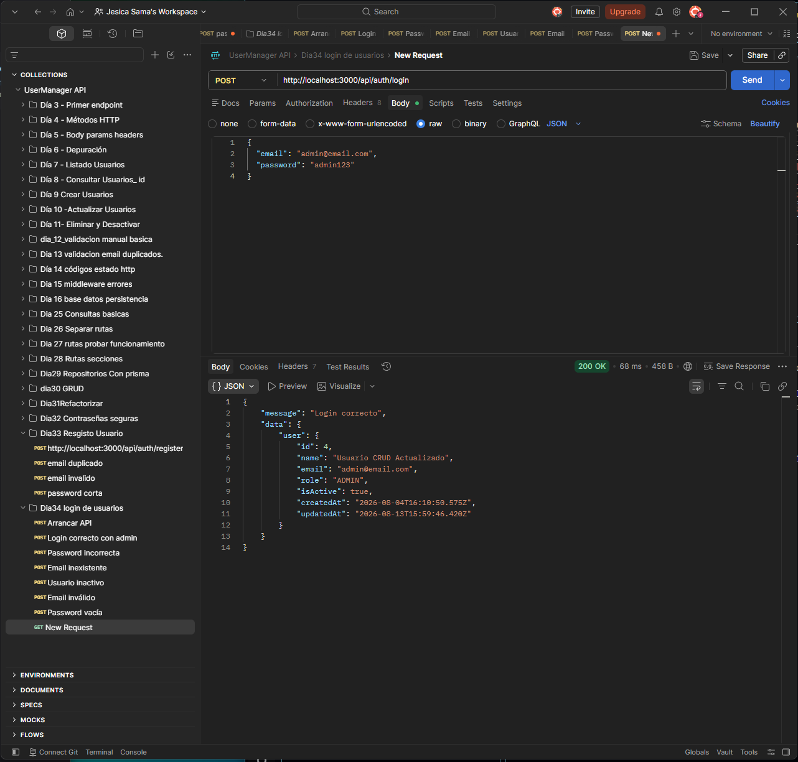
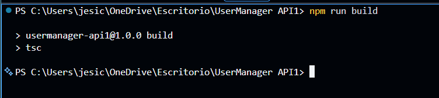

# Día 34 - Login de usuarios

## Qué he hecho

- He creado findUserByEmailWithPassword en el repositorio.
- He creado un selector interno que incluye passwordHash.
- He creado loginService.
- He usado comparePassword para comprobar contraseñas.
- He comprobado si el usuario existe.
- He comprobado si la contraseña es correcta.
- He comprobado si el usuario está activo.
- He creado loginController.
- He añadido POST /api/auth/login.
- He probado login correcto con USER.
- He probado login correcto con ADMIN.
- He probado password incorrecta.
- He probado email inexistente.
- He probado usuario inactivo.
- He comprobado que passwordHash no se devuelve.
- He ejecutado npm run build.

## Endpoint creado

```text
POST /api/auth/login
```

## Body esperado

```json
{
  "email": "user@email.com",
  "password": "user123"
}
```

## Respuesta correcta

```text
200 OK
```

## Respuesta aproximada

```json
{
  "message": "Login correcto",
  "data": {
    "user": {
      "id": 2,
      "name": "Usuario Demo",
      "email": "user@email.com",
      "role": "USER",
      "isActive": true
    }
  }
}
```

## Reglas del login

```text
email es obligatorio.
password es obligatoria.
email debe tener formato válido.
Si el email no existe, se devuelven credenciales inválidas.
Si la password no coincide, se devuelven credenciales inválidas.
Si el usuario está inactivo, no puede iniciar sesión.
passwordHash se usa internamente, pero nunca se devuelve.
Todavía no se genera JWT.
```

## Flujo del login

```text
Route → Controller → Service → Repository → Prisma → PostgreSQL
```

## Función especial del repositorio

```text
findUserByEmailWithPassword
```

Esta función permite leer passwordHash internamente para comparar la contraseña con bcrypt.

## Explicación personal

El login comprueba que un usuario existe, que la contraseña enviada coincide con el hash guardado y que la cuenta está activa. Aunque el backend lee passwordHash internamente, nunca lo devuelve al cliente.



## Checklist de pruebas

| Prueba | Resultado |
| --- | --- |
| Login correcto con USER |  |
| Login correcto con ADMIN |  |
| Password incorrecta |  |
| Email inexistente |  |
| Usuario inactivo |  |
| Email inválido |  |
| Password vacía |  |
| La respuesta no devuelve passwordHash |  |
| `npm run build` funciona |  |
