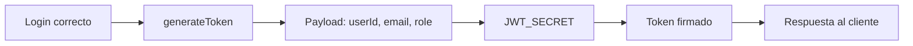

# Día 35 - Generación de token JWT

## Qué he hecho

- He instalado jsonwebtoken.
- He instalado los tipos de jsonwebtoken para TypeScript.
- He añadido JWT_SECRET en .env.
- He añadido JWT_EXPIRES_IN en .env.
- He actualizado .env.example.
- He creado jwt.utils.ts.
- He creado generateToken.
- He modificado loginService para generar token.
- He añadido userId, email y role al payload.
- He comprobado que passwordHash no se mete en el token.
- He probado login correcto con USER.
- He probado login correcto con ADMIN.
- He comprobado que el login incorrecto no devuelve token.
- He ejecutado npm run build.

## Dependencias instaladas

```bash
npm install jsonwebtoken
npm install -D @types/jsonwebtoken
```

## Variables de entorno añadidas

```env
JWT_SECRET="cambia_esta_clave_en_produccion"
JWT_EXPIRES_IN="1h"
```

## Archivo creado

```text
src/utils/jwt.utils.ts
```

## Función creada

```ts
generateToken(payload)
```

## Payload del token

```ts
{
  userId: user.id,
  email: user.email,
  role: user.role
}
```

## Regla de seguridad

```text
El token no debe contener password ni passwordHash.
```

## Respuesta de login actualizada

```json
{
  "message": "Login correcto",
  "data": {
    "user": {
      "id": 2,
      "email": "user@email.com",
      "role": "USER"
    },
    "token": "eyJhbGciOiJIUzI1NiIs..."
  }
}
```

## Explicación personal

JWT permite que el servidor entregue un token firmado tras un login correcto. Ese token podrá usarse más adelante para acceder a rutas protegidas.



## Checklist de pruebas

| Prueba | Resultado |
| --- | --- |
| `jsonwebtoken` instalado | (./Images/dia35_prueba1.png) |
| `@types/jsonwebtoken` instalado | (./Images/dia35_prueba2.png) |
| `JWT_SECRET` configurado | (./Images/dia35_prueba3.png) |
| `JWT_EXPIRES_IN` configurado | (./Images/dia35_prueba4.png) |
| `jwt.utils.ts` creado | (./Images/dia35_prueba5.png) |
| Login correcto devuelve token | (./Images/dia35_prueba6.png) |
| Login incorrecto no devuelve token | (./Images/dia35_prueba7.png) |
| Token contiene tres partes separadas por puntos | (./Images/dia35_prueba9.png) |
| Token no contiene passwordHash | No lo contiene |
| `npm run build` funciona | (./Images/dia35_prueba10.png) |
