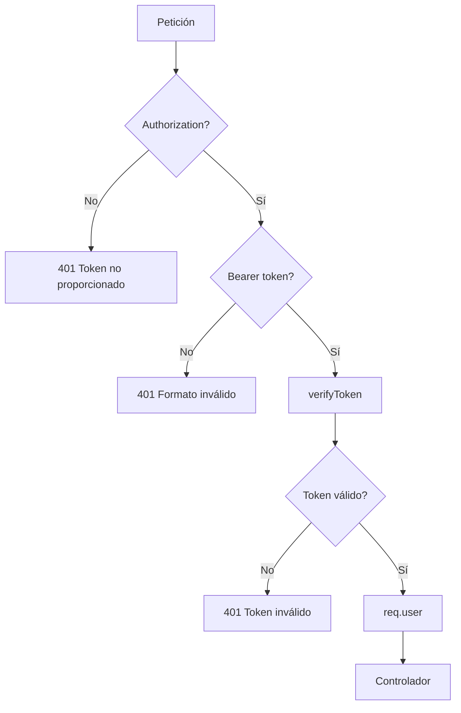
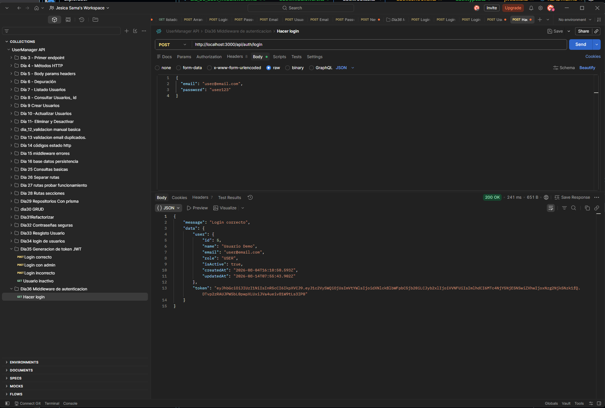
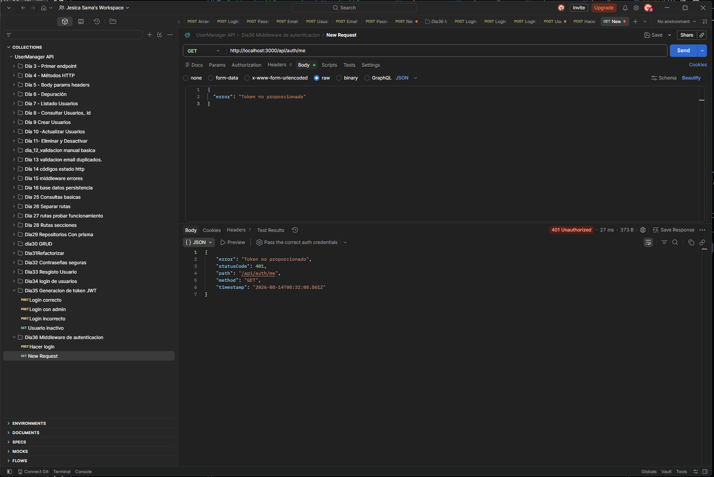
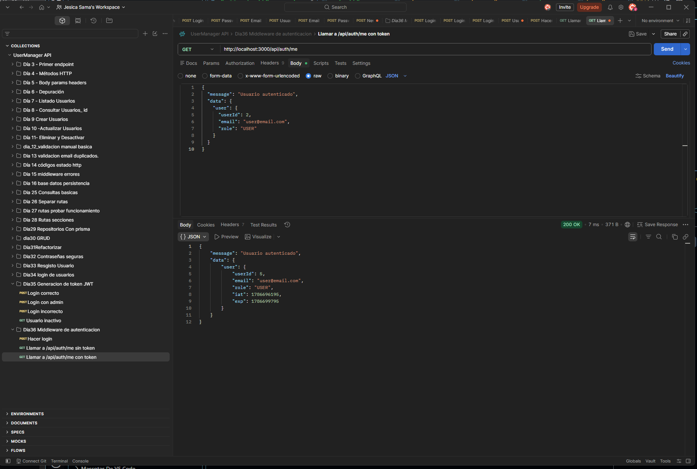
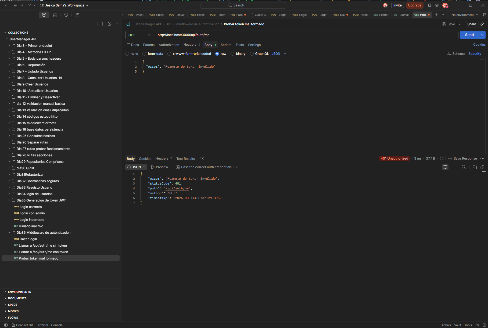
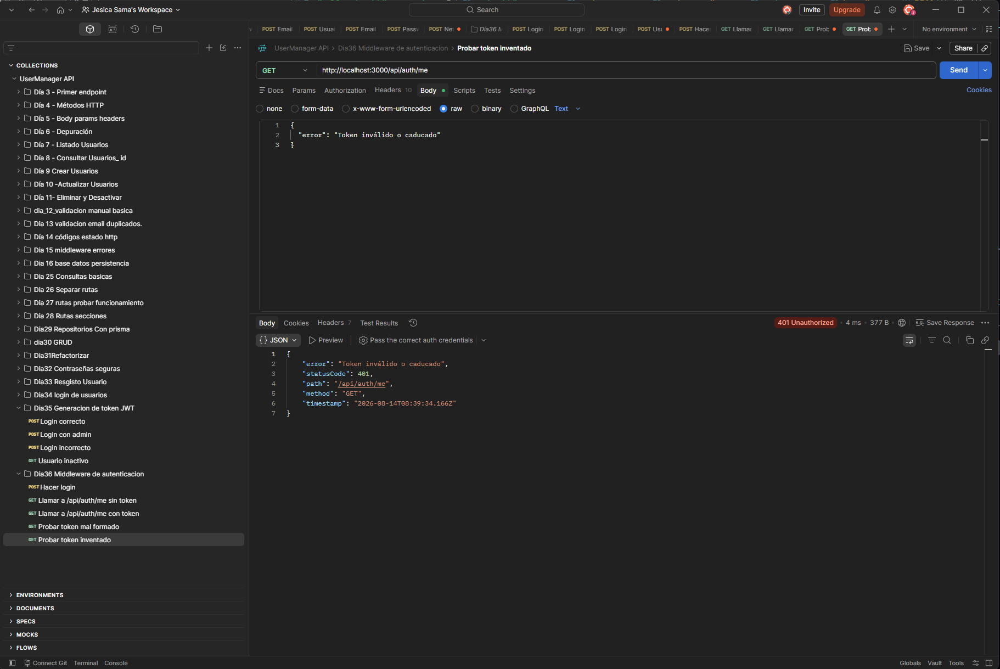
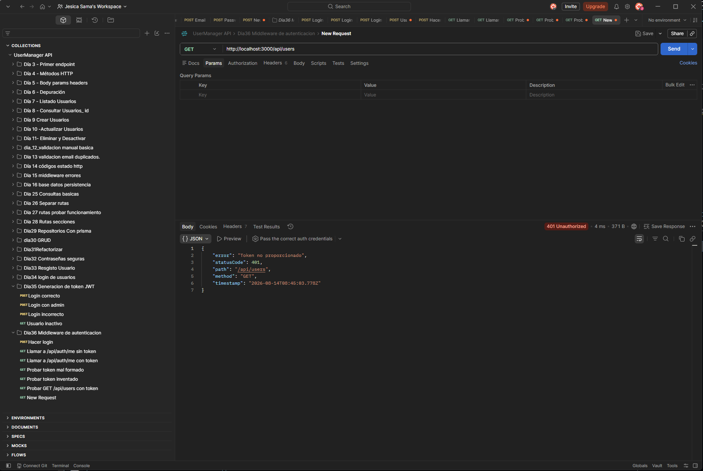
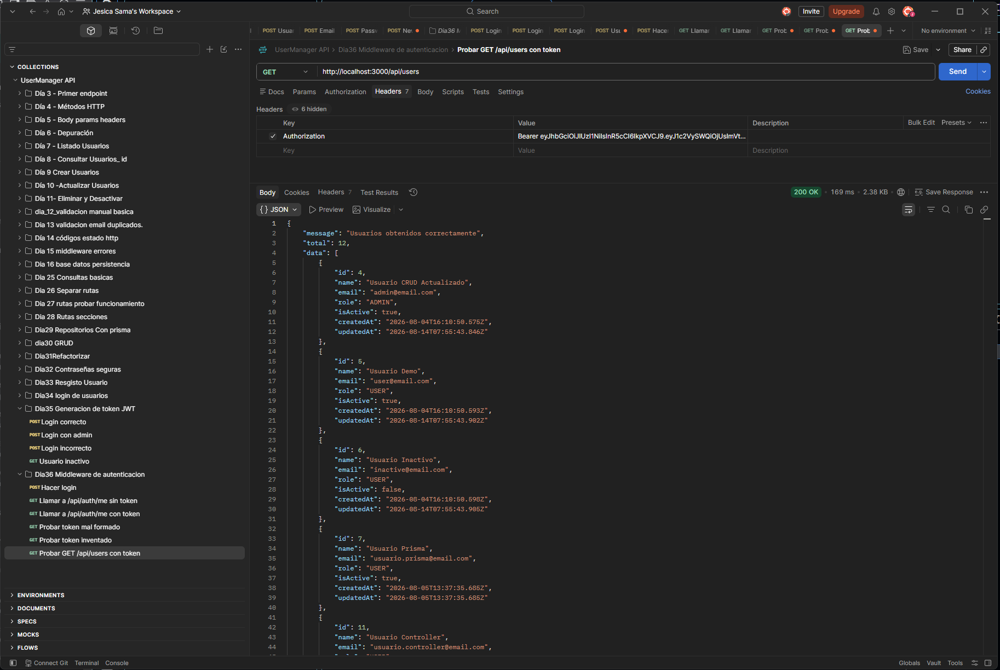
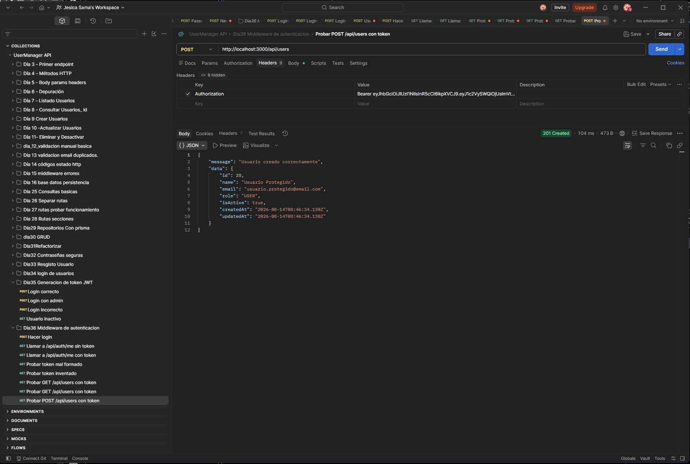
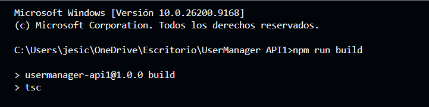

# Día 36 - Middleware de autenticación

## Qué he hecho

- He creado la carpeta src/types.
- He creado auth.types.ts.
- He definido AuthenticatedUser.
- He definido AuthenticatedRequest.
- He añadido verifyToken en jwt.utils.ts.
- He creado la carpeta src/middlewares.
- He creado auth.middleware.ts.
- He creado authMiddleware.
- He leído la cabecera Authorization.
- He comprobado el formato Bearer.
- He verificado tokens con JWT_SECRET.
- He guardado el payload en req.user.
- He creado GET /api/auth/me.
- He protegido las rutas de /api/users.
- He probado rutas sin token.
- He probado rutas con token.
- He ejecutado npm run build.

## Cabecera usada

```text
Authorization: Bearer <token>
```

## Archivos creados

```text
src/types/auth.types.ts
src/middlewares/auth.middleware.ts
```

## Archivos modificados

```text
src/utils/jwt.utils.ts
src/controllers/auth.controller.ts
src/routes/auth.routes.ts
src/routes/user.routes.ts
```

## Middleware creado

```text
authMiddleware
```

## Qué hace el middleware

```text
Lee Authorization.
Comprueba que exista.
Comprueba que use Bearer.
Extrae el token.
Verifica el token.
Guarda el usuario autenticado en req.user.
Permite continuar con next().
```

## Ruta de prueba

```text
GET /api/auth/me
```

## Rutas protegidas

```text
GET    /api/users
GET    /api/users/:id
POST   /api/users
PATCH  /api/users/:id
DELETE /api/users/:id
```

## Flujo

```text
Cliente → Authorization Bearer token → authMiddleware → req.user → controlador
```

## Explicación personal

El middleware de autenticación permite comprobar si una petición pertenece a un usuario autenticado. Si el token es válido, la API guarda sus datos en req.user y deja continuar la petición. Si el token falta o es inválido, responde con 401.



## Checklist de pruebas

| Prueba | Resultado |
| --- | --- |
| Login devuelve token |  |
| `GET /api/auth/me` sin token devuelve 401 |  |
| `GET /api/auth/me` con token devuelve usuario |  |
| Token sin Bearer devuelve 401 |  |
| Token inventado devuelve 401 |  |
| `GET /api/users` sin token devuelve 401 |  |
| `GET /api/users` con token devuelve 200 |  |
| `POST /api/users` con token funciona |  |
| `npm run build` funciona |  |
