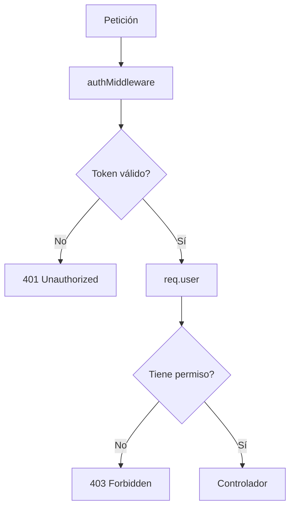

# Día 37 - Roles y permisos

## Qué he hecho

- He diferenciado autenticación y autorización.
- He creado role.middleware.ts.
- He creado requireRole.
- He creado requireSelfOrAdmin.
- He protegido GET /api/users para ADMIN.
- He protegido POST /api/users para ADMIN.
- He protegido DELETE /api/users/:id para ADMIN.
- He permitido GET /api/users/:id al ADMIN o al propio usuario.
- He permitido PATCH /api/users/:id al ADMIN o al propio usuario.
- He creado GET /api/users/me.
- He evitado que USER pueda cambiar isActive.
- He probado rutas con token de ADMIN.
- He probado rutas con token de USER.
- He comprobado respuestas 401 y 403.
- He ejecutado npm run build.

## Roles del proyecto

```text
USER
ADMIN
```

## Reglas de permisos

| Ruta | Permiso |
| --- | --- |
| `GET /api/users` | Solo ADMIN |
| `POST /api/users` | Solo ADMIN |
| `GET /api/users/me` | Usuario autenticado |
| `GET /api/users/:id` | ADMIN o el propio usuario |
| `PATCH /api/users/:id` | ADMIN o el propio usuario |
| `DELETE /api/users/:id` | Solo ADMIN |

## Middlewares creados

```text
requireRole
requireSelfOrAdmin
```

## Diferencia entre 401 y 403

| Código | Significado |
| --- | --- |
| 401 | No autenticado |
| 403 | Autenticado, pero sin permiso |

## Flujo de seguridad

```text
authMiddleware → req.user → middleware de permisos → controlador
```

## Explicación personal

Autenticación significa comprobar quién es el usuario mediante un token. Autorización significa comprobar si ese usuario tiene permiso para realizar una acción concreta.


## Checklist de pruebas

| Prueba | Resultado |
| --- | --- |
| ADMIN puede hacer `GET /api/users` |  |
| USER no puede hacer `GET /api/users` |  |
| ADMIN puede hacer `POST /api/users` |  |
| USER no puede hacer `POST /api/users` |  |
| USER puede hacer `GET /api/users/me` |  |
| USER puede consultar su propio ID |  |
| USER no puede consultar otro ID |  |
| USER puede actualizar su nombre |  |
| USER no puede cambiar `isActive` |  |
| USER no puede hacer `DELETE /api/users/:id` |  |
| ADMIN puede hacer `DELETE /api/users/:id` |  |
| `npm run build` funciona |  |
