# Día 38 - Frontend entregado y conexión con la API

## Qué he hecho

- He arrancado PostgreSQL.
- He ejecutado el seed de datos iniciales.
- He generado Prisma Client.
- He arrancado el backend.
- He comprobado `/api/health`.
- He configurado CORS si era necesario.
- He entrado en la carpeta frontend.
- He instalado las dependencias del frontend.
- He creado o revisado `.env.local`.
- He configurado `NEXT_PUBLIC_API_URL`.
- He arrancado el frontend.
- He probado login desde la interfaz.
- He comprobado que el token se guarda en `localStorage`.
- He comprobado que el dashboard envía `Authorization`.
- He probado acceso al panel admin con USER.
- He probado acceso al panel admin con ADMIN.

## URLs usadas

| Aplicación | URL |
| --- | --- |
| Backend | `http://localhost:3000` |
| Frontend | `http://localhost:3001` |
| PostgreSQL | `localhost:5432` |

## Variable del frontend

```env
NEXT_PUBLIC_API_URL=http://localhost:3000
```

## Cabecera de autenticación

```text
Authorization: Bearer <token>
```

## Pantallas del frontend

| Pantalla | Ruta | Objetivo |
| --- | --- |---|
| Inicio | `/` | Presentar el cliente |
| Registro | `/register` | Crear cuenta |
| Login | `/login` | Obtener token |
| Dashboard | `/dashboard` | Consultar perfil |
| Panel admin | `/admin/users` | Gestionar usuarios |

## Endpoints consumidos

| Método | Endpoint | Acceso |
| --- | --- |---|
| `POST` | `/api/auth/register` | Público |
| `POST` | `/api/auth/login` | Público |
| `GET` | `/api/users/me` | Autenticado |
| `PATCH` | `/api/users/:id` | Propio usuario o ADMIN |
| `GET` | `/api/users` | ADMIN |
| `POST` | `/api/users` | ADMIN |
| `DELETE` | `/api/users/:id` | ADMIN |

## Explicación personal

El frontend y el backend son aplicaciones distintas. El frontend realiza peticiones HTTP a la API y la API responde con JSON. Cuando una ruta está protegida, el frontend debe enviar el token JWT en la cabecera Authorization.

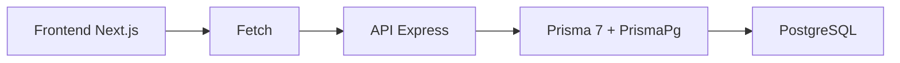

## Checklist de pruebas

| Prueba | Resultado |
| --- | --- |
| PostgreSQL activo | 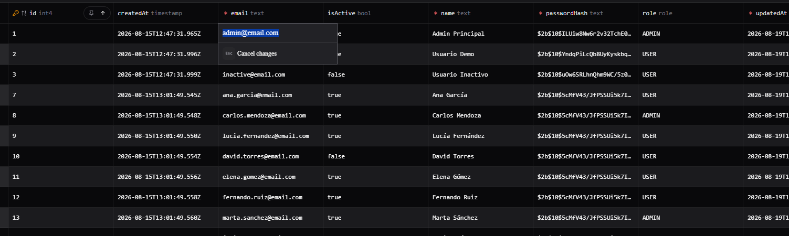 |
| Backend activo en puerto 3000 | 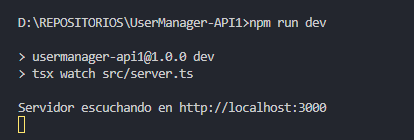 |
| Frontend activo en puerto 3001 | 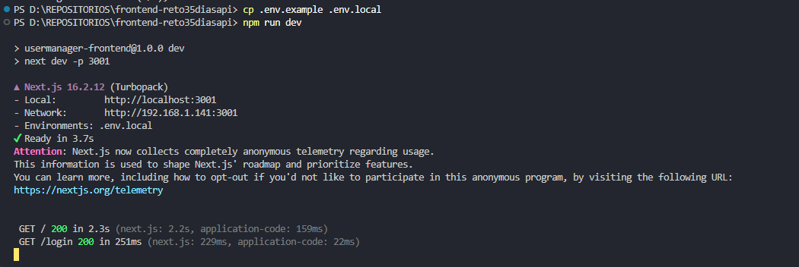 |
| `/api/health` responde | 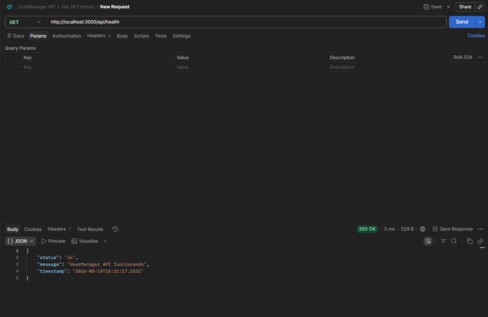 |
| `.env.local` configurado | 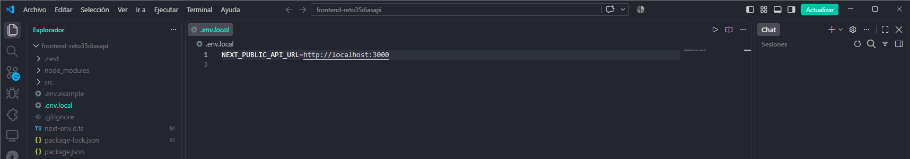 |
| Login correcto desde frontend | 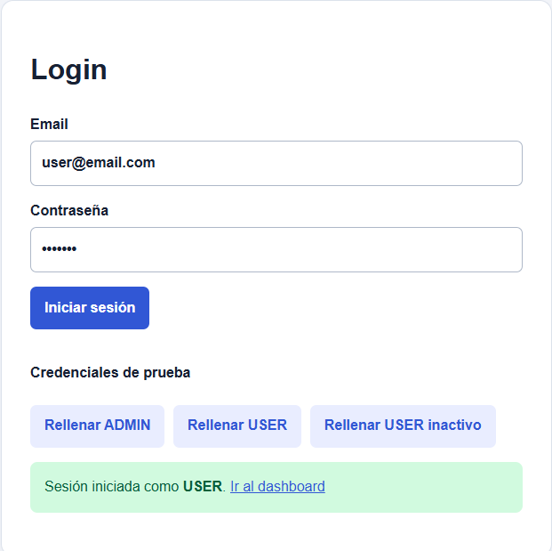 |
| Token guardado en localStorage | 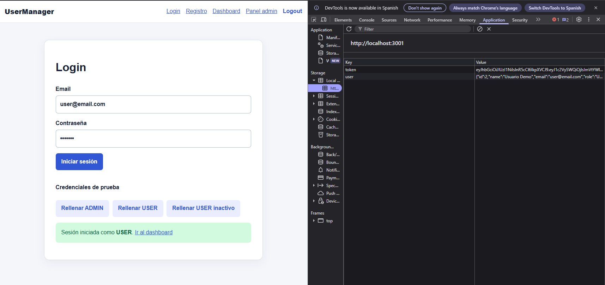 |
| Dashboard carga perfil | 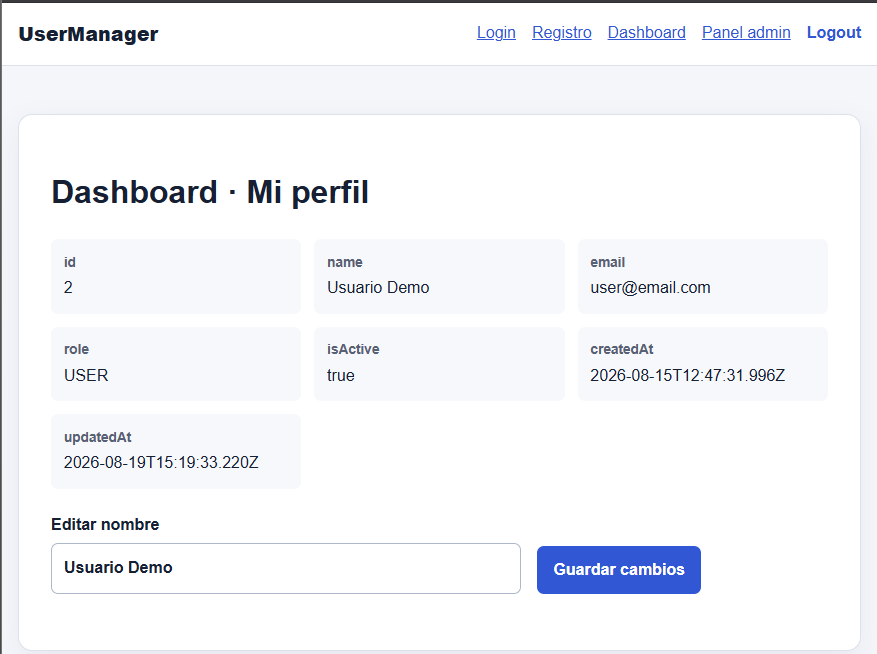 |
| Se envía cabecera Authorization | 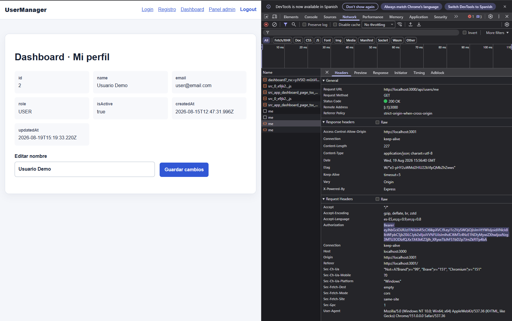 |
| USER recibe 403 en panel admin | 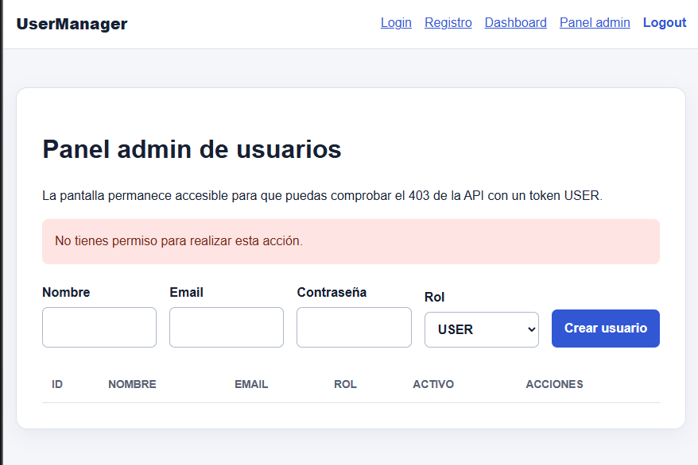 |
| ADMIN accede al panel admin | 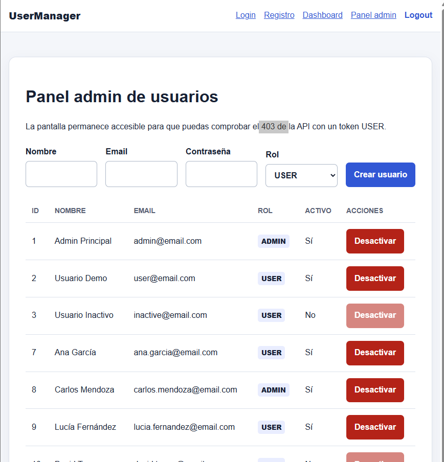 |
| Logout elimina token | 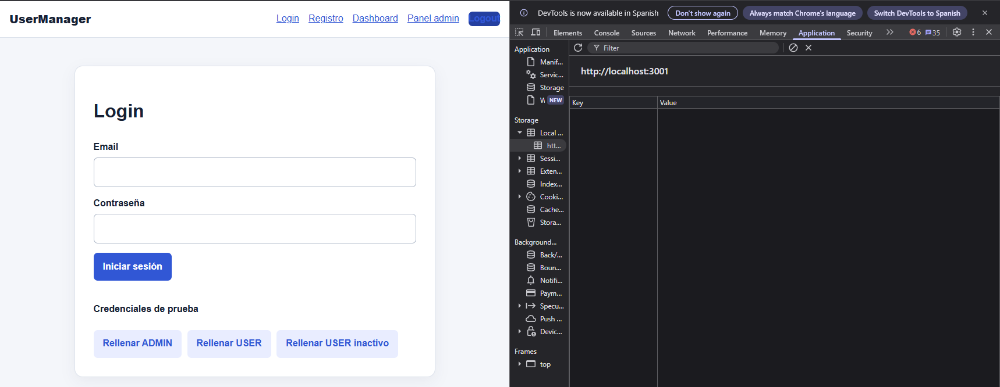 |
