# Día 39 - Pruebas de integración desde el frontend

## Qué he hecho

- He arrancado PostgreSQL.
- He ejecutado el seed.
- He arrancado el backend.
- He arrancado el frontend.
- He probado registro desde el frontend.
- He probado email duplicado.
- He probado login como USER.
- He probado login como ADMIN.
- He probado login con usuario inactivo.
- He comprobado el token en localStorage.
- He comprobado la cabecera Authorization en Network.
- He probado el dashboard.
- He editado mi nombre desde el frontend.
- He comprobado persistencia en Prisma Studio.
- He probado panel admin con USER.
- He probado panel admin con ADMIN.
- He creado un usuario como ADMIN.
- He desactivado un usuario como ADMIN.
- He probado logout.
- He probado una ruta protegida sin token.
- He distinguido códigos 400, 401, 403 y 409.

## Idea principal

```text
Una prueba de integración comprueba que varias piezas del proyecto funcionan correctamente cuando trabajan juntas.
```

## Flujo probado

```text
Frontend → API → JWT → permisos → Prisma → PostgreSQL
```

## Códigos trabajados

| Código | Significado | Ejemplo |
| --- | --- |---|
| `400` | Datos incorrectos | Email inválido |
| `401` | No autenticado | Falta token |
| `403` | Sin permiso | USER intenta listar usuarios |
| `409` | Conflicto | Email duplicado |

## Usuarios usados

| Email | Rol | Uso |
| --- | --- |---|
| `user@email.com` | USER | Probar usuario normal |
| `admin@email.com` | ADMIN | Probar administración |
| `inactive@email.com` | USER inactivo | Probar bloqueo de login |

## Evidencias recogidas

| Evidencia | Descripción |
| --- | --- |
| Petición correcta | |
| Error 401 | |
| Error 403 | |
| Cambio en Prisma Studio | |

## Explicación personal

Hoy he usado el frontend como punto de entrada para comprobar que todas las capas funcionan juntas. No basta con que la pantalla muestre datos; también hay que revisar códigos HTTP, cabeceras, respuestas JSON y persistencia en base de datos.

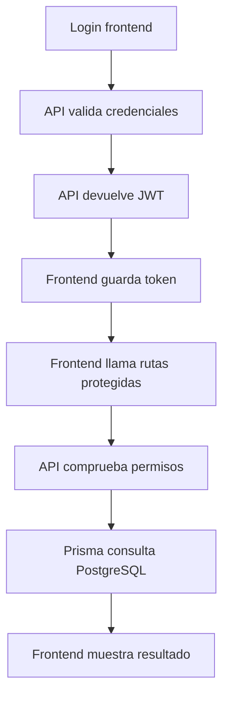

## Matriz de pruebas

| Acción | Endpoint | Rol necesario | Resultado con USER | Resultado con ADMIN |
| --- | --- | --- | --- | --- |  
| Registro | `POST /api/auth/register` | Público | `201` y `201` | 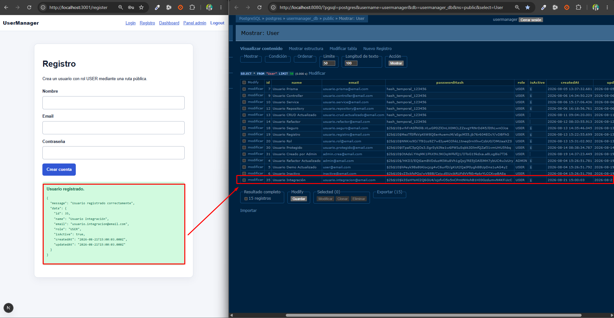 |
| Login | `POST /api/auth/login` | Público | `200` + JWT 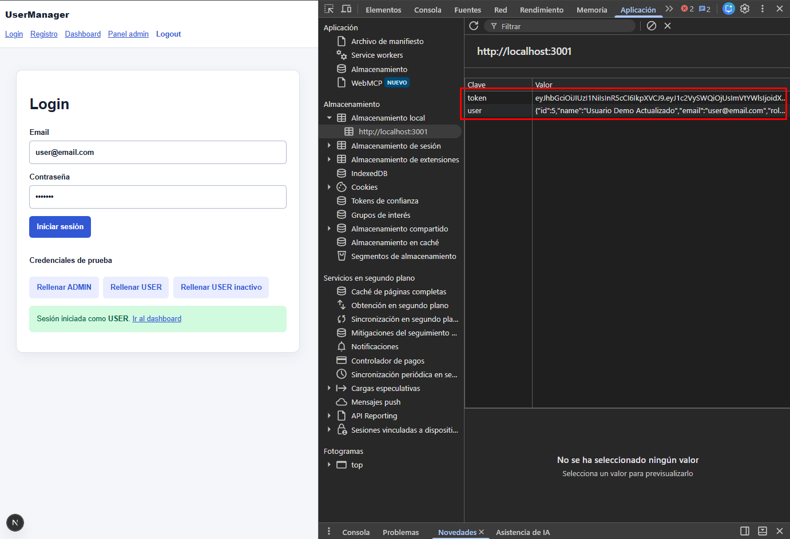 | `200` + JWT 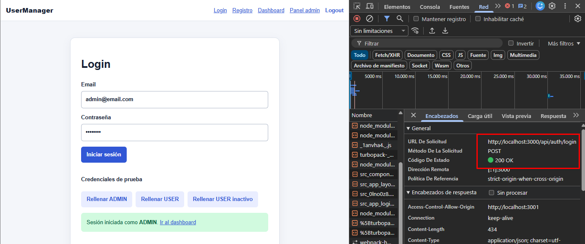 |
| Ver perfil | `GET /api/users/me` | Autenticado | `200` 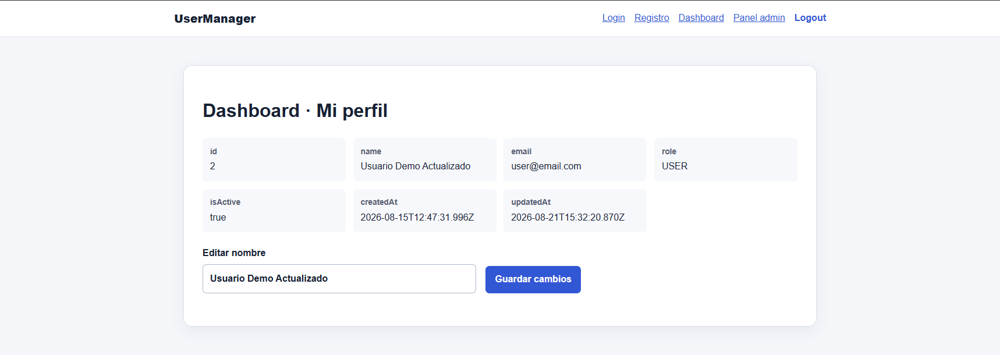 | `200` 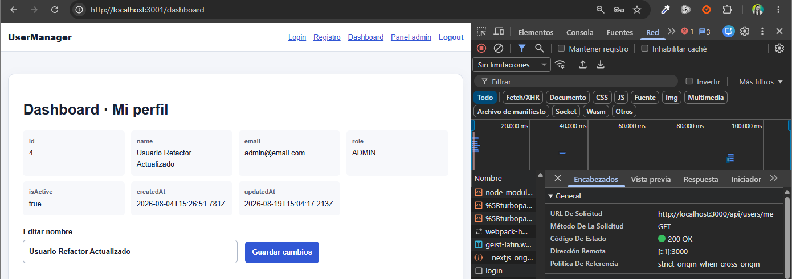 |
| Editar nombre | `PATCH /api/users/:id` | Propio o ADMIN | `200` si es propio 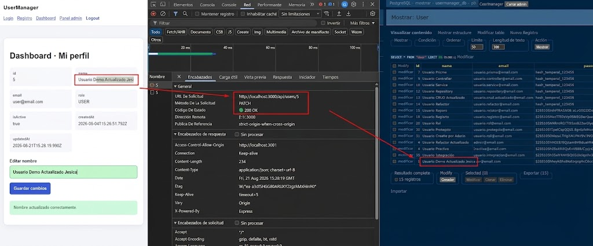 | `200` |
| Listar usuarios | `GET /api/users` | ADMIN | `403` 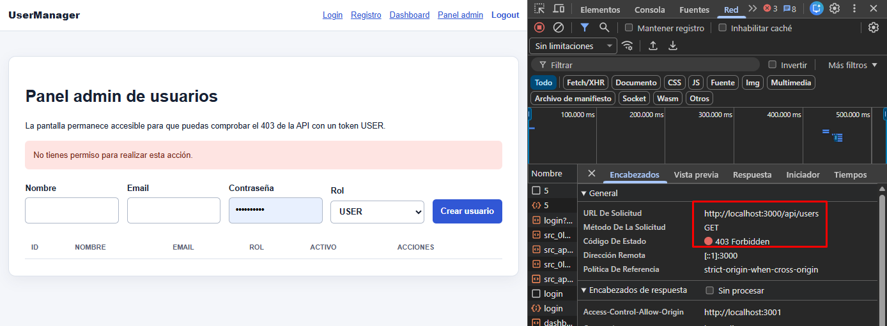 | `200` 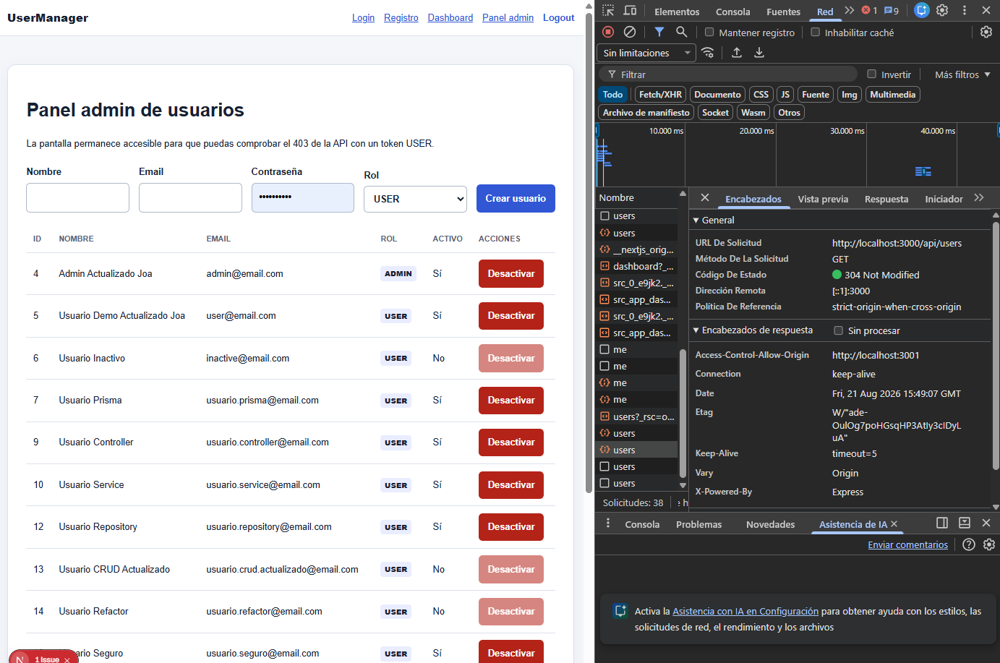 |
| Crear usuario | `POST /api/users` | ADMIN | `403` 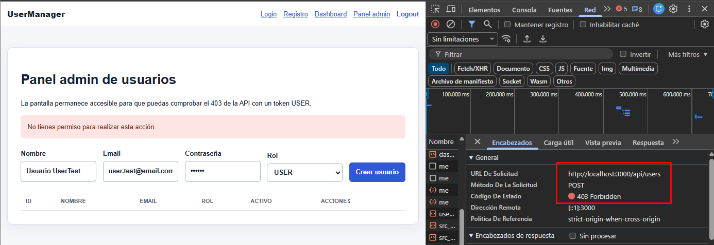 | `201` 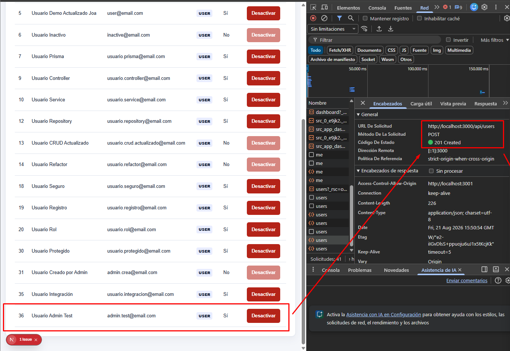 |
| Desactivar usuario | `DELETE /api/users/:id` | ADMIN | `403` | `200` 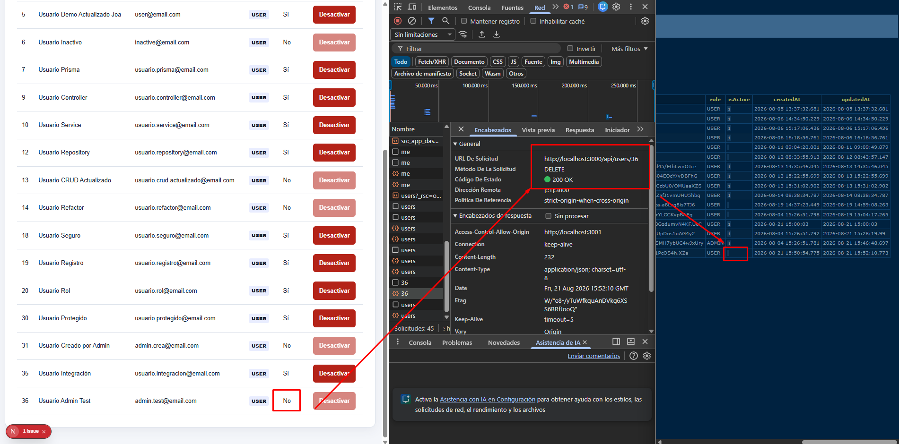 |
| Ruta sin token | `GET /api/users/me` | Autenticado | `401` y `401` | 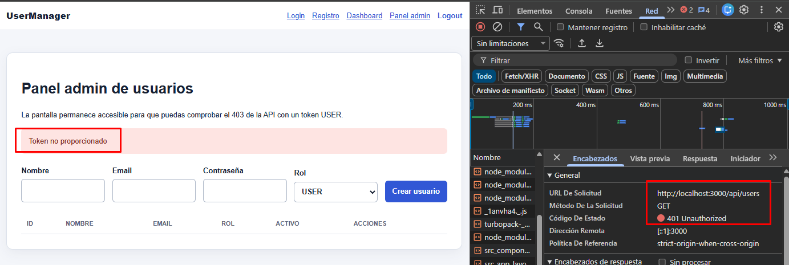 |
