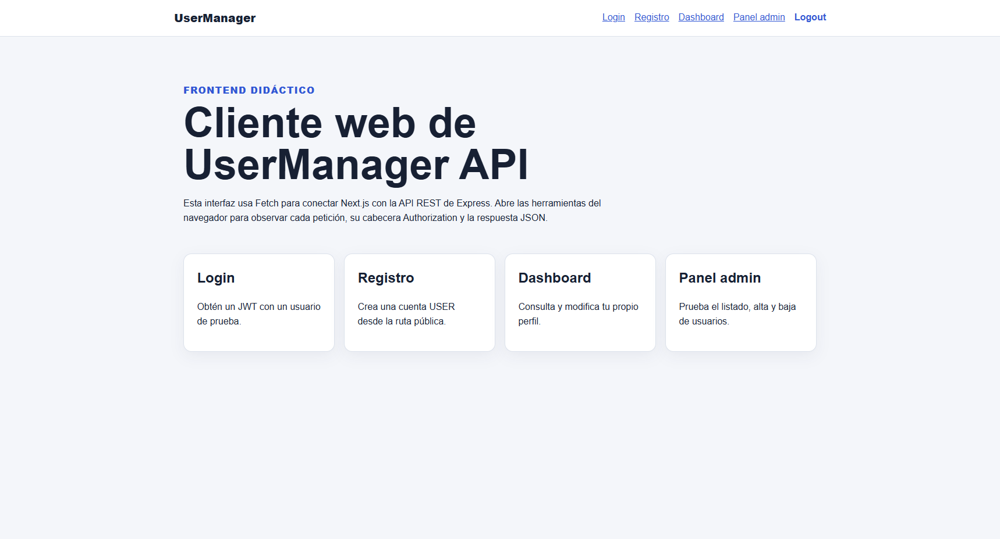
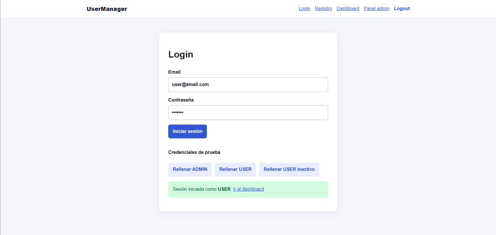
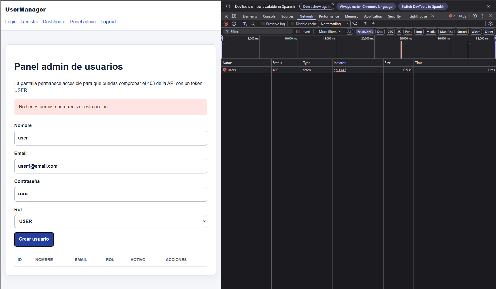
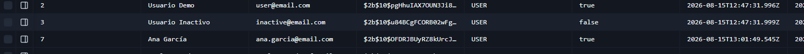
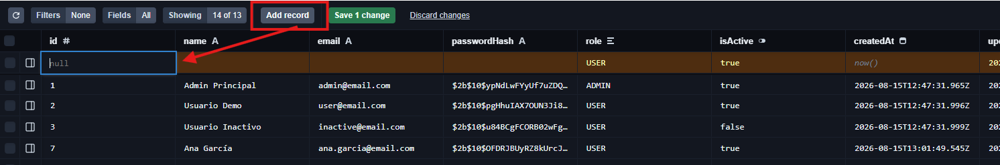

# Día 40 - Revisión final del proyecto

## Checklist de revisión del backend

| Estado | Revisión final del backend |
| :---: | :--- |
| ✅ | PostgreSQL arranca con Docker Compose. |
| ✅ | `npm run prisma:generate` termina correctamente. |
| ✅ | El seed puede ejecutarse más de una vez sin duplicar datos. |
| ✅ | `npm run build` compila. |
| ✅ | Los errores usan códigos HTTP coherentes. |
| ✅ | `passwordHash` nunca aparece en respuestas. |
| ✅ | Las rutas públicas, autenticadas y ADMIN tienen sus middlewares. |
| ✅ | CORS permite `http://localhost:3001`. |
| ✅ | La documentación menciona Prisma 7, el cliente generado y PrismaPg. |

## Checklist de revisión del frontend

| Estado | Revisión final del frontend |
| :---: | :--- |
| ✅ | Existe `frontend/.env.local`. |
| ✅ | `npm run build` compila. |
| ✅ | Registro y login muestran errores legibles. |
| ✅ | El JWT se guarda y se envía en `Authorization`. |
| ✅ | Dashboard consulta y edita el perfil. |
| ✅ | USER recibe 403 en el panel admin. |
| ✅ | ADMIN lista, crea y desactiva usuarios. |
| ✅ | Logout elimina el estado local. |
| ✅ | La interfaz se puede usar en móvil y escritorio. |

### Inicio del frontend

### Login correcto como USER

### Dashboard con el perfil

### Respuesta 403 del panel admin con USER

### Tabla de usuarios con ADMIN

### Desactivación de un usuario

### Petición en Network con el token parcialmente oculto

## Posibles mejoras futuras

* Refresh tokens.
* Tests automáticos.
* Paginación.
* Buscador de usuarios.
* Validación con Zod.
* Mejor gestión de errores en frontend.
* Despliegue.
* Dockerizar frontend.
* Roles más avanzados.
* Cambio de contraseña.
* Recuperación de contraseña.

## Propuesta de Mejora: Implementación de Refresh Tokens

### 1. Problema que resuelve
Actualmente, el sistema utiliza un único token JWT para mantener la sesión. Esto obliga a elegir entre dos malos escenarios: si el token tiene una caducidad larga, supone un riesgo de seguridad en caso de robo; si es muy corta, la experiencia de usuario es frustrante porque se le cierra la sesión constantemente.
Los *Refresh Tokens* solucionan esto dividiendo la responsabilidad: se usa un **Access Token** de vida muy corta (ej. 15 minutos) para las peticiones diarias, y un **Refresh Token** de vida larga (ej. 7 días) que renueva el Access Token de forma silenciosa sin obligar al usuario a volver a poner su contraseña.

### 2. Cambios en el Backend
*   **Base de datos (Prisma):** Crear un nuevo modelo `RefreshToken` vinculado al modelo `User`. Esto permite almacenar los tokens activos y revocarlos (por ejemplo, si el administrador desactiva al usuario o si el usuario cierra sesión en todos los dispositivos).
*   **Modificar el Login:** El endpoint de autenticación ahora debe generar dos tokens. El Access Token se envía en el cuerpo de la respuesta (JSON), y el Refresh Token se envía incrustado en una cookie `HttpOnly` para protegerlo contra ataques XSS.
*   **Nuevo Endpoint `/auth/refresh`:** Una nueva ruta que lee la cookie del Refresh Token, verifica en Prisma que existe y no ha expirado, y devuelve un nuevo Access Token.

### 3. Cambios en el Frontend
*   **Gestión del Estado:** Actualizar la lógica del login para almacenar solo el Access Token en memoria o en el almacenamiento local.
*   **Interceptores HTTP (Axios/Fetch):** Configurar un interceptor global que "vigile" las respuestas del backend. Si el frontend recibe un error `401 Unauthorized` (token caducado), el interceptor debe pausar la petición, llamar automáticamente al nuevo endpoint `/auth/refresh`, actualizar el Access Token y reintentar la petición original sin que el usuario note ninguna interrupción.

### 4. Riesgos y Mitigaciones

*   **Condiciones de carrera (Race conditions):** Si el Access Token caduca y la vista del frontend lanza 3 peticiones simultáneas, las 3 fallarán a la vez y podrían disparar 3 intentos de refresco simultáneos. 
    * *Mitigación:* Programar un sistema de cola en el interceptor para que la primera petición fallida ponga las demás en espera hasta que se obtenga el nuevo token.
*   **Aumento de carga en base de datos:** Cada renovación requiere consultar la tabla `RefreshToken` en PostgreSQL.
    * *Mitigación:* Crear los índices adecuados en Prisma (`@@index`) para el campo del token, garantizando búsquedas ultrarrápidas.

### 5. Primera Prueba de Aceptación (Criterio de éxito)
1. Modificamos temporalmente el backend para que el Access Token caduque en solo **1 minuto**.
2. El usuario inicia sesión en la aplicación.
3. El usuario espera **61 segundos** en el Dashboard sin interactuar.
4. El usuario hace clic en "Ver perfil" (petición a una ruta protegida).
5. **Resultado esperado:** El usuario **no** es redirigido a la pantalla de login. En la pestaña *Network* de las herramientas de desarrollador se observa que la primera petición falla (401), se ejecuta silenciosamente una petición a `/refresh` (200), y se reintenta la petición del perfil obteniendo los datos con éxito (200). La interfaz carga fluidamente.